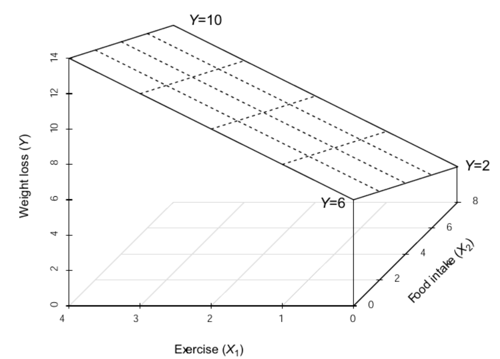

# D&H Ch3a - Multiple Regression: "Weight"

Compiled: `r format(Sys.time(), '%B %d, %Y')`

Darlington & Hayes, Chapter 3's first example

> Darlington, Richard B., and Andrew F. Hayes. Regression Analysis and Linear Models : Concepts, Applications, and Implementation, Guilford Publications, 2016. ProQuest Ebook Central, http://ebookcentral.proquest.com/lib/usu/detail.action?docID=4652287.
Created from usu on 2025-01-29 01:13:21.

```{block type='rmdlink', echo=TRUE}
Outside resource
* https://www.harshaash.com/R/part-and-partial-corr/
* https://dstanley4.github.io/psyc4780bookdown/multiple-regression.html

Reference:

* Knapp, T. R. (1996). [Semi-Partial Correlations: I Don't Need Them; You Can Have Them.](https://scholarworks.bgsu.edu/cgi/viewcontent.cgi?article=1631&context=mwer) Mid-Western Educational Researcher, 9(4), 4.
```


```{r}
# install.packages("remotes")
# remotes::install_github("sarbearschwartz/apaSupp")
# remotes::install_github("ddsjoberg/gtsummary")

library(magrittr)       
library(tidyverse)   
library(broom)     
library(naniar)
library(corrplot)   
library(GGally)
library(gtsummary)
library(flextable)
library(apaSupp)
library(performance)
library(interactions)
library(effects)
library(emmeans)
library(car)
library(ggResidpanel)
library(modelsummary)
library(ppcor)
library(jtools)
library(olsrr)
library(DescTools)
library(effectsize)
library(ggpubr)
```


## PURPOSE

### Research Question

> How is weight loss associationed with exercise frequency and food intake? 


### Data Description

Suppose you conducted a study examining the relationship between food consumption and weight loss among people enrolled (`n` = 10) in a month-long healthy living class.

**Dependent Variable (DV)**

* `loss` average weight loss in hundreds of grams per week


**Independent Variables (IVs)**

* `exer` average weekly hours of exercise

* `diet` average daily food consumption (in 100s of calories about the recommended minimum of 1,000 calories required to maintain good health)

* `meta` metabolic rate


```{block type='rmdlightbulb', echo=TRUE}
Manually enter the data set provided on page 44 in Table 3.1
```


```{r}
df_loss <- tibble::tribble(~id, ~exer, ~diet, ~meta, ~loss,
                           1, 0, 2, 15,  6, 
                           2, 0, 4, 14,  2,
                           3, 0, 6, 19,  4,
                           4, 2, 2, 15,  8,
                           5, 2, 4, 21,  9,
                           6, 2, 6, 23,  8,
                           7, 2, 8, 21,  5,
                           8, 4, 4, 22, 11,
                           9, 4, 6, 24, 13,
                           10, 4, 8, 26,  9)
```


```{r}
df_loss %>% 
  dplyr::select("ID" = id,
                "Exercise\nFrequency" = exer,
                "Food\nIntake" = diet,
                "Weight\nLoss" = loss) %>% 
  flextable::flextable() %>% 
  apaSupp::theme_apa(caption = "D&H Table 3.1: Exercise, Food Intake, and Weight Loss") %>% 
  flextable::colformat_double(digits = 0) %>% 
  flextable::footnote(part = "header", 
                      i = 1, j = 2:4, 
                      value = flextable::as_paragraph(c("Weekly average of hours/day",
                                                        "Daily average of 100s of calories above recommendation",
                                                        "Weekly average of 100s of grams/week")))
```


## EXPLORATORY DATA ANALYSIS

### Summary Statistics


#### Univariate

```{r}
df_loss %>% 
  dplyr::select("Exercise Frequency" = exer,
                "Food Intake" = diet,
                "Metabolic Rate" = meta,
                "Weight Loss" = loss) %>% 
  apaSupp::tab_desc(caption = "Summary Statistics",
                    general_not = "Exercise captures daily average hours.  Food intake is the average of 100's of calories above the recommendation.  Metabolism is the metobalic rate. Weight loss is average weekly weight lost in 100s of grams.") 
```

#### Bivariate

```{r}
df_loss %>% 
  dplyr::select("Weight Loss" = loss,
                "Exercise Frequency" = exer,
                "Food Intake" = diet) %>% 
  apaSupp::tab_cor(caption = "Correlations",
                   general_note = "Exercise captures daily average hours.  Food intake is the average of 100's of calories above the recommendation.  Weight loss is average weekly weight lost in 100s of grams.") %>% 
  flextable::hline(i = 2)
```


### Visualizations

#### Univariate


```{r, fig.cap="Univariate Distibution on Continuous Measures"}
df_loss %>% 
  dplyr::select(id, 
                "Weight Loss\n(100 g/day)" = loss,
                "Exercise Frequency\n(hr/day)" = exer,
                "Food Intake\n(100 cal/day above 1000)" = diet,
                "Metabolic Rate" = meta) %>% 
  tidyr::pivot_longer(cols = -id) %>% 
  ggplot(aes(value)) +
  geom_histogram(binwidth = 1,
                 color = "black",
                 alpha = .25) +
  theme_bw() +
  facet_wrap(~ name,
             scale = "free_x") +
  labs(x = NULL,
       y = "Count")
```

#### Bivariate

```{r, fig.cap= "D&H Figure 3.1 (page 45) An example with positive simple association and negative partial association - BASIC"}
df_loss %>% 
  ggplot(aes(x = diet,
             y = loss)) +
  geom_point(aes(shape = factor(exer))) 
```

```{r, fig.cap= "D&H Figure 3.1 (page 45) An example with positive simple association and negative partial association - BETTTER"}
df_loss %>% 
  ggplot(aes(x = diet,
             y = loss)) +
  geom_point(aes(shape = factor(exer),
                 color = factor(exer)),
             size = 3)  +
  theme_bw() +
  labs(x = "Observed Food Intake)",
       y = "Observed Weight Loss",
       shape = "Exercise Frequency",
       color = "Exercise Frequency") +
  theme(legend.position = "bottom")
```

```{r, fig.cap= "D&H Figure 3.1 (page 45) An example with positive simple association and negative partial association - WORST"}
df_loss %>% 
  dplyr::mutate(exer = factor(exer)) %>% 
  ggplot(aes(x = diet,
             y = loss)) +
  geom_point(size = 3)  +
  theme_bw() +
  labs(x = "Observed Food Intake)",
       y = "Observed Weight Loss",
       shape = "Exercise Frequency",
       color = "Exercise Frequency") +
  theme(legend.position = "bottom") +
  geom_smooth(aes(group = 1),
              method = "lm",
              formula = y ~ x,
              se = FALSE)
```


```{r, fig.cap= "D&H Figure 3.1 (page 45) An example with positive simple association and negative partial association - BEST"}
df_loss %>% 
  dplyr::mutate(exer = factor(exer)) %>% 
  ggplot(aes(x = diet,
             y = loss,
             group = exer)) +
  geom_point(aes(shape = exer,
                 color = exer),
             size = 3)  +
  theme_bw() +
  labs(x = "Observed Food Intake",
       y = "Observed Weight Loss",
       shape = "Exercise Frequency",
       color = "Exercise Frequency") +
  theme(legend.position = "bottom") +
  geom_smooth(aes(color = exer),
              method = "lm",
              formula = y ~ x,
              se = FALSE)
```


## REGRESSION ANALYSIS

### Fit the models

* The dependent variable (DV) is weight loss ($Y$)
* The independent variables (IVs) are exercise and diet ($X$)

```{r}
fit_lm_exer <- lm(loss ~ exer,
                  data = df_loss)

fit_lm_diet <- lm(loss ~ diet,
                  data = df_loss)

fit_lm_both <- lm(loss ~ exer + diet,
                  data = df_loss)

fit_lm_three<- lm(loss ~ exer + diet + meta,
                  data = df_loss)
```


### Equations

$$
\hat{loss} = 4 + 1.75(exercise) \\
\hat{loss} = 7.14 + 0.07(food) \\
\hat{loss} = 6 + 2(exercise) -0.5(food) \\
\hat{loss} = -1.636 + 1.045(exercise) -1.136(food) + 0.636(metabolism)\\
$$


### Tables


```{r}
apaSupp::tab_lms(list(fit_lm_exer, fit_lm_diet, fit_lm_both))
```


```{r}
tab_lm3 <- apaSupp::tab_lms(list("Model 1\nExercise" = fit_lm_exer, 
                                 "Model 2\nFood Intake" = fit_lm_diet, 
                                 "Model 3\nBoth" = fit_lm_both),
                            var_labels = c("exer" = "Exercise",
                                           "diet" = "Food"),
                            narrow = TRUE,
                            caption = "Parameter Estimates for Weight Loss Regressed on Exercise Frequency and Food Intake",
                            general_note = "Dependent variable is average weekly weight lost in 100s of grams. Exercise is daily average hours and food intake is the average of 100's of calories above the recommendation. ") 


tab_lm3
```

How to save to word document in the same folder as your R file.

```{r, eval=FALSE}
flextable::save_as_docx(tab_lm3,
                        path = "DH_ch3_tab_lm3.docx")
```


```{r}
apaSupp::tab_lms(list("Model 3\nTwo Predictors" = fit_lm_both, 
                      "Model 4\nThree Predictors" = fit_lm_three),
                 var_labels = c("exer" = "Exercise Freq",
                                "diet" = "Food Intake",
                                "meta" = "Metabolic Rate"),
                 caption = "Parameter Estimates for Weight Loss Regressed on Exercise Frequency, Food Intake, and Metabolic Rate",
                 general_note = "Dependent variable is average weekly weight lost in 100s of grams. Exercise is daily average hours and food intake is the average of 100's of calories above the recommendation. ") %>% 
  flextable::autofit()

```


### Visualization


```{r, fig.cap="Darlington & Hayes: Figure 3.2, page 49", echo=FALSE}

```


```{r}
interactions::interact_plot(model = fit_lm_both,
                            pred = diet,
                            modx = exer,
                            modx.values = 0:4) +
  theme_bw() 
```


```{r}
interactions::interact_plot(model = fit_lm_both,
                            pred = exer,
                            modx = diet,
                            modx.values = c(0, 2, 4, 6, 8)) +
  theme_bw() 
```


```{r}
interactions::interact_plot(model = fit_lm_three,
                            pred = exer,
                            modx = diet,
                            mod2 = meta,
                            modx.values = c(8, 5, 2),
                            modx.labels = c("1800 cal",
                                            "1500 cal",
                                            "1200 cal"),
                            mod2.values = c(16, 22.75),
                            mod2.labels = c("Low Metabolic Rate\n(Q1 = 16.00)", 
                                            "High Metabolic Rate\n(Q3 = 22.75)"),
                            x.label = "Daily Exercise, hours",
                            y.label = "Weight Loss, 100s grams/week",
                            legend.main = "Food Consumption") +
  theme_bw() +
  theme(legend.position = c(0, 1),
        legend.justification = c(-0.1, 1.1),
        legend.background = element_rect(color = "black"),
        legend.key.width = unit(2, "cm")) +
  scale_y_continuous(breaks = c(0, 5, 10, 15),
                     labels = c(0, 500, 1000, 1500))
```


## EFFECT SIZES


```{r}
apaSupp::tab_lm(fit_lm_both,
                var_labels = c("exer" = "Exercise Freq",
                               "diet" = "Food Intake"),
                vif = TRUE,
                caption = "Parameter Estimates for Weight Loss Regressed on Exercise Frequency and Food Intake, with Effect Size Estimates",
                general_note = "Dependent variable is average weekly weight lost in 100s of grams. Exercise is daily average hours and food intake is the average of 100's of calories above the recommendation. ") %>% 
  flextable::autofit()
```


```{r}
apaSupp::tab_lm(fit_lm_three,
                var_labels = c("exer" = "Exercise Freq",
                               "diet" = "Food Intake"),
                vif = TRUE,
                caption = "Parameter Estimates for Weight Loss Regressed on Exercise Frequency, Food Intake and Metabolic Rate, with Effect Size Estimates",
                general_note = "Dependent variable is average weekly weight lost in 100s of grams. Exercise is daily average hours and food intake is the average of 100's of calories above the recommendation. ") %>% 
  flextable::autofit()
```

### Semipartial Correlation 

Unique contribution


```{r}
effectsize::r2_semipartial(fit_lm_both)
```

```{r}
effectsize::r2_semipartial(fit_lm_three)
```


### Eta Squared


```{r}
effectsize::eta_squared(fit_lm_both, partial = FALSE)
```

```{r}
effectsize::eta_squared(fit_lm_three, partial = FALSE)
```

```{r}
effectsize::eta_squared(fit_lm_both, partial = TRUE)
```

```{r}
effectsize::eta_squared(fit_lm_three, partial = TRUE)
```


### Standardized Regression Coefficients

```{r}
parameters::standardise_parameters(fit_lm_both)
```


```{r}
parameters::standardise_parameters(fit_lm_three)
```


### Cohen's $f$ (see chapter 8)

Cohen’s $f$ (Cohen, 1988) is appropriate for calculating the effect size within a multiple regression model in which the independent variable of interest and the dependent variable are **both continuous**.


```{r}
effectsize::cohens_f_squared(fit_lm_both,
                             partial = TRUE)

```


```{r}
effectsize::cohens_f_squared(fit_lm_both,
                             partial = FALSE)

```


## VARIANCE INFLATION FACTORS

```{r}
car::vif(fit_lm_both)
```

```{r}
car::vif(fit_lm_three)
```


## CONCLUSION: SPECIFIC QUESTIONS


```{r}
apaSupp::tab_lm(fit_lm_both, vif = TRUE)
```


```{r}
confint(fit_lm_both)
```                               


$$
\hat{loss} = 6 + 2(exercise) -0.5(food)
$$

Suppose an examination of the literature on diet, exercise, and weight loss led you to the following conclusions: 

1. People who eat the **minimum number of calories** to maintain good health and who **do not exercise** at all will lose how much?


```{r}
fit_lm_both %>% 
  emmeans::emmeans(~ exer + diet,
                   at = list(exer = 0,
                             diet = 0))

```

> The estimated marginal mean weight loss is 600 grams per week among thoes who eat the minimum number of calories to maintain good health and who do not exercise at, *b* = 6.00, 95% *CI* = [2.99, 9.01].


2. If food intake is held constant, then **each 1 hour of average daily exercise** leads to how much more weight loss?

```{r}
fit_lm_both %>% 
  emmeans::emmeans(~ exer + diet,
                   at = list(exer = 0:4))

```


> Holding food consumption constant, each additional hour of daily exercise is associated with 200 grams additional weight lost per week, *b* = 2.00, 95% *CI* = [1.21, 2.79].


3. If exercise is held constant, then **each one unit of food intake per day** (i.e., 100 calories) above the minimum to maintain good health translates to much weight gain?

```{r}
fit_lm_both %>% 
  emmeans::emmeans(~ diet,
                   at = list(diet = 0:4))

```

> Holding exercise constant, each additional 100 calories of food consumed daily is associated with 50 grams weight gained per week, *b* = -0.50, 95% *CI* = [1.21, 2.79]. 


4. If a person exercises 2 hours per week and eats 600 more calories than the minimum, how much weight would they loose weekly on average?


```{r}
fit_lm_both %>% 
  emmeans::emmeans(~ exer + diet,
                   at = list(exer = 2,
                             diet = 6))
```


> On average, 700 grams were lost per week amonth participants who exrcised 2 hours a week and consumed 6,600 more calories, 95% *CI* [572, 828]. 


