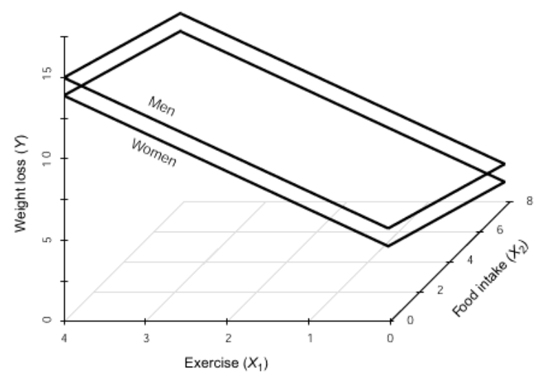

# D&H Ch5 - Dichotomous Regressors: "Weight"


Darlington & Hayes, Chapter 5's first example


```{r, warning=FALSE, message=FALSE, error=FALSE}
# install.packages("remotes")
# remotes::install_github("sarbearschwartz/apaSupp")
# remotes::install_github("ddsjoberg/gtsummary")
     
library(tidyverse) 
library(flextable)
library(apaSupp)
library(car)
library(rempsyc)
library(parameters)
library(performance)
library(interactions)
library(ggResidpanel)
library(olsrr)
```

```{r}
flextable::set_flextable_defaults(digits = 2)
```


## PURPOSE


```{block type='rmdlightbulb', echo=TRUE}
RESEARCH QUESTION:

How is weight loss associationed with **sex**, after accounting for metabolism, exercise and food intake? 
```

### Data Description

Suppose you conducted a study examining the relationship between food consumption and weight loss among people enrolled (*n* = 10) in a month-long healthy living class.

#### Variables

**Dependent Variable (DV)**

* `loss` average weight loss in hundreds of grams per week


**Independent Variables (IVs)**

* `exer` average weekly hours of exercise

* `diet` average daily food consumption (in 100s of calories about the recommended minimum of 1,000 calories required to maintain good health)

* `meta` metabolic rate

* `sex` dichotomous variable with 2 codes for Male and Female


Manually enter the data set provided on page 44 in Table 3.1


```{r}
df_loss <- tibble::tribble(~id, ~exer, ~diet, ~meta, ~ sex, ~loss,
                           1, 0, 2, 15,  0,  6, 
                           2, 0, 4, 14,  0,  2,
                           3, 0, 6, 19,  0,  4,
                           4, 2, 2, 15,  1,  8,
                           5, 2, 4, 21,  1,  9,
                           6, 2, 6, 23,  0,  8,
                           7, 2, 8, 21,  1,  5,
                           8, 4, 4, 22,  1, 11,
                           9, 4, 6, 24,  0, 13,
                           10, 4, 8, 26,  0,  9) %>% 
  dplyr::mutate(sex = factor(sex,
                             levels = c(0, 1),
                             labels = c("Male", "Female")))
```


View the dataset

```{r}
df_loss %>% 
  dplyr::select("ID" = id,
                "Exercise\nFrequency" = exer,
                "Food\nIntake" = diet,
                "Metabolic\nRate" = meta,
                "Sex" = sex,
                "Weight\nLoss" = loss) %>% 
  flextable::flextable() %>% 
  apaSupp::theme_apa(caption = "Dataset on Exercise, Food Intake, and Weight Loss",
                     general_note = "Darlington and Hayes textbook, data set provided on page 44 in Table 3.1.  Dependent variable is average weekly weight lost in 100s of grams.  Exercise captures daily average of hours.  Food intake is the average of 100's of calories above the recommendation.") %>% 
  flextable::colformat_double(digits = 0) 
```


## EXPLORATORY DATA ANALYSIS

### Descriptive Statistics

#### Univariate

```{r}
df_loss %>% 
  dplyr::select("Sex" = sex) %>% 
  apaSupp::tab_freq(caption = "Summary of Categorical Measures")
```


```{r}
df_loss %>% 
  dplyr::select("Exercise Frequency" = exer,
                "Food Intake" = diet,
                "Metabolic Rate" = meta,
                "Weight Loss" = loss) %>% 
  apaSupp::tab_desc(caption = "Summary for Continuous Measures") %>% 
  flextable::hline(i = 3)
```


```{r}
df_loss %>% 
  dplyr::select(sex,
                "Weight Loss" = loss,
                "Exercise Frequency" = exer,
                "Food Intake" = diet,
                "Metabolic Rate" = meta) %>% 
  apaSupp::table1_apa(caption = "Descriptive of Continuous Measures by Sex",
                      split = sex) %>% 
  flextable::bg(i = 1:3, j = 3, bg = "lightblue") %>% 
  flextable::bg(i = 1:3, j = 4, bg = "lightpink")
```


#### Bivariate


```{block type='rmdimportant', echo=TRUE}
Pearson's correlation is only appropriate for TWO CONTINUOUS variables.  The exception is when 1 variable is continuous and the other has exactly 2 levels.  In this case, the binary variable needs to be converted to two numbers (numeric not factor) and the value is called the **Point-Biserial Correlation** ($r_{pb}$).
```


```{block type='rmdlightbulb', echo=TRUE}
Table highlighting below:

* YELLOW: un-adjusted correlation between each IV and the DV, at least some of them will usually be significant

* ORANGE: pairwise correlations between each pair of IVs...if any are moderately strong, then we need to be concerned about potential multicolinearity and check the variance inflation factors (VIF).
```

```{r}
df_loss %>% 
  dplyr::mutate(sex = as.numeric(sex == "Female")) %>% 
  dplyr::select("Weight Loss" = loss,
                "Exercise Frequency" = exer,
                "Food Intake" = diet,
                "Metabolic Rate" = meta,
                "Sex" = sex) %>% 
  apaSupp::tab_cor(caption = "Correlation Between Pairs of Measures",
                   general_note = "For pairs of variables with sex, r = Point-Biserial Correlation, otherwise ") %>% 
  flextable::hline(i = 4) %>% 
  flextable::bg(i = 1:4, bg = "yellow") %>% 
  flextable::bg(i = c(6, 8), bg = "orange") %>% 
  flextable::bold(i = c(4, 7, 9, 10))
```


### Visualizing Distributions

#### Univariate


```{r, fig.cap="Univariate Distibution of Measures"}
df_loss %>% 
  dplyr::mutate(sex = as.numeric(sex)) %>% 
  dplyr::select(id, 
                "Sex" = sex,
                "Weight Loss\n(100 g/day)" = loss,
                "Exercise Frequency\n(hr/day)" = exer,
                "Food Intake\n(100 cal/day above 1000)" = diet,
                "Metabolic Rate" = meta) %>% 
  tidyr::pivot_longer(cols = -id) %>% 
  ggplot(aes(value)) +
  geom_histogram(binwidth = 1,
                 color = "black",
                 alpha = .25) +
  theme_bw() +
  facet_wrap(~ name,
             scale = "free_x") +
  labs(x = NULL,
       y = "Count")
```


#### Bivariate


```{r, fig.cap="Scatterplot for Weight Loss Regressed on Sex"}
df_loss %>% 
  dplyr::mutate(sex = as.numeric(sex == "Female")) %>% 
  ggplot(aes(x = sex,
             y = loss)) +
  geom_point(size = 3)  +
  geom_smooth(method = "lm",
              formula = y ~ x) +
  geom_hline(yintercept = mean(df_loss$loss),
             linetype = "longdash") +
  stat_summary(geom = "point",
               fun = "mean",
               color = "red",
               fill = "red",
               alpha = .2,
               shape = 23,
               size = 9) +
  theme_bw() +
  scale_x_continuous(breaks = 0:1) +
  labs(x = "Sex, recoded as 0 = Male and 1 = Female",
       y = "Observed Weight Loss, 100s of grams/week") 
```


```{r, fig.cap="Boxplot for Weight Loss Distribution by Sex"}
df_loss %>% 
  ggplot(aes(x = sex,
             y = loss)) +
  geom_boxplot(fill = "gray") +
  stat_summary(geom = "point",
               fun = "mean",
               color = "red",
               shape = 18,
               size = 9) +
  theme_bw() +
  labs(x = NULL,
       y = "Observed Weight Loss\nWeekly average of 100s of grams/week") 
```


## GROUP MEAN DIFFERENCE


### Assess Homogeneity of Variance 

```{block type='rmdimportant', echo=TRUE}
When conducting an independent group mean difference t-test ...

IF: 
* evidence that HOV is violated (Levene's *p* < .05)

THEN: 
* use Welch's adjustment to degrees of freedom and perform a seperate variance t-test instead of a standard pool-variance t-test.
```


```{r}
car::leveneTest(loss ~ sex,
                data = df_loss,
                center = "mean")
```


```{block type='rmdimportant', echo=TRUE}
The un-adjusted MEAN DIFFERENCE in weight loss by gender may be tested with a t-test
```


```{r}
t.test(loss ~ sex,
       data = df_loss,
       var.equal = TRUE)
```


```{r}
cor.test(~ loss + as.numeric(sex), data = df_loss)
```


```{r}
r <- 0.1951181 

r^2
```


## REGRESSION ANALYSIS

This data was previously analyzed by regressing weight loss on the main effects of the continuous independent measures (See D & H Ch2 a).


### Binary Predictor (IV)

#### Unadjusted Model

```{r}
fit_loss_sex <- lm(loss ~ sex,
                    data = df_loss)

summary(fit_loss_sex)
```


#### Adjusted Model

```{r}
fit_loss_wsex <- lm(loss ~ exer + diet + meta + sex,
                    data = df_loss)

summary(fit_loss_wsex)
```


```{r}
apaSupp::tab_lms(list(fit_loss_sex, fit_loss_wsex),
                 mod_names = c("Unadjusted", "Adjusted"),
                var_labels = c("exer" = "Exercise Freq",
                               "diet" = "Food Intake",
                               "meta" = "Metabolic Rate",
                               "sex"  = "Sex"),
                caption = "Compare Unadjusted and Adjusted Models") %>% 
  flextable::bg(i = 2:4, bg = "yellow")
```


```{r}
apaSupp::tab_lm(fit_loss_wsex, 
                fit = c("r.squared", "adj.r.squared",
                        "statistic", "df", "df.residual", "p.value"),
                var_labels = c("exer" = "Exercise Freq",
                               "diet" = "Food Intake",
                               "meta" = "Metabolic Rate",
                               "sex"  = "Sex"),
                caption = "Parameter Estimtates for Weight Loss Regressed Exercise Frequency, Food Intake, and Sex",
                d = 3) %>% 
  flextable::bg(i = 5:7, bg = "yellow")
```


```{block type='rmdimportant', echo=TRUE}
Estimated Regression Coefficients show **RELATIONSHIPS**

* Continuous IV: slope, rise per run
* Categorical IV: difference in group means
```


```{block type='rmdlightbulb', echo=TRUE}
INTERPRETATION: 

After adjusting or correcting for difference in exercise frequency, food intake, and metobalic rate, females lost nearly 404 g/wk less on average than their male counterparts although this was not a statistically significant difference, *b* = -0.40, *SE* = 0.87, *p* = .662.
```


### Model to Visualize

#### Fit Model


```{r}
fit_loss_plot <- lm(loss ~ exer + diet + sex,
                    data = df_loss)

summary(fit_loss_plot)
```


#### Equations


General Equation:

$$
\widehat{loss} = 6.571 + 2.127(exer) - 0.584(diet) - 1.008(sex)
$$

Equation for MALES:

$$
\widehat{loss} = 6.571 + 2.127(exer) - 0.584(diet) - 1.008(0) \\
\widehat{loss} = 6.571 + 2.127(exer) - 0.584(diet) - 0\\
\widehat{loss} = 6.571 + 2.127(exer) - 0.584(diet)
$$

Equation for FEAMLES:

$$
\widehat{loss} = 6.571 + 2.127(exer) - 0.584(diet) - 1.008(1) \\
\widehat{loss} = 6.571 + 2.127(exer) - 0.584(diet) - 1.008 \\
\widehat{loss} = 5.563 + 2.127(exer) - 0.584(diet)
$$

#### 3D Plot


```{r, fig.cap="Darlington & Hayes: Figure 5.2, page 130", echo=FALSE}

```


#### 2D Plots

There is always more than one way to arrange a plot when there are TWO OR MORE predictors (IVs).

```{r, fig.cap = "Option A"}
interactions::interact_plot(model = fit_loss_plot,
                            pred = exer,
                            modx = sex,
                            mod2 = diet,
                            mod2.values = c(2, 8),
                            mod2.labels = c("1200 Calories/day",
                                            "1800 Calories/day"),
                            interval = TRUE,
                            legend.main = "Sex",
                            x.label = "Exercise, hr/wk",
                            y.label = "Estimated Marginal Mean\nWeight Loss, 100g/wk") + 
  theme_bw() +
  theme(legend.position = "inside",
        legend.position.inside = c(0, 1),
        legend.justification = c(-0.1, 1.1),
        legend.background = element_rect(color = "black"),
        legend.key.width = unit(1.5, "cm"))
```


```{r, fig.cap = "Option B"}
interactions::interact_plot(model = fit_loss_plot,
                            pred = diet,
                            modx = sex,
                            mod2 = exer,
                            mod2.values = c(0, 2, 4),
                            mod2.labels = c("Exercise = 0 hr/wk",
                                            "Exercise = 2 hr/wk",
                                            "Exercise = 4 hr/wk"),
                            interval = TRUE,
                            legend.main = "Sex",
                            x.label = "Food Intake, cal/day",
                            y.label = "Estimated Marginal Mean\nWeight Loss, 100g/wk") + 
  theme_bw() +
  scale_x_continuous(breaks = c(2, 4, 6, 8),
                     labels = c(1200, 1400, 1600, 1800)) +
  theme(legend.position = "inside",
        legend.position.inside = c(0, 1),
        legend.justification = c(-0.1, 1.1),
        legend.background = element_rect(color = "black"),
        legend.key.width = unit(1.5, "cm")) 
```


```{r, fig.cap = "Option C"}
interactions::interact_plot(model = fit_loss_plot,
                            pred = diet,
                            modx = exer,
                            modx.values = c(0, 2, 4),
                            modx.labels = c("0 hr/wk",
                                            "2 hr/wk",
                                            "4 hr/wk"),
                            mod2 = sex,
                            mod2.labels = c("Male", "Female"),
                            interval = TRUE,
                            legend.main = "Exercise",
                            x.label = "Food Intake, cal/day",
                            y.label = "Estimated Marginal Mean\nWeight Loss, 100g/wk") + 
  theme_bw() +
  scale_x_continuous(breaks = c(2, 4, 6, 8),
                     labels = c(1200, 1400, 1600, 1800)) +
  theme(legend.position = "inside",
        legend.position.inside = c(1, 1),
        legend.justification = c(1.1, 1.1),
        legend.background = element_rect(color = "black"),
        legend.key.width = unit(1.5, "cm")) 
```


## MULTIDIMENSIONAL SETS

### Fit Models

Divide the predictors (IVs) into two sets as folows:


* "Set A" (`meta` and `sex`) demographic or biological,hard to change

* "Set B" (`exer` and `diet`) modifiable behavioral, can be targeted


```{r}
fit_loss_none <- lm(loss ~ 1,                        data = df_loss)
fit_loss_setA <- lm(loss ~ meta + sex,               data = df_loss)
fit_loss_setB <- lm(loss ~ exer + diet,              data = df_loss)
fit_loss_all4 <- lm(loss ~ meta + sex + exer + diet, data = df_loss)
```


### Table of Parameter Estimates


```{r}
apaSupp::tab_lms(list(fit_loss_setA, fit_loss_setB, fit_loss_all4),
                 mod_names = c("Set A",
                               "Set B",
                               "A & B"),
                 var_labels = c("exer" = "Exercise Freq",
                                "diet" = "Food Intake",
                                "meta" = "Metabolic Rate",
                                "sex"  = "Sex"),
                 caption = "Compare Model Parameter Estimates") %>% 
  flextable::bg(i = 2:5, bg = "lightgreen") %>% 
  flextable::bg(i = 6:7, bg = "violet")
```


### Compare Fit Statistics

```{r}
performance::compare_performance(fit_loss_none,
                                 fit_loss_setA, 
                                 fit_loss_setB, 
                                 fit_loss_all4) %>% 
  data.frame() %>% 
  dplyr::mutate(Model = c("None", "Set A", "Set B", "A & B")) %>% 
  dplyr::select(Model, AIC, BIC, R2, R2_adjusted, RMSE, Sigma) %>% 
  flextable::flextable() %>% 
  apaSupp::theme_apa(caption = "Compare Models Fit Measures")
```


### Multicolinearity Checks

Refer back to the pairwise correlations in the exploratory data anlaysis section above


```{r}
car::vif(fit_loss_setA)
```

```{r}
car::vif(fit_loss_setB)
```

```{r}
car::vif(fit_loss_all4)
```

Most multivariate statistical approaches involve decomposing a correlation matrix into linear combinations of variables. The linear combinations are chosen so that the first combination has the largest possible variance (subject to some restrictions we won’t discuss), the second combination has the next largest variance, subject to being uncorrelated with the first, the third has the largest possible variance, subject to being uncorrelated with the first and second, and so forth. The variance of each of these linear combinations is called an eigenvalue. Collinearity is spotted by finding 2 or more variables that have large proportions of variance (.50 or more) that correspond to large condition indices. A rule of thumb is to label as large those condition indices in the range of 30 or larger.

```{r}
olsrr::ols_coll_diag(fit_loss_all4)
```


### Residual Diagnostics


```{block type='rmdlightbulb', echo=TRUE}
Interpretation:

> `rempsyc::nice_assumption()`

p-values < .05 imply assumptions are not respected. 
`Diagnostic` is how many assumptions are not respected for a given model or variable.
```

```{r}
rempsyc::nice_assumptions(fit_loss_all4) %>% 
  unlist()
```


```{r}
performance::check_residuals(fit_loss_all4)
```

```{r}
ggResidpanel::resid_panel(fit_loss_all4)
```


## EFFECT of VARIABLE SET

Unique Contribution: amount $R^2$ would drop if the regressor(s) were removed from the analysis.


```{r}
ss_lm <- function(model){
  ss_tot = data.frame(anova(model))$Sum.Sq[model$rank]
  ss_reg = sum(data.frame(anova(model))$Sum.Sq[-model$rank])
  ss_err = deviance(model)
  r_sqr  = summary(model)$r.squared
  r_adj  = summary(model)$adj.r.squared
  return(list(R2_Unadjusted = r_sqr,
              R2_Adjusted   = r_adj,
              SS_Total      = ss_tot, 
              SS_Regression = ss_reg, 
              SS_Error      = ss_err))
}
```


```{r}
data.frame(Variables = c("None", "Set A", "Set B", "A & B")) %>% 
  dplyr::mutate(model = list(fit_loss_none,
                             fit_loss_setA,
                             fit_loss_setB,
                             fit_loss_all4)) %>% 
  dplyr::mutate(values = purrr::map_df(model, ss_lm)) %>% 
  dplyr::select(-model) %>% 
  tidyr::unnest(cols = values) %>% 
  flextable::flextable() %>% 
  flextable::separate_header() %>% 
  apaSupp::theme_apa(caption = "Contribution of Variables Sets A and B") %>% 
  flextable::border_inner(part = "header", border = officer::fp_border(width = 0)) %>% 
  flextable::align(part = "body", j = c(2, 4, 5), align = "right")%>% 
  flextable::align(part = "body", j = c(3, 6), align = "left")
```


#### Set B's Unique Contriburion

*Semipartial Multiple Correlation*, $SR(B \vert A)$  

* UNIQUE contribution of set B, relative to **ALL** the variance in the Dependent Variable (DV)

* Correlation between the Dependent Variable (DV) AND set B, with all the the variables in set A held constant.

* How much $R^2$ increase when the variables in set B are added to a model of Y already including set A variables as regressors.


$$
SR(B \vert A)^2 = R(AB)^2 - R(A)^2 \\
$$


```{r}
summary(fit_loss_all4)$r.squared - summary(fit_loss_setA)$r.squared
```


*Partial multiple correlation*, $PR(B \vert A)$

* Proportion of remaining variables explained by set B


* UNIQUE contribution of set B, relative to the **REMAINING** variance in the Dependent Variable (DV) unaccounted for by set A


$$
PR(B \vert A)^2 = \frac{SR(B \vert A)^2}{1 - R(A)^2}
$$


```{r}
(summary(fit_loss_all4)$r.squared - summary(fit_loss_setA)$r.squared) /
  (1 - summary(fit_loss_setA)$r.squared)
```


```{block type='rmdlightbulb', echo=TRUE}
INTERPRETATION: 

Of these four factors, the onse most under a person's control (food intake and exercise) uniquely explain about 45.7% of the varaince in weight loss, holding constant the ones less under personal control (sex and metabolism).  

We can also say the factors more under personal control explain about 86.9% of the variance in weight loss that remains after accounting for the factors less under control.
```


### Significance of Set B's Contribution


### Significance of Set B's Contribution

```{r}
anova(fit_loss_none, fit_loss_setA, fit_loss_all4)
```


```{block type='rmdlightbulb', echo=TRUE}
INTERPRETATION: 

After controlling for biological factors of metabolism and sex, *F*(2, 7) = 17.19, *p* = .005, the modifiable factors of exercise and food intake significantly impart weight loss, *F*(2, 5) = 16.54, *p* = .006.
```


### Standardized Regression Coefficients

```{block type='rmdimportant', echo=TRUE}
Standardized regression coefficients for **CATEGORICAL** predictors (IVs) is **DISCOURAGED!**
```


```{r}
parameters::standardise_parameters(fit_loss_setB)
```

```{r}
parameters::standardise_parameters(fit_loss_all4)
```

