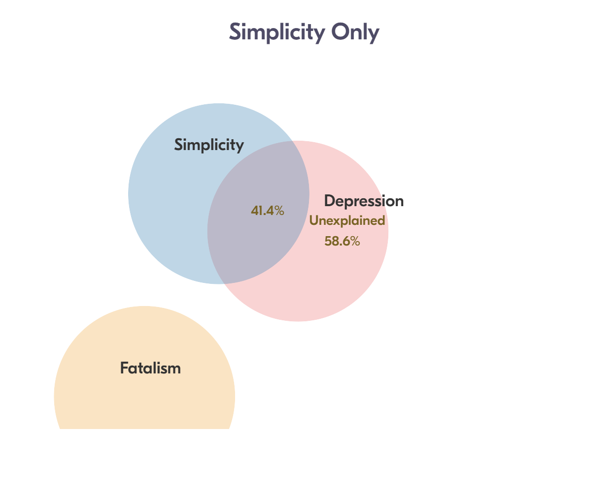
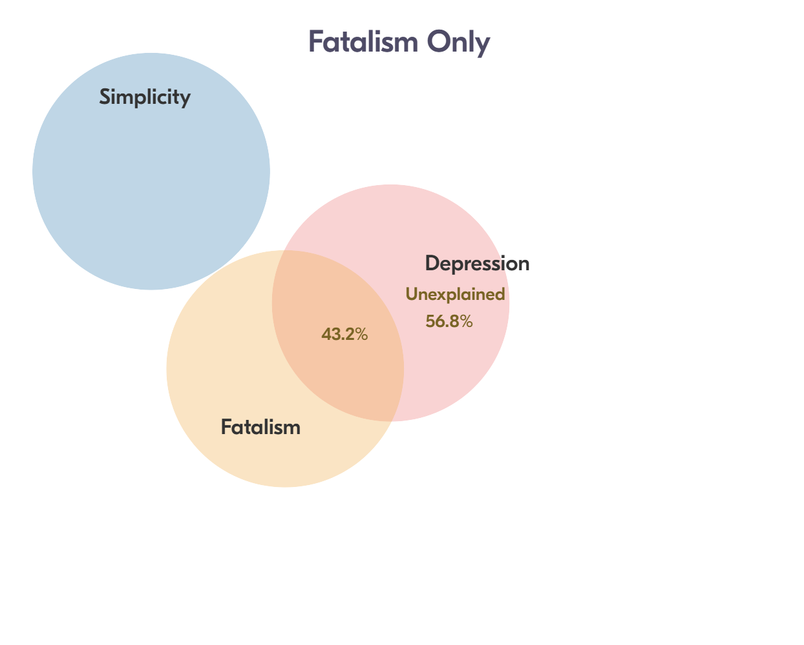
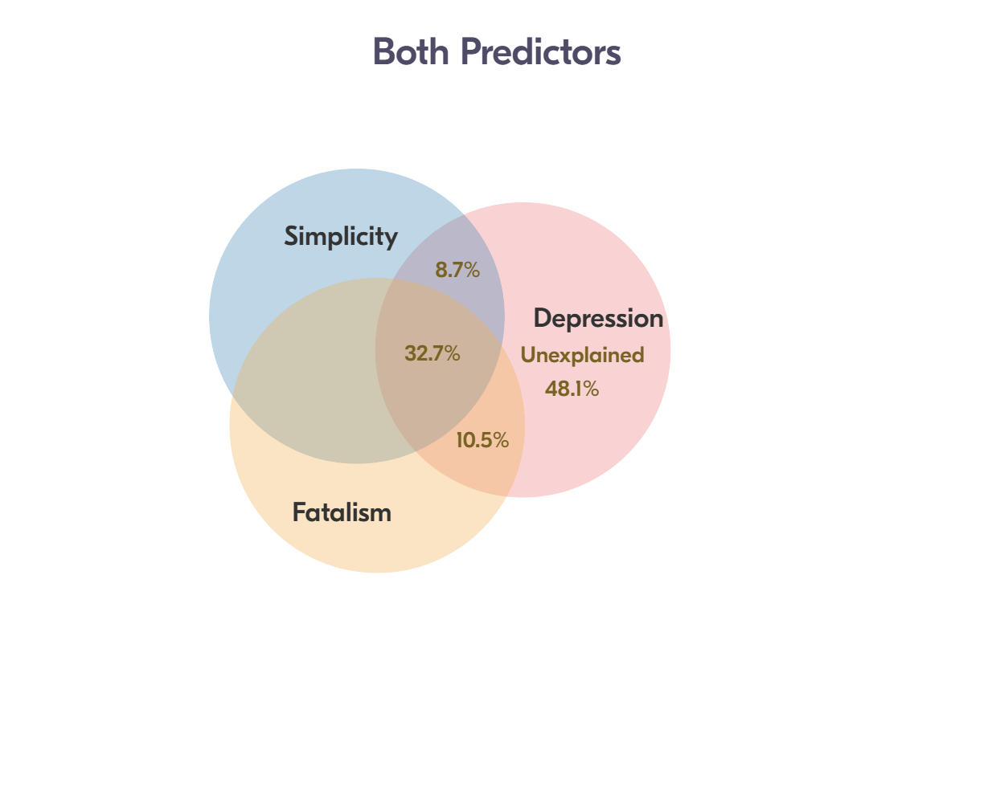

# Ex: Ginzberg Depression 


```{block type='rmdlink', echo=TRUE}
> References:  
> http://www.philender.com/courses/intro/notes/cor1.html
> https://lytarhan.rbind.io/post/variancepartitioning/
> https://stats.stackexchange.com/questions/552451/which-r-functions-are-correct-for-estimating-partial-eta-squared-for-effects-in
```


```{r}
# install.packages("remotes")
# remotes::install_github("sarbearschwartz/apaSupp")
# remotes::install_github("ddsjoberg/gtsummary")

library(carData)
library(tidyverse)   
library(broom)     
library(naniar)
library(corrplot)   
library(GGally)
library(gtsummary)
library(apaSupp)
library(performance)
library(interactions)
library(car)
library(effects)
library(emmeans)
library(ggResidpanel)
library(modelsummary)
library(ppcor)
library(jtools)
library(olsrr)
library(DescTools)
library(effectsize)
library(ggpubr)
```


## PURPOSE

### Background

Fatalism has been studied as a health belief since 1980. Several studies have found a positive association between fatalism and depression. Researchers have suggested that fatalism can make people more vulnerable to depression. 

If you have pathological Simplicity thinking, you can't think gray about nearly anything. You see everything in life as a black-and-white film. You think in such extremes, so you end up feeling in these extremes as well.

### Research Question

> Is there a relationship between depression and beliefs (simplicity and fatalism)? 
>
> More so, if we control for the assumed association between fatalism and depression, does simplistic beliefs play an additional role?


### Data Description

The data for psychiatric patients (*n* = 84) hospitalized for depression is provided by the `carData` package.

> Source: Personal communication from Georges Monette, Department of Mathematics and Statistics, York University, with the permission of the original investigator.
> 
> References: Fox, J. (2016) Applied Regression Analysis and Generalized Linear Models, Third Edition. Sage.

#### Variables


* `simplicity` Measures subject's need to see the world in black and white
* `fatalism` Fatalism scale
* `depression` Beck self-report depression scale


```{r}
data("Ginzberg", package = "carData")  

df_ginz <- Ginzberg
```


```{r}
tibble::glimpse(df_ginz)
```


\clearpage

## EXPLORATORY DATA ANALYSIS

```{block type='rmdimportant', echo=TRUE}
Before embarking on any inferencial anlaysis or modeling, always get familiar with your variables one at a time *(univariate)*, as well as pairwise *(bivariate)*.
```

### Summary Statistics


#### Univariate

```{r}
df_ginz %>% 
  dplyr::select("Simplicity" = simplicity,
                "Fatalism" = fatalism,
                "Depression" = depression) %>% 
  apaSupp::tab_desc(caption = "Description of Psychiatric Patients Hospitalized for Depression")
```


#### Bivariate

```{r}
df_ginz %>% 
  dplyr::select("Simplicity" = simplicity,
                "Fatalism" = fatalism,
                "Depression" = depression) %>% 
  apaSupp::tab_cor(caption = "Correlations Between Continuous Meaurses")
```


```{r}
df_ginz %>% 
  dplyr::select("Simplicity" = simplicity,
                "Fatalism" = fatalism,
                "Depression" = depression) %>% 
  cor(method = "pearson") %>% 
  corrplot::corrplot.mixed()
```


### Visualizations

#### Univariate 


```{block type='rmdimportant', echo=TRUE}
Always plot your data first!
```

```{r}
df_ginz %>% 
  apaSupp::spicy_histos(var = simplicity)
```

```{r}
df_ginz %>% 
  apaSupp::spicy_histos(var = fatalism)
```


```{r}
df_ginz %>% 
  apaSupp::spicy_histos(var = depression)
```


#### Bivariate


```{r}
df_ginz %>% 
  dplyr::select("Simplicity" = simplicity,
                "Fatalism" = fatalism,
                "Depression" = depression) %>%
  data.frame %>% 
  GGally::ggscatmat() +
  theme_bw()
```


```{r, fig.caption = "Scatterplot for Depression Regressed on Simplicity"}
df_ginz %>% 
  ggplot(aes(x = simplicity,
              y = depression)) +
  geom_point() +
  theme_bw() +
  geom_smooth(method = "lm",
              formula = y ~ x) +
  ggpubr::stat_regline_equation(label.x = 0.25,
                                label.y = 2.45,
                                size = 6) +
  labs(x = "Simplicity\n(need to see the world in black and white)",
       y = "Observed Depression\n(Beck self-report)")
```


```{r, fig.caption = "Scatterplot for Depression regresssed on Fatalism"}
df_ginz %>% 
  ggplot(aes(x = fatalism,
              y = depression)) +
  geom_point() +
  theme_bw() +
  geom_smooth(method = "lm",
              formula = y ~ x) +
  ggpubr::stat_regline_equation(label.x = 0,
                                label.y = 2.45,
                                size = 6) +
  labs(x = "Fatalism\n(belief that all events are predetermined and therefore inevitable)",
       y = "Observed Depression\n(Beck self-report)")
```


## REGRESSION ANALYSIS

* The dependent variable (DV) is depression score ($Y$)
* The independent variables (IVs) are 2 beliefs, simplicity and fatalism ($X_1$, $X_2$)


### Model 1: Fatalism


```{r}
fit_lm_fat <- lm(depression ~ fatalism,
               data = df_ginz)
```

```{r}
summary(fit_lm_fat)
```


### Model 2: Simplicity


```{r}
fit_lm_sim <- lm(depression ~ simplicity,
               data = df_ginz)
```

```{r}
summary(fit_lm_sim)
```

### Model 3: Both Beliefs


```{r}
fit_lm_both <- lm(depression ~ fatalism + simplicity,
               data = df_ginz)
```

```{r}
summary(fit_lm_both)
```


### Compare Models

```{r}
apaSupp::tab_lms(list(fit_lm_sim, fit_lm_fat, fit_lm_both))
```

### Multicolinearity Check

```{r}
car::vif(fit_lm_both)
```


### Residual Diagnostics


```{r}
performance::check_residuals(fit_lm_both)
```

```{r}
ggResidpanel::resid_panel(fit_lm_both)
```


## EFFECT SIZES

**Variance Explained** = variance in the DV "explained by" or "attributed to" the IV(s) 

### Variance Partitioning

Variance in the DV - Total

```{r}
var(df_ginz$depression)
```

Variance in the SV - Not attributed to Simplicity

```{r}
var(fit_lm_sim$residuals)
```


Variance in the SV - Not attributed to Fatalism

```{r}
var(fit_lm_fat$residuals)
```


Variance in the SV - Not attributed to the combination of Simplicity and Fatalism

```{r}
var(fit_lm_both$residuals)
```


#### Model with only Simplicity

```{r}
summary(fit_lm_sim)$r.squared
```


```{r}
1 - (var(fit_lm_sim$residuals)/var(df_ginz$depression))
```


```{r, echo=FALSE, out.width = "75%"}

```


#### Model with only Fatalism

```{r}
summary(fit_lm_fat)$r.squared
```


```{r}
1 - (var(fit_lm_fat$residuals)/var(df_ginz$depression))
```

```{r, echo=FALSE, out.width = "75%"}

```


#### Model with Both Predictors

```{r}
summary(fit_lm_both)$r.squared
```


```{r}
1 - (var(fit_lm_both$residuals)/var(df_ginz$depression))
```

```{r, echo=FALSE, out.width = "75%"}

```


### Variance Explained

#### R-squared 

AKA: "Coefficient of Determination"

Total for all the predictors in the model


* From Simplicity, not controlling for Fatalism = .414
* From Fatalism, not controlling for Simplicity = .432

* Total COLLECTIVELY from Both Beliefs = .519

"Coefficient of **NON-**Determination"

```{r}
1 - .519
```


#### Eta-Squared

AKA: "Semi-partial Correlation"


* Unique from only Simplicity, WHILE controlling for Fatalism

```{r}
.519 - .432
```


* Unique from only Fatalism, WHILE controlling for Simplicity

```{r}
.519 - .414
```


* Shared from OVERLAP in Both Beliefs 

```{r}
.432 + .414 - .519
```


#### Partial Eta-squared

AKA: "Partial Correlation"

* Unique from only Simplicity, AFTER controlling for Fatalism

```{r}
.087/(.087 + .481)
```

* Unique from only Fatalism, AFTER controlling for Simplicity

```{r}
.105/(.105 + .481)
```


#### Auto Calculations

```{r}
DescTools::EtaSq(fit_lm_both)
```

### Standardized Regression 

```{r}
parameters::standardise_parameters(fit_lm_both)
```


## APA WRITE-UP


### Methods

A sample of 82 psychiatric patients hospitalized for depression completed the Beck Depression Inventory by self-report.  Their beliefs in simplicity (*black and white thinking*) and fatalism (*fate controls everything*) were also self-reported and scored. 

To assess the potential relationship between both these beliefs and depressive symptoms, first Pearson correlations were computed between pairs of all three measures.  Then unadjusted, simple linear regression models for each belief score separately were compared to the multiple linear regression including both beliefs. Multiple linear regression was used to further investigate the hypothesized association between simplicity and depression after controlling for the previously documented correlation between fatalism and depression. Variance inflation factors (*VIF*) were computed to assess potential concern regarding colinearity between the two beliefs.


### Results

A summary of the participant measures is provided in Table 1.  Notably, the distribution of simplicity beliefs exhibited a high degree of positive skewness, while depressive symptoms was less positively skewed (*see supplemental materials*).    

Depressive Symptoms were positively correlated with both fatalism beliefs (*r* = .660) and simplicity beliefs (*r* = .640). A similar degree of correlation was manifest between the two types of belief (*r* = .630).

The unadjusted models are presented in Table 2.  The first model replicated previous studies, as fatalism beliefs exhibited a strong and significant association with depressive symptoms, *b* = 0.66, *SE* = 0.08, *p* < .001, $R^2$ = .43. The second model showed a similar association between simplicity beliefs and depressive symptoms, *b* = 0.64, *SE* = 0.09, *p* < .001, $R^2$ = .41.

Table 3 details the final model which revealed that after accounting for fatalism's role, simplicity beliefs accounted for 15% of the remaining variance in depressive symptoms, $\eta_p^2$ = .153. Over half of the total variance in depressive symptoms may be attributed to both beliefs together, $R_{adj}^2$ = .51. No concern was raised regarding multicolinearity, thus each belief exhibited a distinct association with depression symptom. Fatalism belief did expressed a slightly stronger association, *b* = 0.42, *SE* = 0.10, *p* < .001, $\eta^2$ = .105, compared to simplicity beliefs, *b* = 0.38, *SE* = 0.10, *p* < .001, $\eta^2$ = .087. 
  

### Tables

```{r}
df_ginz %>% 
  dplyr::select("Simplicity Beliefs" = simplicity,
                "Fatalism Beliefs" = fatalism,
                "Depressive Symptoms" = depression) %>% 
  apaSupp::tab_desc(caption = "Description of Sampled Psychiatric Patients Hospitalized for Depression",
                    general_note = "All measures are self-reported. Depressive symptoms are captured by the Beck Depression Inventory and each belief is scored between zero and three.")
```


```{r}
apaSupp::tab_lms(list(fit_lm_fat, fit_lm_sim),
                 mod_names = c("Model 1\nFatalism Only",
                               "Model 2\nSimplicity Only"),
                 var_labels = c("simplicity" = "Simplicity",
                                "fatalism"   = "Fatalism"),
                 caption = "Parameter Estimates for Unadjusted, Simple Linear Models Regressing Depressive Symptoms on EAch Belief Score Seperately",
                 general_note = "All measures are self-reported. Depressive symptoms are captured by the Beck Depression Inventory and each belief is scored between zero and three. N = 82.",
                 p_note = "*** p < .001")
```


```{r}
apaSupp::tab_lm(fit_lm_both,
                 var_labels = c("simplicity" = "Simplicity",
                                "fatalism"   = "Fatalism"),
                 caption = "Parameter Estimates for Multiple Linear Model Regressing Depressive Symptoms on Both Belief Scorse",
                 general_note = "All measures are self-reported. Depressive symptoms are captured by the Beck Depression Inventory and each belief is scored between zero and three. N = 82.",
                 p_note = "* p < .05. *** p < .001",
         std = FALSE,
         vif = TRUE)
```


