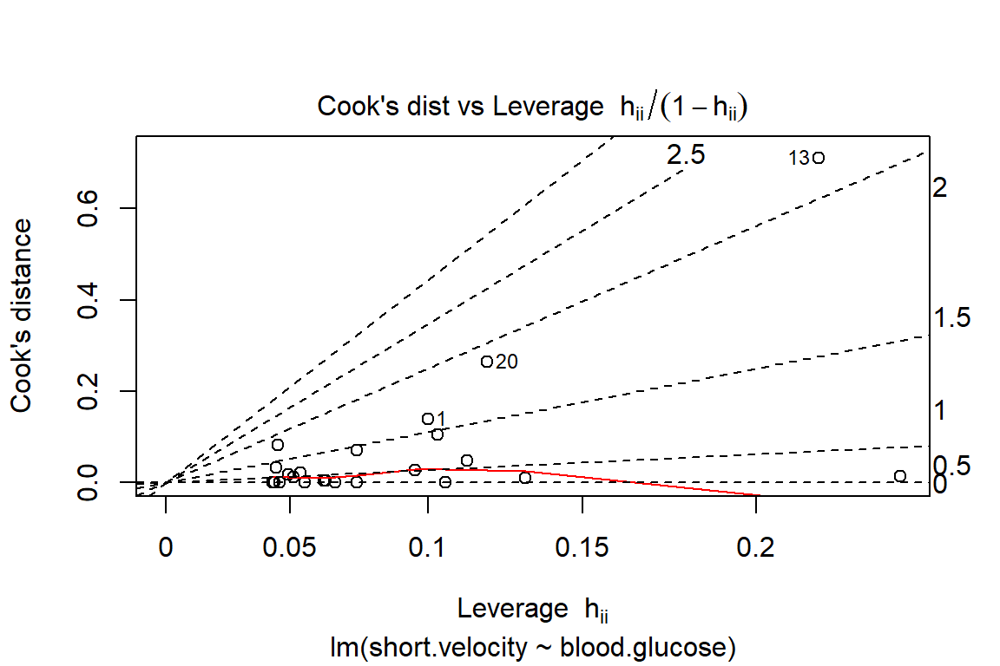
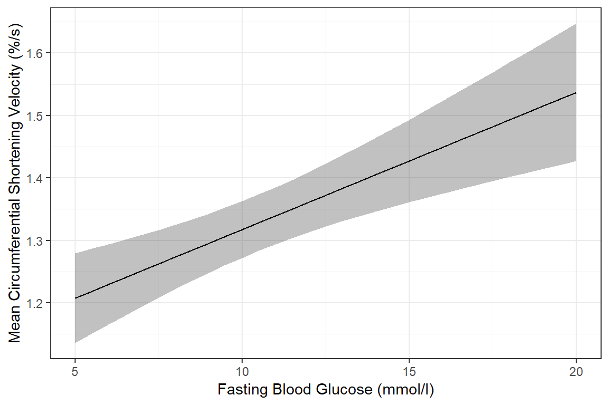

# Example: Ventricular Shortening Velocity  (simple linear regression)


```r
library(tidyverse)       # super helpful everything!
library(magrittr)        # includes other versions of the pipe 
library(haven)           # inporting SPSS data files
library(furniture)       # nice tables of descriptives
library(texreg)          # nice regression summary tables
library(stargazer)       # nice tables of descrip and regression
library(corrplot)        # visualize correlations
library(car)             # companion for applied regression
library(psych)           # lots of handy tools
library(ISwR)            # Introduction to Statistics with R (datasets)
```

## Purpose

### Research Question

> Is there a relationship between fasting blood flucose and shortening of ventricular velocity among type 1 diabetic patiences?  If so, what is the nature of the association?


### Data Description

This dataset is included in the `ISwR` package [@R-ISwR], which was a companion to the texbook "Introductory Statistics with R, 2nd ed." [@dalgaard2008], although it was first published by @altman1991 in table 11.6. 


> The `thuesen` data frame has 24 rows and 2 columns. It contains ventricular shortening velocity and blood glucose for type 1 diabetic patients.

* `blood.glucose` a numeric vector, fasting blood glucose (mmol/l).
* `short.velocity` a numeric vector, mean circumferential shortening velocity (%/s).


```r
data(thuesen, package = "ISwR")

tibble::glimpse(thuesen)  # view the class and 1st few values of each variable
```

```
Observations: 24
Variables: 2
$ blood.glucose  <dbl> 15.3, 10.8, 8.1, 19.5, 7.2, 5.3, 9.3, 11.1, 7.5...
$ short.velocity <dbl> 1.76, 1.34, 1.27, 1.47, 1.27, 1.49, 1.31, 1.09,...
```


## Exploratory Data Analysis

Before embarking on any inferencial anlaysis or modeling, always get familiar with your variables one at a time *(univariate)*, as well as pairwise *(bivariate)*.


### Univariate Statistics

Summary Statistics for all three variables of interest.


```r
thuesen %>% 
  stargazer::stargazer(type = "html")
```


<table style="text-align:center"><tr><td colspan="8" style="border-bottom: 1px solid black"></td></tr><tr><td style="text-align:left">Statistic</td><td>N</td><td>Mean</td><td>St. Dev.</td><td>Min</td><td>Pctl(25)</td><td>Pctl(75)</td><td>Max</td></tr>
<tr><td colspan="8" style="border-bottom: 1px solid black"></td></tr><tr><td style="text-align:left">blood.glucose</td><td>24</td><td>10.300</td><td>4.338</td><td>4.200</td><td>7.075</td><td>12.700</td><td>19.500</td></tr>
<tr><td style="text-align:left">short.velocity</td><td>23</td><td>1.326</td><td>0.233</td><td>1.030</td><td>1.185</td><td>1.420</td><td>1.950</td></tr>
<tr><td colspan="8" style="border-bottom: 1px solid black"></td></tr></table>

The `stargazer()` function has many handy options, should you wish to change the default settings.


```r
thuesen %>% 
  stargazer(type   = "html", 
            digits = 4, 
            flip   = TRUE,                    
            summary.stat   = c("n", "mean", "sd", "min", "median", "max"),
            title  = "Descriptives")
```


<table style="text-align:center"><caption><strong>Descriptives</strong></caption>
<tr><td colspan="3" style="border-bottom: 1px solid black"></td></tr><tr><td style="text-align:left">Statistic</td><td>blood.glucose</td><td>short.velocity</td></tr>
<tr><td colspan="3" style="border-bottom: 1px solid black"></td></tr><tr><td style="text-align:left">N</td><td>24</td><td>23</td></tr>
<tr><td style="text-align:left">Mean</td><td>10.3000</td><td>1.3257</td></tr>
<tr><td style="text-align:left">St. Dev.</td><td>4.3375</td><td>0.2329</td></tr>
<tr><td style="text-align:left">Min</td><td>4.2000</td><td>1.0300</td></tr>
<tr><td style="text-align:left">Median</td><td>9.4000</td><td>1.2700</td></tr>
<tr><td style="text-align:left">Max</td><td>19.5000</td><td>1.9500</td></tr>
<tr><td colspan="3" style="border-bottom: 1px solid black"></td></tr></table>

Although the `table1()` function from the `furniture` package creates a nice summary table, it 'hides' the nubmer of missing values for each continuous variable.


```r
thuesen %>% 
  furniture::table1()
```

```

----------------------------------
                Mean/Count (SD/%)
                n = 24           
 blood.glucose                   
                10.3 (4.3)       
 short.velocity                  
                1.3 (0.2)        
----------------------------------
```

### Univariate Visualizations


```r
thuesen %>% 
  ggplot() +
  aes(blood.glucose) +              # variable of interest (just one)
  geom_histogram(binwidth = 2)      # specify the width of the bars
```


```r
thuesen %>% 
  ggplot() +
  aes(short.velocity) +              # variable of interest (just one)
  geom_histogram(bins = 10)          # specify the number of bars
```


### Bivariate Statistics (Unadjusted Pearson's correlation)

The `cor()` fucntion in base $R$ doesn't like `NA` or missing values


```r
thuesen %>% cor()           
```

```
               blood.glucose short.velocity
blood.glucose              1             NA
short.velocity            NA              1
```


You may specify how to handle cases that are missing on at least one of the variables of interest:

* `use = "everything"` `NA`s will propagate conceptually, i.e., a resulting value will be `NA` whenever one of its contributing observations is `NA` **<-- DEFAULT**
*`use = "all.obs"` the presence of missing observations will produce an error
* `use = "complete.obs"` missing values are handled by casewise deletion (and if there are no complete cases, that gives an error). 
* `use = "na.or.complete"` is the same as above unless there are no complete cases, that gives `NA` 
* `use = "pairwise.complete.obs"` the correlation between each pair of variables is computed using all complete pairs of observations on those variables. This can result in covariance matrices which are not positive semi-definite, as well as `NA` entries if there are no complete pairs for that pair of variables. 


Commonly, we want  **listwise deletion**:


```r
thuesen %>% cor(use = "complete.obs")   # list-wise deletion
```

```
               blood.glucose short.velocity
blood.glucose      1.0000000      0.4167546
short.velocity     0.4167546      1.0000000
```


It is also handy to specify the  number of decimal places desired, but adding a rounding step:


```r
thuesen %>% 
  cor(use="complete.obs") %>%   
  round(2)                       # number od decimal places
```

```
               blood.glucose short.velocity
blood.glucose           1.00           0.42
short.velocity          0.42           1.00
```


If you desire a correlation single value of a single PAIR of variables, instead of a matrix, then you must use a **`magrittr` exposition pipe (`%$%`)** 


```r
thuesen %$%                            # notice the special kind of pipe
  cor(blood.glucose, short.velocity,   # specify exactly TWO variables            
      use="complete.obs")
```

```
[1] 0.4167546
```

In addition to the `cor()` funciton, the base $R$ `stats` package also includes the `cor.test()` function to test if the correlation is zero ($H_0: R = 0$)

This TESTS if the cor == 0

```r
thuesen %$%                                 # notice the special kind of pipe
  cor.test(blood.glucose, short.velocity,   # specify exactly TWO variables            
           use="complete.obs")
```

```

	Pearson's product-moment correlation

data:  blood.glucose and short.velocity
t = 2.101, df = 21, p-value = 0.0479
alternative hypothesis: true correlation is not equal to 0
95 percent confidence interval:
 0.005496682 0.707429479
sample estimates:
      cor 
0.4167546 
```


The default correltaion type for `cor()`is **Pearson's $R$**, which assesses linear relationships.  **Spearman's correlation** assesses monotonic relationships.


```r
thuesen %$%                            # notice the special kind of pipe
  cor(blood.glucose, short.velocity,   # specify exactly TWO variables  
           use    = 'complete',
           method = 'spearman')       # spearman's (rho) 
```

```
[1] 0.318002
```


### Bivariate Visualization

Scatterplots show the relationship between two continuous measures (one on the $x-axis$ and the other on the $y-axis$), with one point for each observation.


```r
thuesen %>% 
  ggplot() +
  aes(x = blood.glucose,         # x-axis variable
      y = short.velocity)) +     # y-axis variable
  geom_point() +                 # place a point for each observation
  theme_bw()                     # black-and-white theme 
```

Both the code chunk above and below produce the same plot.


```r
ggplot(thuesen, 
       aes(x = blood.glucose,        # x-axis variable
           y = short.velocity)) +    # y-axis variable
  geom_point() +                     # place a point for each observation
  theme_bw()                         # black-and-white theme 
```


## Regression Analysis


### Fit A Simple Linear Model


$$
Y = \beta_0 + \beta_1 \times X
$$

* `short.velocity` dependent variable or outcome ($Y$)
* `blood.glucose` independent variable or predictor ($X$)

The `lm()` function must be supplied with at least two options:

* a formula:  `Y ~ X`
* a dataset: `data = XXXXXXX`

When a model is fit and directly saved as a named object via the assignment opperator (`<-`), no output is produced.


```r
fit_vel_glu <- lm(short.velocity ~ blood.glucose, data = thuesen)
```


Running the name of the fit object yields very little output:


```r
fit_vel_glu
```

```

Call:
lm(formula = short.velocity ~ blood.glucose, data = thuesen)

Coefficients:
  (Intercept)  blood.glucose  
      1.09781        0.02196  
```


Appling the `summary()` funciton produced a good deal more output:


```r
summary(fit_vel_glu)
```

```

Call:
lm(formula = short.velocity ~ blood.glucose, data = thuesen)

Residuals:
     Min       1Q   Median       3Q      Max 
-0.40141 -0.14760 -0.02202  0.03001  0.43490 

Coefficients:
              Estimate Std. Error t value Pr(>|t|)    
(Intercept)    1.09781    0.11748   9.345 6.26e-09 ***
blood.glucose  0.02196    0.01045   2.101   0.0479 *  
---
Signif. codes:  0 '***' 0.001 '**' 0.01 '*' 0.05 '.' 0.1 ' ' 1

Residual standard error: 0.2167 on 21 degrees of freedom
  (1 observation deleted due to missingness)
Multiple R-squared:  0.1737,	Adjusted R-squared:  0.1343 
F-statistic: 4.414 on 1 and 21 DF,  p-value: 0.0479
```

You may request specific pieces of the output:

* Coefficients or beta estimates:


```r
coef(fit_vel_glu)
```

```
  (Intercept) blood.glucose 
   1.09781488    0.02196252 
```

* 95% confidence intervals for the coefficients or beta estimates:


```r
confint(fit_vel_glu)
```

```
                     2.5 %     97.5 %
(Intercept)   0.8534993816 1.34213037
blood.glucose 0.0002231077 0.04370194
```

* The F-test for overall modle fit vs. a $null$ or empty model having only an intercept and no predictors.


```r
anova(fit_vel_glu)
```

```
# A tibble: 2 x 5
     Df `Sum Sq` `Mean Sq` `F value` `Pr(>F)`
* <int>    <dbl>     <dbl>     <dbl>    <dbl>
1     1    0.207    0.207       4.41   0.0479
2    21    0.986    0.0470     NA     NA     
```

* Various other model fit indicies:


```r
logLik(fit_vel_glu)     
```

```
'log Lik.' 3.583612 (df=3)
```

```r
AIC(fit_vel_glu)
```

```
[1] -1.167223
```

```r
BIC(fit_vel_glu)
```

```
[1] 2.239259
```


### Checking Assumptions via Residual Diagnostics

Before reporting a model, ALWAYS make sure to check the residules to ensure that the model assumptions are not violated.


```r
plot(fit_vel_glu, which = 1)
```


```r
plot(fit_vel_glu, which = 2)
```


```r
plot(fit_vel_glu, which = 5)
```


```r
plot(fit_vel_glu, which = 6)
```




Viewing potentially influencial or outlier points based on plots above:


```r
thuesen %>% 
  dplyr::mutate(id = row_number()) %>% 
  dplyr::filter(id == c(13, 20, 24))
```

```
# A tibble: 3 x 3
  blood.glucose short.velocity    id
          <dbl>          <dbl> <int>
1          19             1.95    13
2          16.1           1.05    20
3           9.5           1.7     24
```


```r
car::residualPlots(fit_vel_glu)
```


```
              Test stat Pr(>|Test stat|)
blood.glucose    0.9289           0.3640
Tukey test       0.9289           0.3529
```


Here is a fancy way to visulaize 'potential problem cases' with `ggplot2`:


```r
thuesen %>% 
  dplyr::filter(complete.cases(.)) %>%                # get ride fo the incomplete cases
  ggplot() +                                          # name the FULL dataset 
  aes(x = blood.glucose,                              # x-axis variable name
      y = short.velocity) +                           # y-axis variable name
  geom_point() +                                      # do a scatterplot
  stat_smooth(method = "lm") +                        # smooth: linear model
  theme_bw()  +                                       # black-and-while theme
  geom_point(data = thuesen %>%                       # override the dataset from above
               filter(row_number() == c(13, 20, 24)), # with a reduced subset of cases
             size = 4,                                # make the points bigger in size 
             color = "red")                           # give the points a different color
```


### Manually checking residual diagnostics

You may extract values from the model in dataset form and then you can maually plot the residuals.


```r
thuesen %>% 
  dplyr::filter(complete.cases(.)) %>%            # get ride fo the incomplete cases
  dplyr::mutate(pred = fitted(fit_vel_glu)) %>%   # fitted/prediction values
  dplyr::mutate(resid = residuals(fit_vel_glu))   # residual values
```

```
# A tibble: 23 x 4
   blood.glucose short.velocity  pred    resid
           <dbl>          <dbl> <dbl>    <dbl>
 1          15.3           1.76  1.43  0.326  
 2          10.8           1.34  1.34  0.00499
 3           8.1           1.27  1.28 -0.00571
 4          19.5           1.47  1.53 -0.0561 
 5           7.2           1.27  1.26  0.0141 
 6           5.3           1.49  1.21  0.276  
 7           9.3           1.31  1.30  0.00793
 8          11.1           1.09  1.34 -0.252  
 9           7.5           1.18  1.26 -0.0825 
10          12.2           1.22  1.37 -0.146  
# ... with 13 more rows
```

Check for equal spread of points along the $y=0$ horizontal line: 


```r
thuesen %>% 
  dplyr::mutate(id = row_number()) %>% 
  dplyr::filter(complete.cases(.)) %>%                # get ride fo the incomplete cases
  dplyr::mutate(pred = fitted(fit_vel_glu)) %>%       # fitted/prediction values
  dplyr::mutate(resid = residuals(fit_vel_glu)) %>%   # residual values
  ggplot() +
  aes(x = id,
      y = resid) +
  geom_point() +
  geom_hline(yintercept = 0,
             color = "red",
             size = 1,
             linetype = "dashed") +
  theme_classic() +
  labs(title = "Looking for homogeneity of residuals",
       subtitle = "want to see equal spread all across")
```


Check for normality:


```r
thuesen %>% 
  dplyr::filter(complete.cases(.)) %>%                # get ride fo the incomplete cases
  dplyr::mutate(pred = fitted(fit_vel_glu)) %>%       # fitted/prediction values
  dplyr::mutate(resid = residuals(fit_vel_glu)) %>%   # residual values
  ggplot() +
  aes(resid) +
  geom_histogram(bins = 12,
                 color = "blue",
                 fill = "blue",
                 alpha = 0.3) +
  geom_vline(xintercept = 0,
             size = 1,
             color = "red",
             linetype = "dashed") +
  theme_classic() +
  labs(title = "Looking for normality of residuals",
       subtitle = "want to see roughly a bell curve")
```


## Conclusion


### Tabulate the Final Model Summary

You may also present the output in a table using two different packages:

* The `stargazer` package has `stargazer()` function:


```r
stargazer::stargazer(fit_vel_glu, type = "html")
```


<table style="text-align:center"><tr><td colspan="2" style="border-bottom: 1px solid black"></td></tr><tr><td style="text-align:left"></td><td><em>Dependent variable:</em></td></tr>
<tr><td></td><td colspan="1" style="border-bottom: 1px solid black"></td></tr>
<tr><td style="text-align:left"></td><td>short.velocity</td></tr>
<tr><td colspan="2" style="border-bottom: 1px solid black"></td></tr><tr><td style="text-align:left">blood.glucose</td><td>0.022<sup>**</sup></td></tr>
<tr><td style="text-align:left"></td><td>(0.010)</td></tr>
<tr><td style="text-align:left"></td><td></td></tr>
<tr><td style="text-align:left">Constant</td><td>1.098<sup>***</sup></td></tr>
<tr><td style="text-align:left"></td><td>(0.117)</td></tr>
<tr><td style="text-align:left"></td><td></td></tr>
<tr><td colspan="2" style="border-bottom: 1px solid black"></td></tr><tr><td style="text-align:left">Observations</td><td>23</td></tr>
<tr><td style="text-align:left">R<sup>2</sup></td><td>0.174</td></tr>
<tr><td style="text-align:left">Adjusted R<sup>2</sup></td><td>0.134</td></tr>
<tr><td style="text-align:left">Residual Std. Error</td><td>0.217 (df = 21)</td></tr>
<tr><td style="text-align:left">F Statistic</td><td>4.414<sup>**</sup> (df = 1; 21)</td></tr>
<tr><td colspan="2" style="border-bottom: 1px solid black"></td></tr><tr><td style="text-align:left"><em>Note:</em></td><td style="text-align:right"><sup>*</sup>p<0.1; <sup>**</sup>p<0.05; <sup>***</sup>p<0.01</td></tr>
</table>


<div class="rmdlightbulb">
<p>The <code>stargazer</code> package can produce the regression table in various output types:</p>
<ul>
<li><code>type = &quot;latex</code> <strong>Default</strong> Use when knitting your .Rmd file to a .pdf via LaTeX</li>
<li><code>type = &quot;text</code> <strong>Default</strong> Use when working on a project and viewing tables on your computer screen</li>
<li><code>type = &quot;html</code> <strong>Default</strong> Use when knitting your .Rmd file to a .html document</li>
</ul>
</div>

* The `texreg` package has the `texreg()` fucntion:


```r
texreg::htmlreg(fit_vel_glu)
```


<!DOCTYPE HTML PUBLIC "-//W3C//DTD HTML 4.01 Transitional//EN" "http://www.w3.org/TR/html4/loose.dtd">
<table cellspacing="0" align="center" style="border: none;">
<caption align="bottom" style="margin-top:0.3em;">Statistical models</caption>
<tr>
<th style="text-align: left; border-top: 2px solid black; border-bottom: 1px solid black; padding-right: 12px;"><b></b></th>
<th style="text-align: left; border-top: 2px solid black; border-bottom: 1px solid black; padding-right: 12px;"><b>Model 1</b></th>
</tr>
<tr>
<td style="padding-right: 12px; border: none;">(Intercept)</td>
<td style="padding-right: 12px; border: none;">1.10<sup style="vertical-align: 0px;">***</sup></td>
</tr>
<tr>
<td style="padding-right: 12px; border: none;"></td>
<td style="padding-right: 12px; border: none;">(0.12)</td>
</tr>
<tr>
<td style="padding-right: 12px; border: none;">blood.glucose</td>
<td style="padding-right: 12px; border: none;">0.02<sup style="vertical-align: 0px;">*</sup></td>
</tr>
<tr>
<td style="padding-right: 12px; border: none;"></td>
<td style="padding-right: 12px; border: none;">(0.01)</td>
</tr>
<tr>
<td style="border-top: 1px solid black;">R<sup style="vertical-align: 0px;">2</sup></td>
<td style="border-top: 1px solid black;">0.17</td>
</tr>
<tr>
<td style="padding-right: 12px; border: none;">Adj. R<sup style="vertical-align: 0px;">2</sup></td>
<td style="padding-right: 12px; border: none;">0.13</td>
</tr>
<tr>
<td style="padding-right: 12px; border: none;">Num. obs.</td>
<td style="padding-right: 12px; border: none;">23</td>
</tr>
<tr>
<td style="border-bottom: 2px solid black;">RMSE</td>
<td style="border-bottom: 2px solid black;">0.22</td>
</tr>
<tr>
<td style="padding-right: 12px; border: none;" colspan="3"><span style="font-size:0.8em"><sup style="vertical-align: 0px;">***</sup>p &lt; 0.001, <sup style="vertical-align: 0px;">**</sup>p &lt; 0.01, <sup style="vertical-align: 0px;">*</sup>p &lt; 0.05</span></td>
</tr>
</table>


<div class="rmdlightbulb">
<p>The <code>texreg</code> package contains three version of the regression table function.</p>
<ul>
<li><code>screenreg()</code> Use when working on a project and viewing tables on your computer screen</li>
<li><code>htmlreg()</code> Use when knitting your .Rmd file to a .html document</li>
<li><code>texreg()</code> Use when knitting your .Rmd file to a .pdf via LaTeX</li>
</ul>
</div>


### Plot the Model

When a model only contains main effects, a plot is not important for interpretation, but can help understand the relationship between multiple predictors.


The `Effect()` function from the `effects` package chooses '5 or 6 nice values' for your continuous independent variable ($X$) based on the range of values found in the dataset on which the model was fit and plugs them into the regression equation $Y = \beta_0 + \beta_1 \times X$ to compute the predicted *mean* value of the outcome ($Y$).


```r
effects::Effect(focal.predictors = c("blood.glucose"),  # IV variable name
                mod = fit_vel_glu)                      # fitted model name
```

```

 blood.glucose effect
blood.glucose
     4.2        8       12       16       20 
1.190057 1.273515 1.361365 1.449215 1.537065 
```

You may override the 'nice values' using the `xlevels = list(var_name = c(#, #, ...#)` option.


```r
effects::Effect(focal.predictors = c("blood.glucose"),
                mod = fit_vel_glu,
                xlevels = list(blood.glucose = c(5, 10, 15, 20))) 
```

```

 blood.glucose effect
blood.glucose
       5       10       15       20 
1.207627 1.317440 1.427253 1.537065 
```

Adding a piped data frame step (` %>% data.frame()`) will arrange the predicted $Y$ values into a column called `fit`.  This tidy data format is ready for plotting.


```r
effects::Effect(focal.predictors = c("blood.glucose"),
                mod = fit_vel_glu) %>% 
  data.frame() 
```

```
# A tibble: 5 x 5
  blood.glucose   fit     se lower upper
*         <dbl> <dbl>  <dbl> <dbl> <dbl>
1           4.2  1.19 0.0788  1.03  1.35
2           8    1.27 0.0516  1.17  1.38
3          12    1.36 0.0483  1.26  1.46
4          16    1.45 0.0742  1.29  1.60
5          20    1.54 0.110   1.31  1.77
```


```r
effects::Effect(focal.predictors = c("blood.glucose"),
                mod = fit_vel_glu,
                xlevels = list(blood.glucose = c(5, 12, 20))) %>% 
  data.frame() %>% 
  ggplot() +
  aes(x = blood.glucose,           # x-axis variable
      y = fit) +                   # y-axis variable
  geom_ribbon(aes(ymin = lower,    # bottom edge of the ribbon
                  ymax = upper),   # top edge of the ribbon
              alpha = .5) +        # ribbon transparency level
  geom_line() +
  theme_bw()
```


Notice that although the regression line is smooth, the ribbon is choppy.  This is because we are basing it on only THREE values of $X$.


```r
c(5, 12, 20)
```

```
[1]  5 12 20
```

Use the `seq()` function in base $R$ to request many values of $X$


```r
seq(from = 5, to = 20, by = 5)
```

```
[1]  5 10 15 20
```


```r
seq(from = 5, to = 20, by = 2)
```

```
[1]  5  7  9 11 13 15 17 19
```


```r
seq(from = 5, to = 20, by = 1)
```

```
 [1]  5  6  7  8  9 10 11 12 13 14 15 16 17 18 19 20
```


```r
seq(from = 5, to = 20, by = .5)
```

```
 [1]  5.0  5.5  6.0  6.5  7.0  7.5  8.0  8.5  9.0  9.5 10.0 10.5 11.0 11.5
[15] 12.0 12.5 13.0 13.5 14.0 14.5 15.0 15.5 16.0 16.5 17.0 17.5 18.0 18.5
[29] 19.0 19.5 20.0
```


```r
effects::Effect(focal.predictors = c("blood.glucose"),
                mod = fit_vel_glu,
                xlevels = list(blood.glucose = seq(from = 5, to = 20, by = .5))) %>% 
  data.frame() %>% 
  ggplot() +
  aes(x = blood.glucose,           # x-axis variable
      y = fit) +                   # y-axis variable
  geom_ribbon(aes(ymin = lower,    # bottom edge of the ribbon
                  ymax = upper),   # top edge of the ribbon
              alpha = .5) +        # ribbon transparency level
  geom_line() +
  theme_bw()
```


Now that we are basing our ribbon on MANY more points of $X$, the ribbon is much smoother.


For publication, you would of course want to clean up the plot a bit more:


```r
effects::Effect(focal.predictors = c("blood.glucose"),
                mod = fit_vel_glu,
                xlevels = list(blood.glucose = seq(from = 5, to = 20, by = .5))) %>% 
  data.frame() %>% 
  ggplot() +
  aes(x = blood.glucose,           # x-axis variable
      y = fit) +                   # y-axis variable
  geom_ribbon(aes(ymin = lower,    # bottom edge of the ribbon
                  ymax = upper),   # top edge of the ribbon
              alpha = .3) +        # ribbon transparency level
  geom_line() +
  theme_bw() +
  labs(x = "Fasting Blood Glucose (mmol/l)",
       y = "Mean Circumferential Shortening Velocity (%/s)")   # axis labels
```


The above plot has a ribbon that represents a 95% confidence interval (`lower` to`upper`) for the MEAN (`fit`) outcome.  Sometimes we would rather display a ribbon for only the MEAN (`fit`) plus-or-minus ONE STANDARD ERROR (`se`) for the mean.  You would do that by changing the variables that define the min and max edges of the ribbon (notice the range of the y-axis has changed):


```r
effects::Effect(focal.predictors = c("blood.glucose"),
                mod = fit_vel_glu,
                xlevels = list(blood.glucose = seq(from = 5, to = 20, by = .5))) %>% 
  data.frame() %>% 
  ggplot() +
  aes(x = blood.glucose,           
      y = fit) +                   
  geom_ribbon(aes(ymin = fit - se,    # bottom edge of the ribbon
                  ymax = fit + se),   # top edge of the ribbon
              alpha = .3) +        
  geom_line() +
  theme_bw() +
  labs(x = "Fasting Blood Glucose (mmol/l)",
       y = "Mean Circumferential Shortening Velocity (%/s)")   
```




Of course, you could do both ribbons together:


```r
effects::Effect(focal.predictors = c("blood.glucose"),
                mod = fit_vel_glu,
                xlevels = list(blood.glucose = seq(from = 5, to = 20, by = .5))) %>% 
  data.frame() %>% 
  ggplot() +
  aes(x = blood.glucose,           
      y = fit) +                  
  geom_ribbon(aes(ymin = lower,    # bottom edge of the ribbon = lower of the 95% CI
                  ymax = upper),   # top edge of the ribbon = upper of the 95% CI
              alpha = .3) +        
  geom_ribbon(aes(ymin = fit - se,    # bottom edge of the ribbon = mean - SE
                  ymax = fit + se),   # top edge of the ribbon = Mean + SE
              alpha = .3) +        
  geom_line() +
  theme_bw() +
  labs(x = "Fasting Blood Glucose (mmol/l)",
       y = "Mean Circumferential Shortening Velocity (%/s)")   # axis labels
```


