# Example: Obesity and Blood Pressure


## Packages


```r
library(tidyverse)
library(magrittr)
library(furniture)
library(texreg)
library(stargazer)
library(psych)
library(car)
library(gpairs)
library(GGally)
library(corrplot)
library(ggthemes)
library(RColorBrewer)
library(effects)
library(ISwR)  # Introduction to Statistics with R (datasets)
```


## The Data


Load dataset that is included in the `ISwR` package


```r
data(bp.obese)
```

View documentation for the dataset (required for all data included in packages) by typeing `?bp.obese` in the console

Have a quick *look* at what we have in the data:


```r
glimpse(bp.obese)
```

```
## Observations: 102
## Variables: 3
## $ sex   <int> 0, 0, 0, 0, 0, 0, 0, 0, 0, 0, 0, 0, 0, 0, 0, 0, 0, 0, 0,...
## $ obese <dbl> 1.31, 1.31, 1.19, 1.11, 1.34, 1.17, 1.56, 1.18, 1.04, 1....
## $ bp    <int> 130, 148, 146, 122, 140, 146, 132, 110, 124, 150, 120, 1...
```

### Declare and Label Factors


```r
bp.obese <- bp.obese %>% 
  dplyr::mutate(sex = factor(sex,
                             labels = c("Male", "Female"))) 

glimpse(bp.obese)
```

```
## Observations: 102
## Variables: 3
## $ sex   <fct> Male, Male, Male, Male, Male, Male, Male, Male, Male, Ma...
## $ obese <dbl> 1.31, 1.31, 1.19, 1.11, 1.34, 1.17, 1.56, 1.18, 1.04, 1....
## $ bp    <int> 130, 148, 146, 122, 140, 146, 132, 110, 124, 150, 120, 1...
```

## Explore the Raw Data

### Tabular Descriptions: Summary Statistics


```r
stargazer::stargazer(bp.obese,
                     type = "html")  
```


<table style="text-align:center"><tr><td colspan="8" style="border-bottom: 1px solid black"></td></tr><tr><td style="text-align:left">Statistic</td><td>N</td><td>Mean</td><td>St. Dev.</td><td>Min</td><td>Pctl(25)</td><td>Pctl(75)</td><td>Max</td></tr>
<tr><td colspan="8" style="border-bottom: 1px solid black"></td></tr><tr><td style="text-align:left">obese</td><td>102</td><td>1.313</td><td>0.258</td><td>0.810</td><td>1.143</td><td>1.430</td><td>2.390</td></tr>
<tr><td style="text-align:left">bp</td><td>102</td><td>127.020</td><td>18.184</td><td>94</td><td>116</td><td>137.5</td><td>208</td></tr>
<tr><td colspan="8" style="border-bottom: 1px solid black"></td></tr></table>


```r
furniture::table1(bp.obese,
                  output = "html")  
```

<table>
 <thead>
  <tr>
   <th>   </th>
   <th> Mean/Count (SD/%) </th>
  </tr>
 </thead>
<tbody>
  <tr>
   <td>  </td>
   <td> n = 102 </td>
  </tr>
  <tr>
   <td> sex </td>
   <td>  </td>
  </tr>
  <tr>
   <td> Male </td>
   <td> 44 (43.1%) </td>
  </tr>
  <tr>
   <td> Female </td>
   <td> 58 (56.9%) </td>
  </tr>
  <tr>
   <td> obese </td>
   <td>  </td>
  </tr>
  <tr>
   <td>  </td>
   <td> 1.3 (0.3) </td>
  </tr>
  <tr>
   <td> bp </td>
   <td>  </td>
  </tr>
  <tr>
   <td>  </td>
   <td> 127.0 (18.2) </td>
  </tr>
</tbody>
</table>


```r
bp.obese %>% 
  furniture::table1(obese, bp,
                    splitby = ~ sex,
                    test = TRUE,
                    output = "html")  
```

<table>
 <thead>
  <tr>
   <th>   </th>
   <th> Male </th>
   <th> Female </th>
   <th> P-Value </th>
  </tr>
 </thead>
<tbody>
  <tr>
   <td>  </td>
   <td> n = 44 </td>
   <td> n = 58 </td>
   <td>  </td>
  </tr>
  <tr>
   <td> obese </td>
   <td>  </td>
   <td>  </td>
   <td> &lt;.001 </td>
  </tr>
  <tr>
   <td>  </td>
   <td> 1.2 (0.2) </td>
   <td> 1.4 (0.3) </td>
   <td>  </td>
  </tr>
  <tr>
   <td> bp </td>
   <td>  </td>
   <td>  </td>
   <td> 0.646 </td>
  </tr>
  <tr>
   <td>  </td>
   <td> 128.0 (16.6) </td>
   <td> 126.3 (19.4) </td>
   <td>  </td>
  </tr>
</tbody>
</table>


### Visualization

`base` graphics:


```r
pairs(bp.obese)
```


`psych` package:


```r
psych::pairs.panels(bp.obese)
```

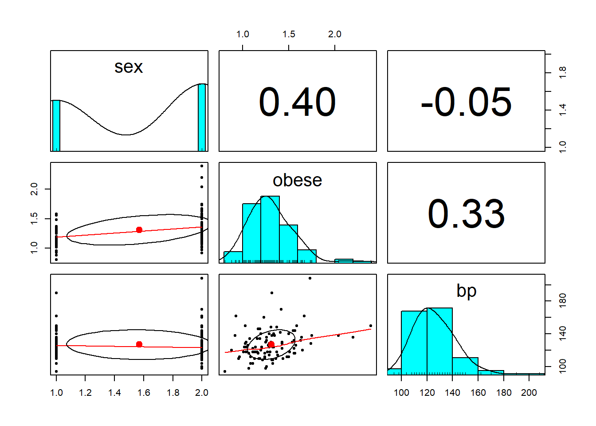


`gpairs` package:


```r
gpairs::gpairs(bp.obese)
```

```
## Loading required package: grid
```

```
## Loading required package: lattice
```

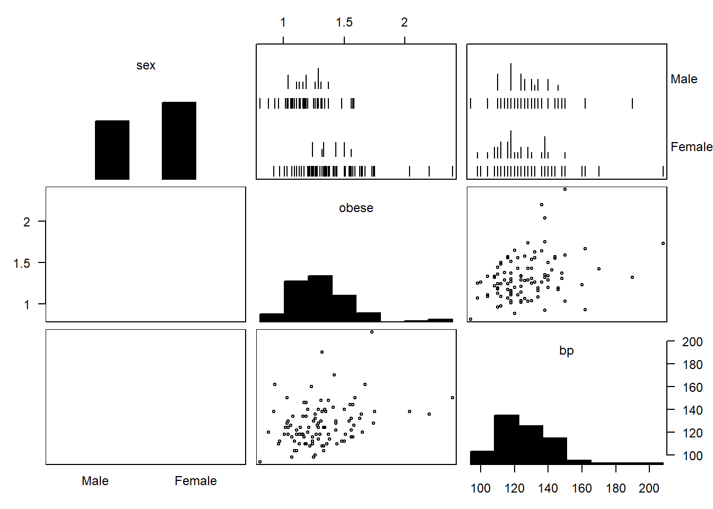

Change up the defaults:


```r
gpairs::gpairs(bp.obese, 
               upper.pars   = list(scatter = "stats"),
               scatter.pars = list(col = as.numeric(bp.obese$sex)))
```

```
## Warning in cor.test.default(x, y, method = "spearman", alternative =
## "two.sided"): Cannot compute exact p-value with ties
```

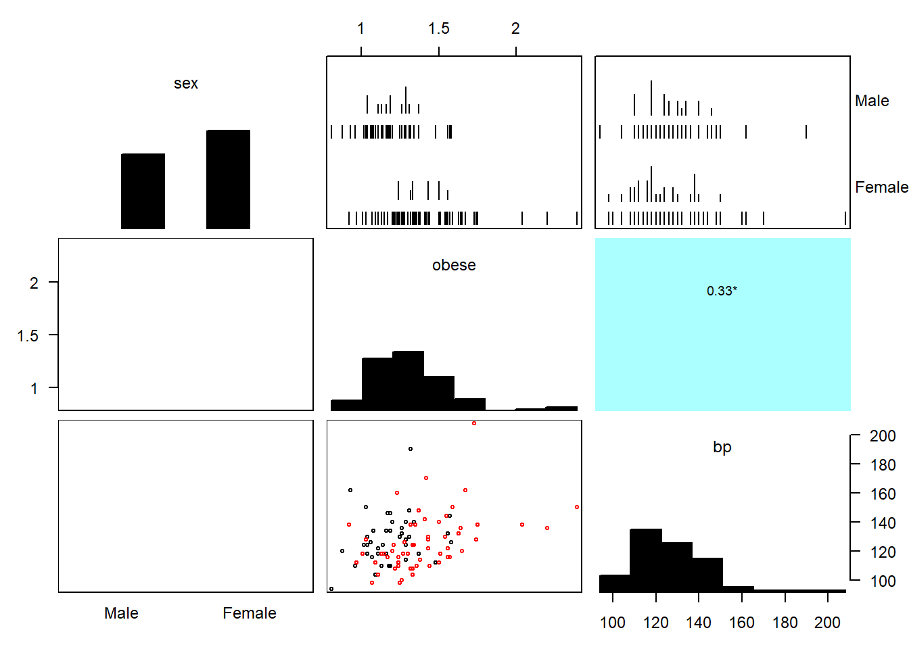


`GGally` package (wrapper for `ggplot2`):


```r
GGally::ggpairs(bp.obese)
```

```
## `stat_bin()` using `bins = 30`. Pick better value with `binwidth`.
## `stat_bin()` using `bins = 30`. Pick better value with `binwidth`.
```


Use the options to make it even better:


```r
# fancy options (I can't figure out how to change the color palette)
GGally::ggpairs(bp.obese,
                mapping = aes(fill      = sex,
                              col       = sex,
                              alpha     = 0.1),
                upper = list(continuous = "smooth",
                             combo      = "facethist",
                             discrete   = "ratio"),
                lower = list(continuous = "cor",
                             combo      = "box",
                             discrete   = "facetbar"),
                title = "Very Useful for Exploring Data") 
```

```
## `stat_bin()` using `bins = 30`. Pick better value with `binwidth`.
## `stat_bin()` using `bins = 30`. Pick better value with `binwidth`.
```

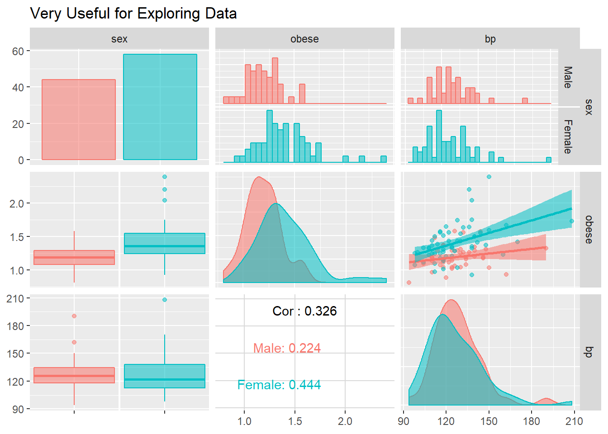


`ggplot2`: specify plot type


```r
ggplot(data = bp.obese, 
       mapping = aes(x = sex, y = bp)) + 
  geom_boxplot() 
```

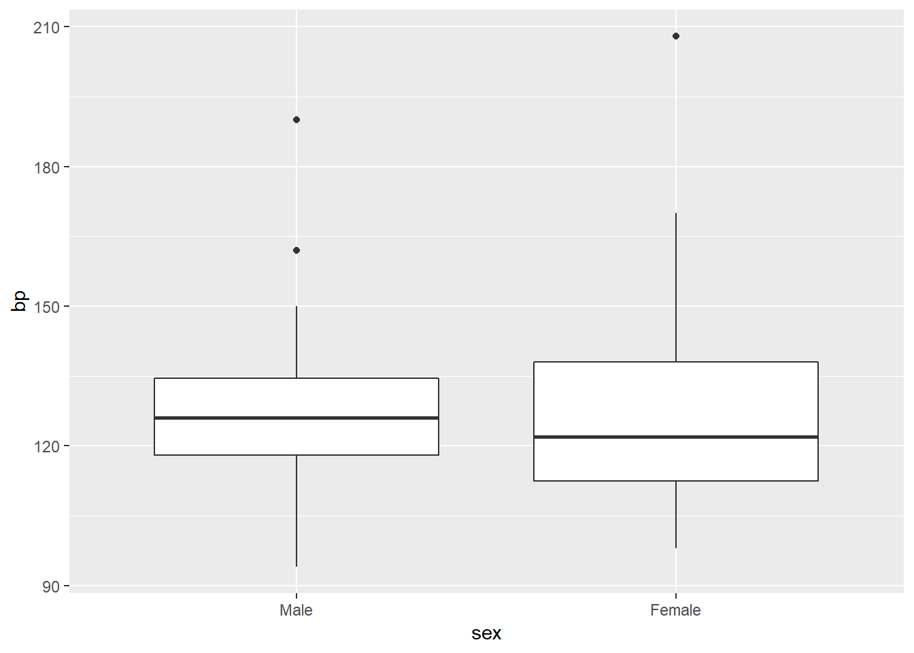

`ggplots` can be assigned (stored to an object and refered to by name)


```r
fig_bp_by_sex <- bp.obese %>% 
  ggplot() +
  aes(x    = sex, 
      y    = bp,
      fill = sex) +
  geom_boxplot(alpha = 0.6) +
  scale_fill_manual(values = c("mediumblue", "maroon3")) +
  labs(x = "Gender",
       y = "Blood Pressure (mmHg)") +
  guides(fill = FALSE) +
  theme_bw()
```

Call the plot by just the name it was assigned


```r
fig_bp_by_sex
```


Add onto a plot...change to a theme from the `ggplot2` package

```r
fig_bp_by_sex + theme_gray()        # 'gray' is the default
```

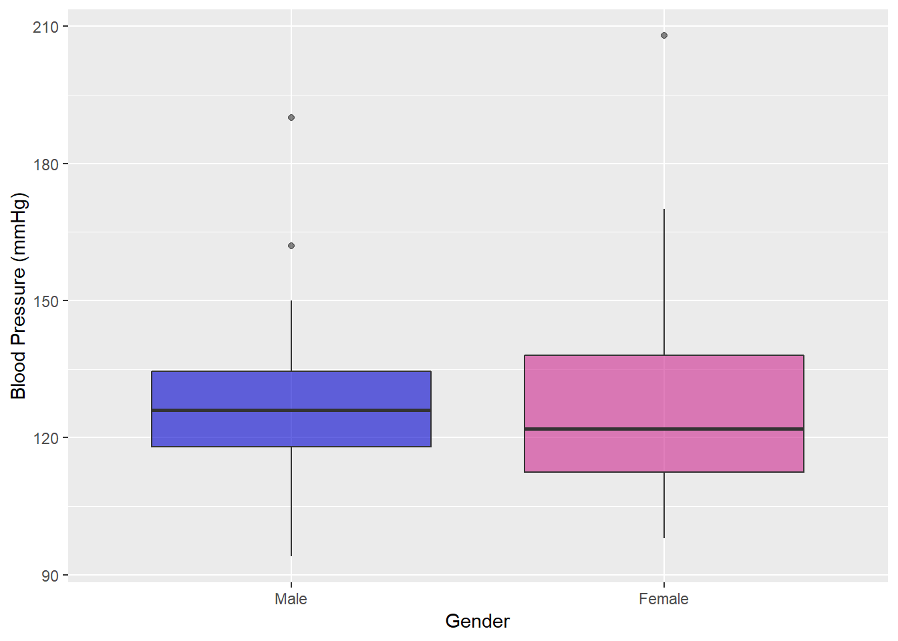

```r
fig_bp_by_sex + theme_bw()
```


```r
fig_bp_by_sex + theme_classic()
```


```r
fig_bp_by_sex + theme_dark()
```

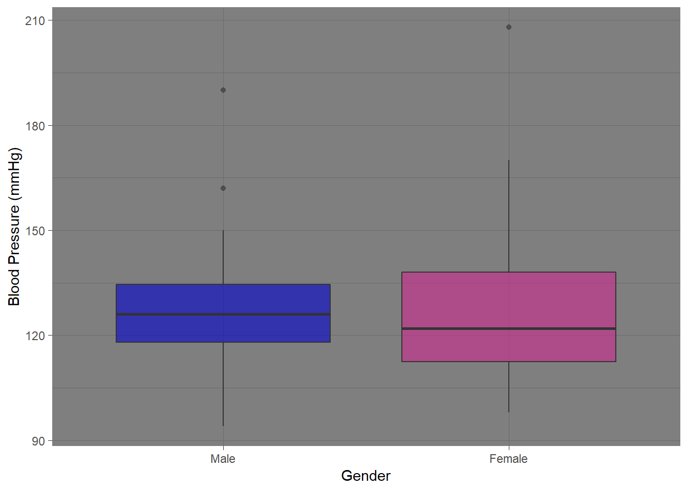

```r
fig_bp_by_sex + theme_minimal()
```

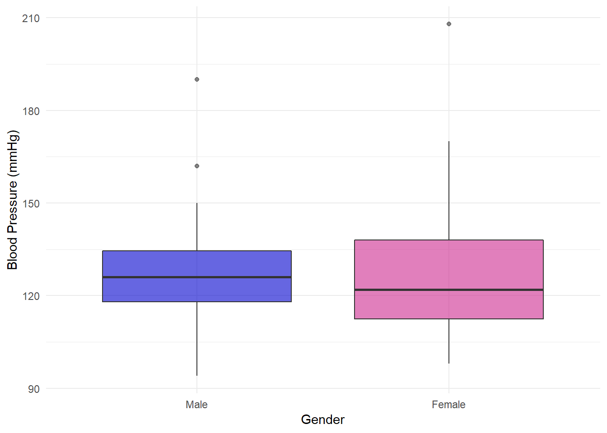

```r
fig_bp_by_sex + theme_linedraw()
```


add onto a plot...change to a theme from the `ggthemes` package


```r
fig_bp_by_sex + theme_tufte()             # Ed Tufte - author, minimalist
```

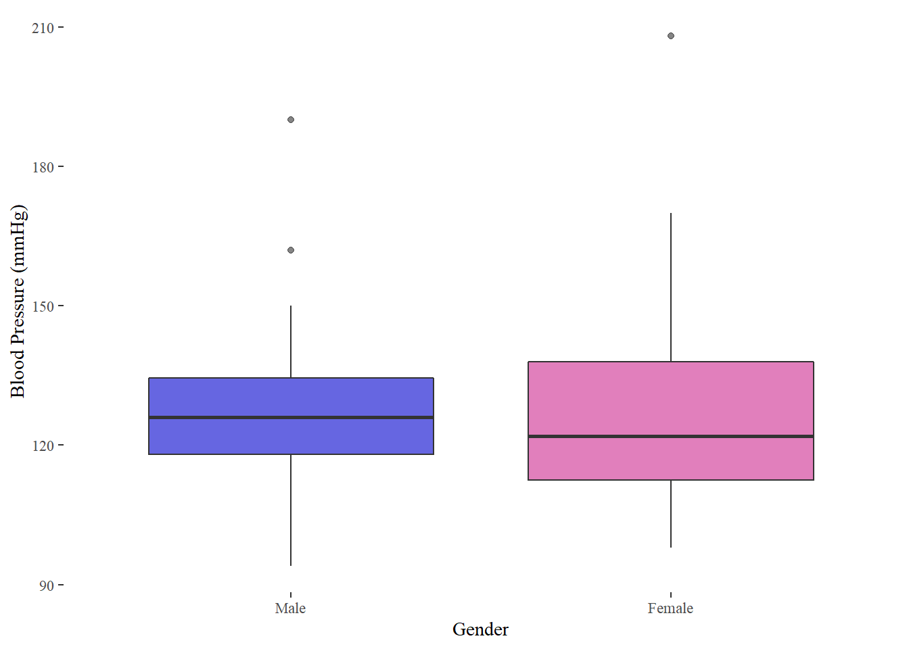

```r
fig_bp_by_sex + theme_stata()             # Stata is a stats software
```


```r
fig_bp_by_sex + theme_economist()         # 'The Economist' magazine
```

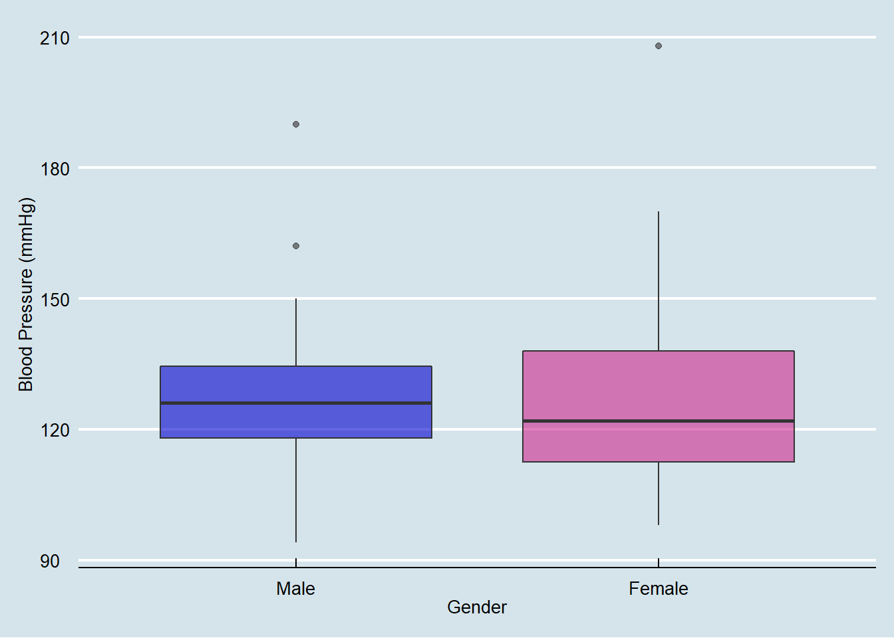

```r
fig_bp_by_sex + theme_economist_white()
```


```r
fig_bp_by_sex + theme_wsj()               # 'The Wall Street Journal
```


```r
fig_bp_by_sex + theme_calc()              # based on Google Docs
```


```r
fig_bp_by_sex + theme_hc()   
```

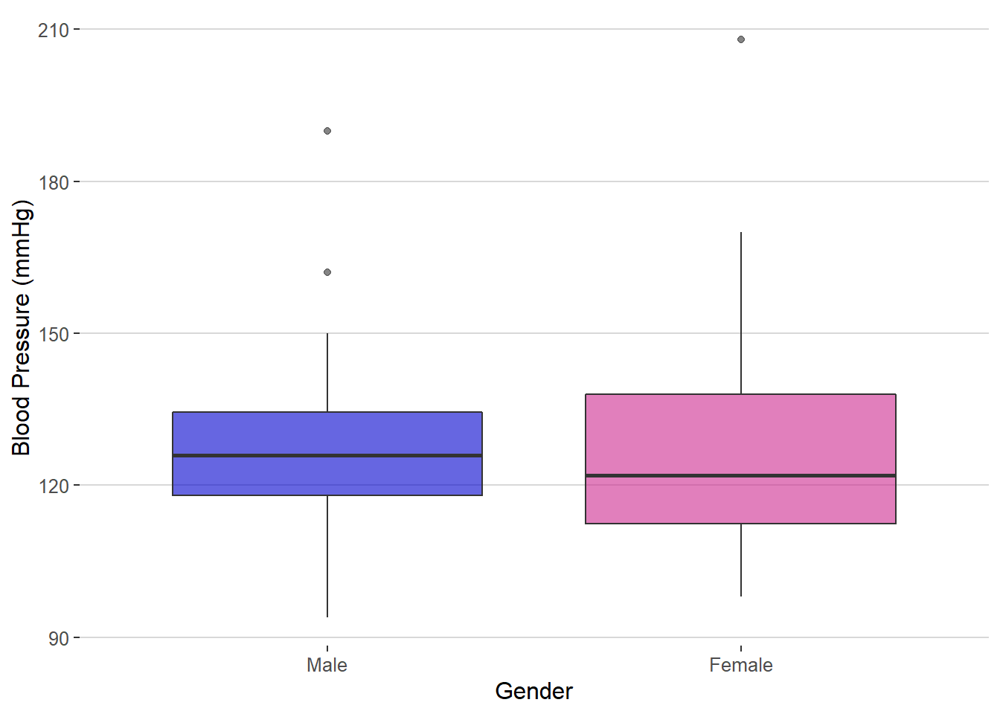

Visual inspection for an interaction (is gender a moderator?)


```r
fig_bp_by_obese <- bp.obese %>% 
  ggplot(aes(x     = obese,
             y     = bp,
             color = sex)) +
  geom_point(size  = 3)

fig_bp_by_obese
```

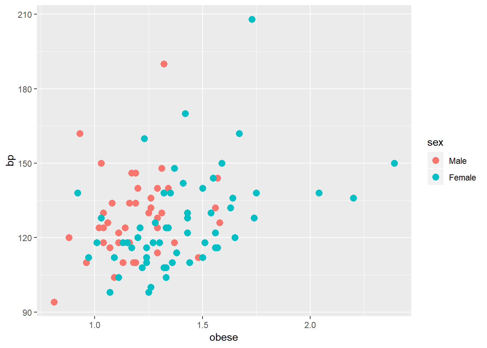

Can save as: pdf, jpeg, tiff, png, bmp, ... (see help) 


```r
ggsave("fig_bp_by_obese.png",     # name of file w/extension 
       fig_bp_by_obese,           # name of the ggplot object
       width  = 5,                # size, width
       height = 5,                # size, height
       units  = "in")             # size, units for width & height
```

add a smoother...the regression line with a conf bands for the mean


```r
fig_bp_by_obese + geom_smooth(method = "lm")
```


create seperate panels

```r
fig_bp_by_obese + facet_grid(. ~ sex) 
```

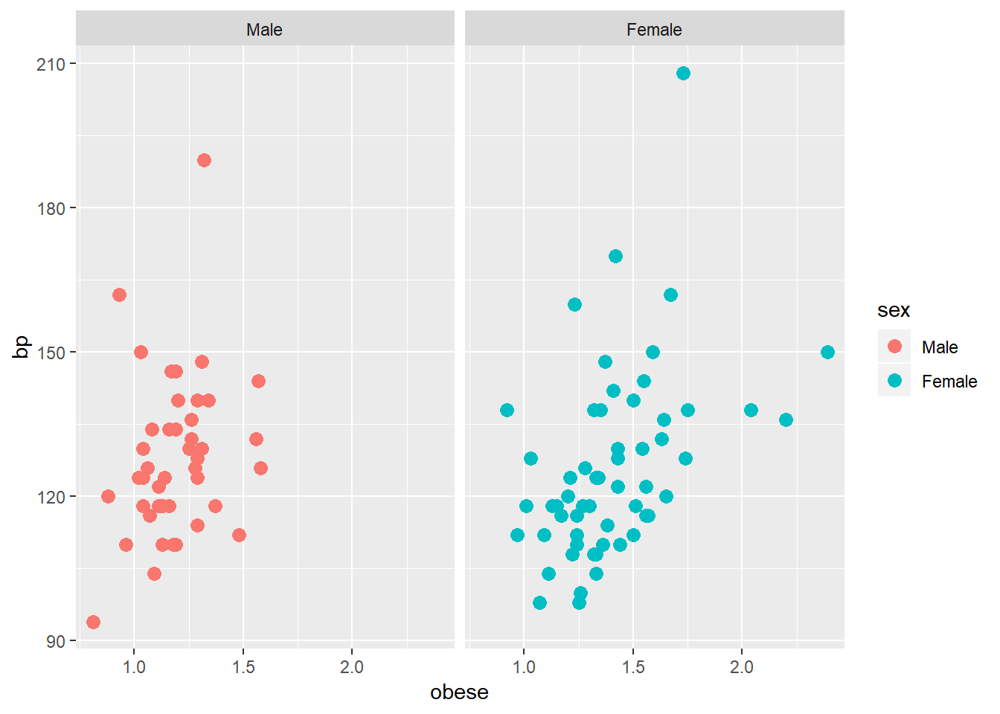


```r
fig_bp_by_obese + 
  facet_grid(. ~ sex) + 
  geom_smooth(method = "lm", level = .95)
```


get fancy


```r
fig_bp_by_obese + 
  facet_grid(. ~ sex) + 
  geom_smooth(method = "lm",
              se     = FALSE,
              size   = 0.9) +
  theme_bw() +
  guides(color = FALSE) +
  labs(title = "Does Gender Moderated the Obese-Blood Pressure Assocation?") +
  scale_color_manual(values = c("mediumblue", "maroon3")) 
```


get even fancier


```r
fig_bp_by_obese +
  geom_smooth(aes(fill = sex),
              alpha  = 0.2,
              method = "lm") +
  scale_color_manual(values = c("mediumblue", "maroon3"),
                     breaks = c("male",       "female"),
                     labels = c("Men",        "Women")) +
  scale_fill_manual(values  = c("mediumblue", "maroon3"),
                    breaks  = c("male",       "female"),
                    labels  = c("Men",        "Women")) +
  labs(title = "Does Gender Moderate the Association Between Obesity and Blood Pressure?",
       x     = "Ratio: Actual Weight vs. Ideal Weight (NYM Life Tables)",
       y     = "Systolic Blood Pressure (mmHg)") + 
  theme_bw() +
  scale_x_continuous(breaks  = seq(from = 0,  to = 3,   by = 0.25 )) +
  scale_y_continuous(breaks  = seq(from = 75, to = 300, by = 25)) +
  theme(legend.title         = element_blank(),
        legend.key           = element_rect(fill = "white"),
        legend.background    = element_rect(color = "black"),
        legend.justification = c(1, 0), 
        legend.position      = c(1, 0))
```


### Codrrelation: pairwise, un-adjusted 


calculate the correlation - nested format

```r
cor(as.numeric(bp.obese$sex), bp.obese$bp)
```

```
## [1] -0.04500234
```

calculate the correlation - with the pipe


```r
bp.obese %>% 
  dplyr::mutate(sex = as.numeric(sex)) %>%  # cor needs only numeric
  cor() 
```

```
##               sex     obese          bp
## sex    1.00000000 0.4045675 -0.04500234
## obese  0.40456750 1.0000000  0.32613855
## bp    -0.04500234 0.3261385  1.00000000
```


```r
bp.obese %>% 
  dplyr::mutate(sex = as.numeric(sex)) %>%  # cor needs only numeric
  dplyr::select(sex, bp) %>%                # limit to only 2 vars
  cor()                                # optional () on end if empty
```

```
##             sex          bp
## sex  1.00000000 -0.04500234
## bp  -0.04500234  1.00000000
```


```r
bp.obese %>% 
  dplyr::mutate(sex = as.numeric(sex)) %$%  # allows you to call vars by name
  cor(sex, bp)                            # just 'var' without the 'data$'
```

```
## [1] -0.04500234
```


addign the correlation matrix to a named object


```r
cor_bp <- bp.obese %>% 
  dplyr::mutate(sex = as.numeric(sex)) %>% 
  cor() 

cor_bp
```

```
##               sex     obese          bp
## sex    1.00000000 0.4045675 -0.04500234
## obese  0.40456750 1.0000000  0.32613855
## bp    -0.04500234 0.3261385  1.00000000
```


```r
cor_bp %>% round(3)
```

```
##          sex obese     bp
## sex    1.000 0.405 -0.045
## obese  0.405 1.000  0.326
## bp    -0.045 0.326  1.000
```

### Correlograms - visually display correlation matrix


all defaults

```r
corrplot::corrplot(cor_bp)
```


                   

change the visualization glyphs   

```r
corrplot::corrplot(cor_bp, method = "ellipse") 
```

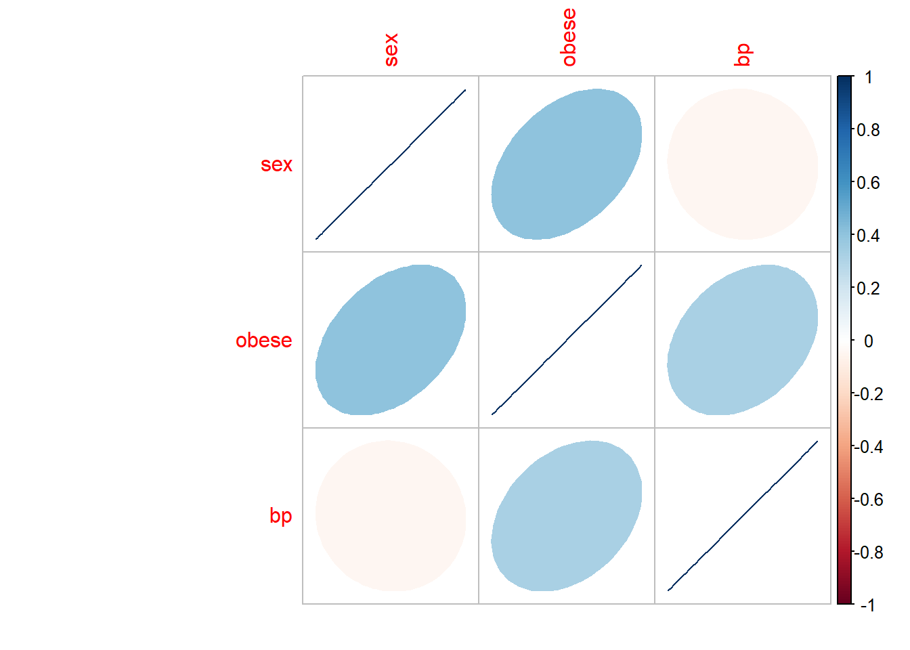


```r
corrplot::corrplot(cor_bp, method = "pie")   
```

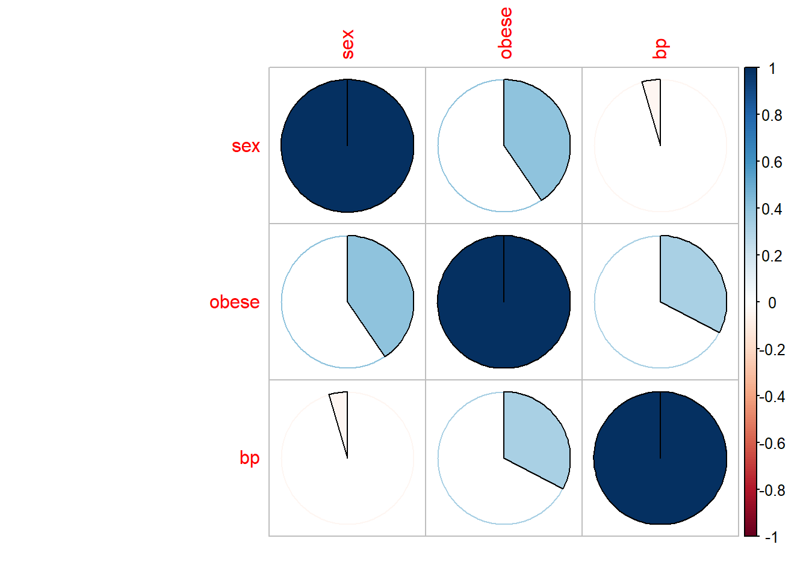


```r
corrplot::corrplot(cor_bp, method = "color") 
```

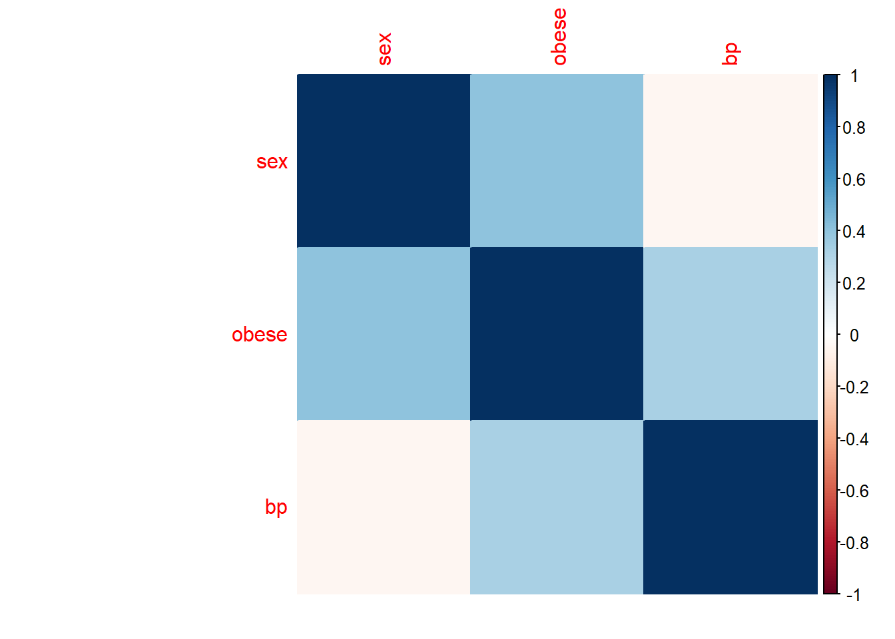


```r
corrplot::corrplot(cor_bp, method = "number") 
```


full matrix, or only the upper or lower half shown

```r
corrplot::corrplot(cor_bp, type = "upper") 
```

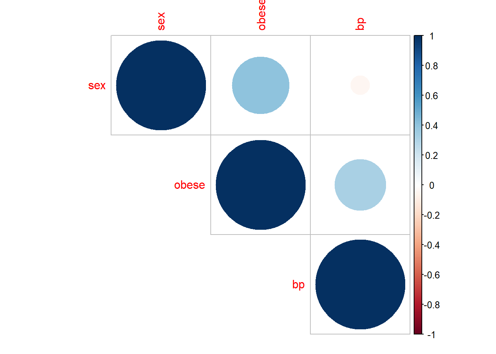


```r
corrplot::corrplot(cor_bp, type = "lower") 
```

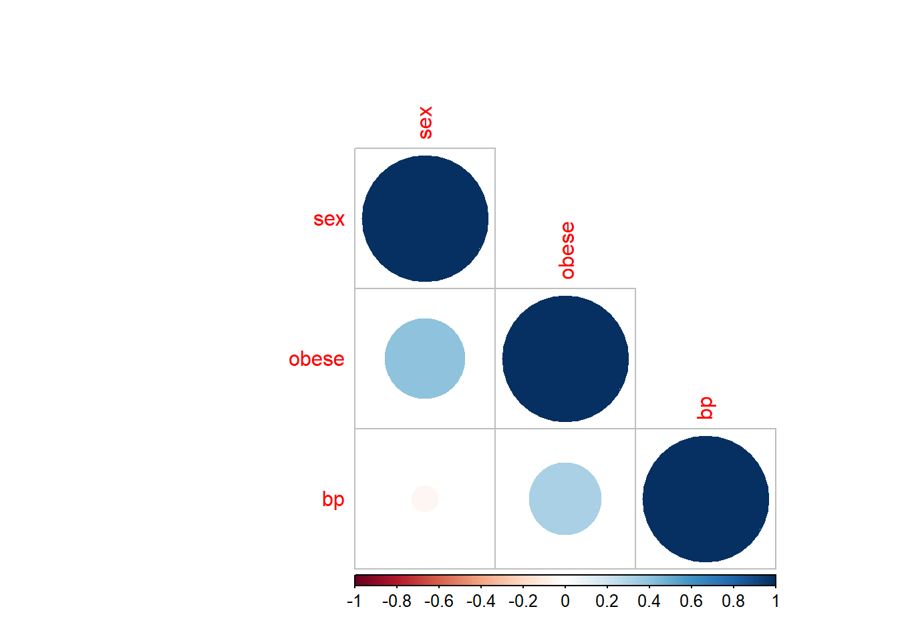


Brewer color palettes


```r
display.brewer.all()
```


change the colors used on the glyphs


```r
corrplot::corrplot(cor_bp, col = brewer.pal(n = 8,  name = "RdBu")) 
```


```r
corrplot::corrplot(cor_bp, col = brewer.pal(n = 6,  name = "RdYlBu")) 
```


```r
corrplot::corrplot(cor_bp, col = brewer.pal(n = 10, name = "PuOr")) 
```

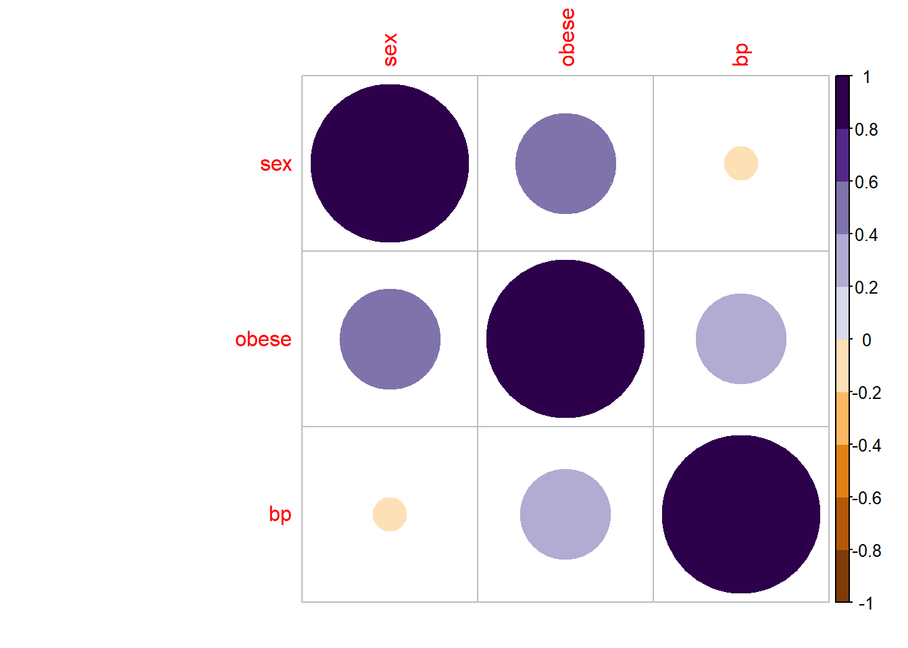

get a bit fancier


```r
corrplot::corrplot.mixed(cor_bp)
```


```r
corrplot::corrplot.mixed(cor_bp,
                       lower  = "ellipse",
                       upper  = "number",
                       tl.col = "black")
```


## Multiple Linear Regression (MLR)


assign the model to an object you can call by name

```r
fit_bp_sex <- lm(bp ~ sex, data = bp.obese) # fit the model
```


###Call the model object several ways

what does the "lm" function save for you?


```r
attributes(fit_bp_sex)
```

```
## $names
##  [1] "coefficients"  "residuals"     "effects"       "rank"         
##  [5] "fitted.values" "assign"        "qr"            "df.residual"  
##  [9] "contrasts"     "xlevels"       "call"          "terms"        
## [13] "model"        
## 
## $class
## [1] "lm"
```

what output does calling the name print?


```r
fit_bp_sex 
```

```
## 
## Call:
## lm(formula = bp ~ sex, data = bp.obese)
## 
## Coefficients:
## (Intercept)    sexFemale  
##     127.955       -1.644
```

this call gives you MORE output


```r
summary(fit_bp_sex) 
```

```
## 
## Call:
## lm(formula = bp ~ sex, data = bp.obese)
## 
## Residuals:
##     Min      1Q  Median      3Q     Max 
## -33.955 -10.310  -3.132  11.190  81.690 
## 
## Coefficients:
##             Estimate Std. Error t value Pr(>|t|)    
## (Intercept)  127.955      2.752   46.49   <2e-16 ***
## sexFemale     -1.644      3.650   -0.45    0.653    
## ---
## Signif. codes:  0 '***' 0.001 '**' 0.01 '*' 0.05 '.' 0.1 ' ' 1
## 
## Residual standard error: 18.26 on 100 degrees of freedom
## Multiple R-squared:  0.002025,	Adjusted R-squared:  -0.007955 
## F-statistic: 0.2029 on 1 and 100 DF,  p-value: 0.6533
```

you can access just the betas 


```r
coef(fit_bp_sex) 
```

```
## (Intercept)   sexFemale 
##  127.954545   -1.644201
```

the CI's for the betas


```r
confint(fit_bp_sex)
```

```
##                  2.5 %     97.5 %
## (Intercept) 122.494090 133.415001
## sexFemale    -8.885474   5.597073
```

you can call just the ANOVA table


```r
anova(fit_bp_sex) 
```

```
## Analysis of Variance Table
## 
## Response: bp
##            Df Sum Sq Mean Sq F value Pr(>F)
## sex         1     68   67.64  0.2029 0.6533
## Residuals 100  33330  333.30
```

### Model fit indicies

-2LL to compare nested models

```r
logLik(fit_bp_sex) 
```

```
## 'log Lik.' -439.9835 (df=3)
```


```r
AIC(fit_bp_sex)
```

```
## [1] 885.967
```


```r
BIC(fit_bp_sex)
```

```
## [1] 893.8419
```


### Tablular Results


```r
stargazer::stargazer(fit_bp_sex,
                     type = "html")
```


<table style="text-align:center"><tr><td colspan="2" style="border-bottom: 1px solid black"></td></tr><tr><td style="text-align:left"></td><td><em>Dependent variable:</em></td></tr>
<tr><td></td><td colspan="1" style="border-bottom: 1px solid black"></td></tr>
<tr><td style="text-align:left"></td><td>bp</td></tr>
<tr><td colspan="2" style="border-bottom: 1px solid black"></td></tr><tr><td style="text-align:left">sexFemale</td><td>-1.644</td></tr>
<tr><td style="text-align:left"></td><td>(3.650)</td></tr>
<tr><td style="text-align:left"></td><td></td></tr>
<tr><td style="text-align:left">Constant</td><td>127.955<sup>***</sup></td></tr>
<tr><td style="text-align:left"></td><td>(2.752)</td></tr>
<tr><td style="text-align:left"></td><td></td></tr>
<tr><td colspan="2" style="border-bottom: 1px solid black"></td></tr><tr><td style="text-align:left">Observations</td><td>102</td></tr>
<tr><td style="text-align:left">R<sup>2</sup></td><td>0.002</td></tr>
<tr><td style="text-align:left">Adjusted R<sup>2</sup></td><td>-0.008</td></tr>
<tr><td style="text-align:left">Residual Std. Error</td><td>18.257 (df = 100)</td></tr>
<tr><td style="text-align:left">F Statistic</td><td>0.203 (df = 1; 100)</td></tr>
<tr><td colspan="2" style="border-bottom: 1px solid black"></td></tr><tr><td style="text-align:left"><em>Note:</em></td><td style="text-align:right"><sup>*</sup>p<0.1; <sup>**</sup>p<0.05; <sup>***</sup>p<0.01</td></tr>
</table>


```r
stargazer(fit_bp_sex, 
          type = "html", 
          single.row = TRUE, 
          ci = TRUE)
```


<table style="text-align:center"><tr><td colspan="2" style="border-bottom: 1px solid black"></td></tr><tr><td style="text-align:left"></td><td><em>Dependent variable:</em></td></tr>
<tr><td></td><td colspan="1" style="border-bottom: 1px solid black"></td></tr>
<tr><td style="text-align:left"></td><td>bp</td></tr>
<tr><td colspan="2" style="border-bottom: 1px solid black"></td></tr><tr><td style="text-align:left">sexFemale</td><td>-1.644 (-8.798, 5.509)</td></tr>
<tr><td style="text-align:left">Constant</td><td>127.955<sup>***</sup> (122.560, 133.349)</td></tr>
<tr><td colspan="2" style="border-bottom: 1px solid black"></td></tr><tr><td style="text-align:left">Observations</td><td>102</td></tr>
<tr><td style="text-align:left">R<sup>2</sup></td><td>0.002</td></tr>
<tr><td style="text-align:left">Adjusted R<sup>2</sup></td><td>-0.008</td></tr>
<tr><td style="text-align:left">Residual Std. Error</td><td>18.257 (df = 100)</td></tr>
<tr><td style="text-align:left">F Statistic</td><td>0.203 (df = 1; 100)</td></tr>
<tr><td colspan="2" style="border-bottom: 1px solid black"></td></tr><tr><td style="text-align:left"><em>Note:</em></td><td style="text-align:right"><sup>*</sup>p<0.1; <sup>**</sup>p<0.05; <sup>***</sup>p<0.01</td></tr>
</table>


### Fit Nested Models


```r
fit_bp_obe    <- lm(bp ~ obese,                   data = bp.obese)
fit_bp_obesex <- lm(bp ~ obese + sex,             data = bp.obese)
fit_bp_inter  <- lm(bp ~ obese + sex + obese*sex, data = bp.obese)
```


```r
stargazer::stargazer(fit_bp_sex, fit_bp_obe, fit_bp_obesex, fit_bp_inter,
                     type = "html",
                     title = "Model Comparison",
                     intercept.bottom = FALSE,
                     keep.stat = c("rsq", "adj.rsq", "aic"))
```


<table style="text-align:center"><caption><strong>Model Comparison</strong></caption>
<tr><td colspan="5" style="border-bottom: 1px solid black"></td></tr><tr><td style="text-align:left"></td><td colspan="4"><em>Dependent variable:</em></td></tr>
<tr><td></td><td colspan="4" style="border-bottom: 1px solid black"></td></tr>
<tr><td style="text-align:left"></td><td colspan="4">bp</td></tr>
<tr><td style="text-align:left"></td><td>(1)</td><td>(2)</td><td>(3)</td><td>(4)</td></tr>
<tr><td colspan="5" style="border-bottom: 1px solid black"></td></tr><tr><td style="text-align:left">Constant</td><td>127.955<sup>***</sup></td><td>96.818<sup>***</sup></td><td>93.287<sup>***</sup></td><td>102.112<sup>***</sup></td></tr>
<tr><td style="text-align:left"></td><td>(2.752)</td><td>(8.920)</td><td>(8.937)</td><td>(18.231)</td></tr>
<tr><td style="text-align:left"></td><td></td><td></td><td></td><td></td></tr>
<tr><td style="text-align:left">sexFemale</td><td>-1.644</td><td></td><td>-7.730<sup>**</sup></td><td>-19.596</td></tr>
<tr><td style="text-align:left"></td><td>(3.650)</td><td></td><td>(3.715)</td><td>(21.664)</td></tr>
<tr><td style="text-align:left"></td><td></td><td></td><td></td><td></td></tr>
<tr><td style="text-align:left">obese:sexFemale</td><td></td><td></td><td></td><td>9.558</td></tr>
<tr><td style="text-align:left"></td><td></td><td></td><td></td><td>(17.191)</td></tr>
<tr><td style="text-align:left"></td><td></td><td></td><td></td><td></td></tr>
<tr><td style="text-align:left">obese</td><td></td><td>23.001<sup>***</sup></td><td>29.038<sup>***</sup></td><td>21.646</td></tr>
<tr><td style="text-align:left"></td><td></td><td>(6.667)</td><td>(7.172)</td><td>(15.118)</td></tr>
<tr><td style="text-align:left"></td><td></td><td></td><td></td><td></td></tr>
<tr><td colspan="5" style="border-bottom: 1px solid black"></td></tr><tr><td style="text-align:left">R<sup>2</sup></td><td>0.002</td><td>0.106</td><td>0.144</td><td>0.146</td></tr>
<tr><td style="text-align:left">Adjusted R<sup>2</sup></td><td>-0.008</td><td>0.097</td><td>0.127</td><td>0.120</td></tr>
<tr><td colspan="5" style="border-bottom: 1px solid black"></td></tr><tr><td style="text-align:left"><em>Note:</em></td><td colspan="4" style="text-align:right"><sup>*</sup>p<0.1; <sup>**</sup>p<0.05; <sup>***</sup>p<0.01</td></tr>
</table>


### Test Assumptions w/ residual diagnostics


The residual plots are hard to use when the single IV is binary

using `base` R 

```r
plot(fit_bp_sex)  
```

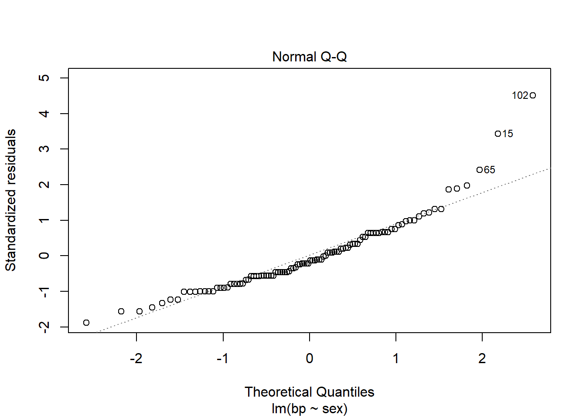


```r
plot(fit_bp_sex, which = 1)  # Residuals vs Fitted
```

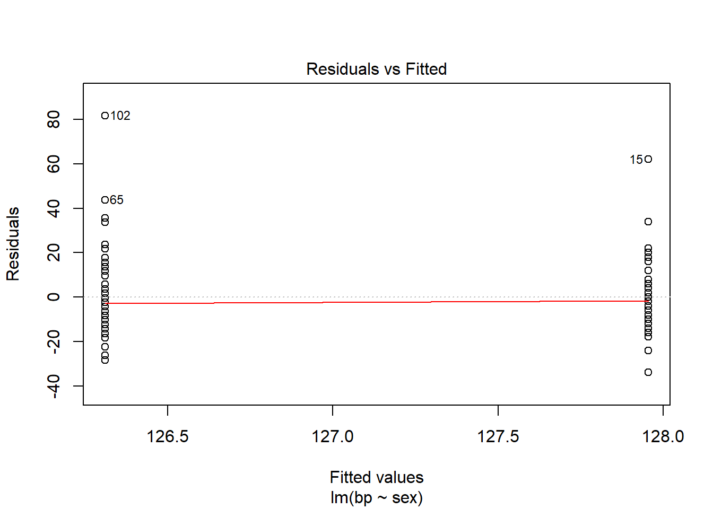

```r
plot(fit_bp_sex, which = 2)  # Normal Q-Q
```


```r
plot(fit_bp_sex, which = 3)  # Scale-Location
```


```r
plot(fit_bp_sex, which = 4)  # Cook's distance
```


```r
plot(fit_bp_sex, which = 5)  # Residuals vs Leverage
```


```r
plot(fit_bp_sex, which = 6)  # Cook's dist vs Leverage
```

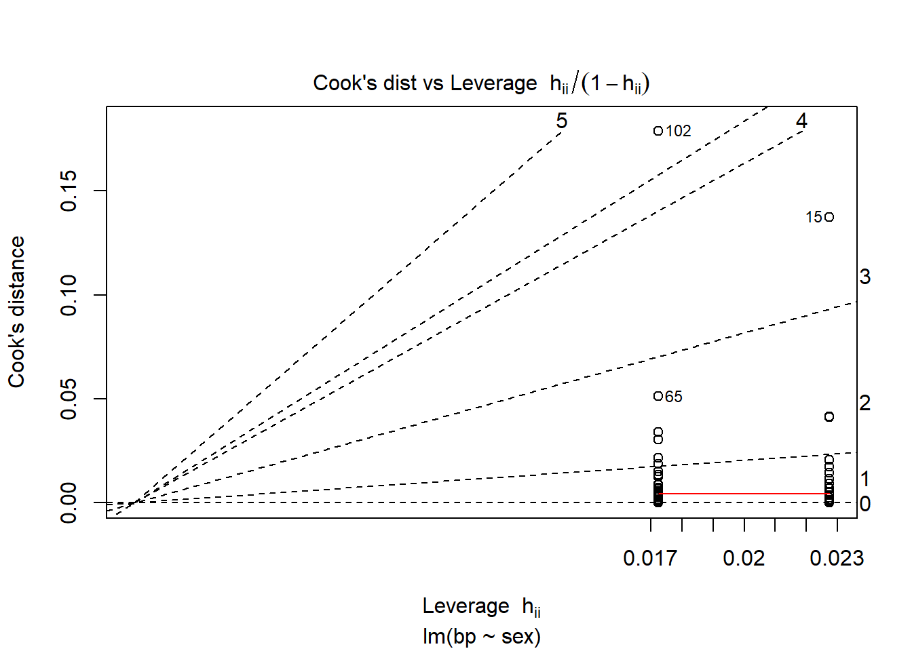


```r
plot(fit_bp_sex, which = 4, id.n = 10)  # Change the number labeled
```

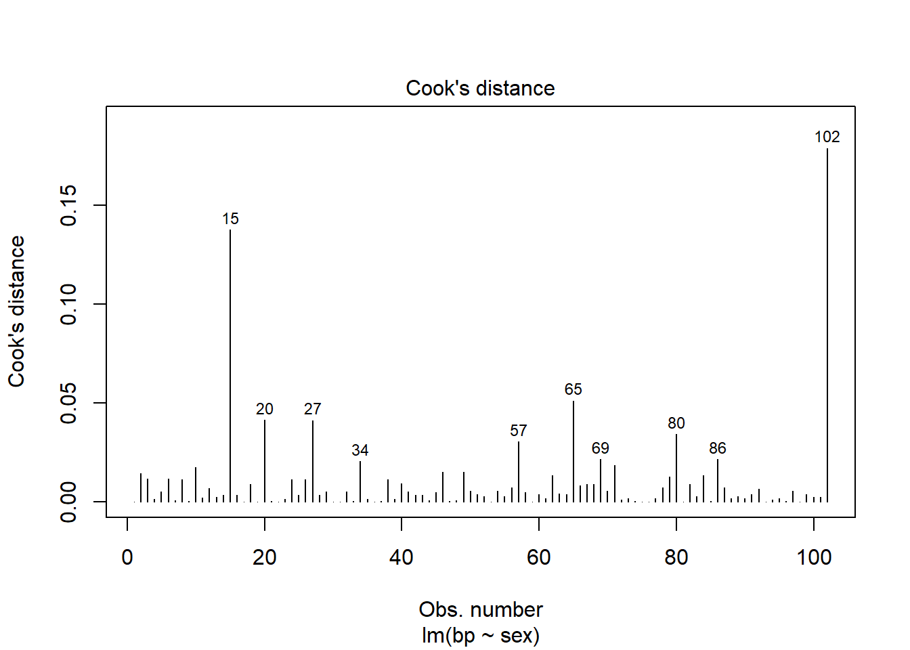

using the `car` package

```r
car::residualPlots(fit_bp_sex)    
```

```
## Warning in residualPlots.default(model, ...): No possible lack-of-fit tests
```


you can adjust any part of a ggplot

```r
bp.obese %>% 
  dplyr::mutate(e_bp = resid(fit_bp_sex)) %>%  # add the resid to the dataset
  ggplot(aes(x     = sex,               # x-axis variable name
             y     = e_bp,              # y-axis variable name
             color = sex,               # color is the outline
             fill  = sex)) +            # fill is the inside
  geom_hline(yintercept = 0,               # set at a meaningful value
             size       = 1,               # adjust line thickness
             linetype   = "dashed",        # set type of line
             color      = "purple") +      # color of line
  geom_boxplot(alpha = 0.5) +                # level of transparency
  theme_bw() +                               # my favorite theme
  labs(title = "Check Assumptions",            # main title's text
       x = "Gender",                           # x-axis text label
       y = "Blood Pressure, Residual (bpm)") + # y-axis text label
  scale_y_continuous(breaks = seq(from = -40,    # declare a sequence of
                                  to   =  80,    # values to make the 
                                  by   =  20)) + # tick marks at
  guides(color = FALSE, fill = FALSE)               # no legends included
```

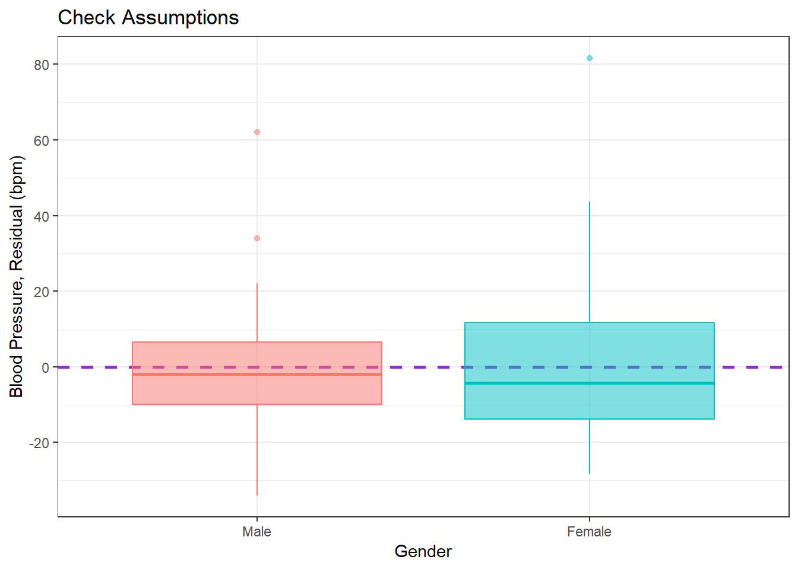

If you don't specify a name of a ggplot object, it will save the last one created (see 'Plots' tab)
 

```r
ggsave("fig_resid-bp_by_obese.png",  # name of file w/extension 
       width  = 5,                   # size, width
       height = 5,                   # size, height
       units  = "in")                # size, units for width & height
```


```r
bp.obese %>% 
  dplyr::mutate(e_bp = resid(fit_bp_sex)) %>%  # add the resid to the dataset
  ggplot(aes(x     = e_bp,              # y-axis variable name
             color = sex,               # color is the outline
             fill  = sex)) +            # fill is the inside
  geom_density(alpha = 0.5) +
  geom_vline(xintercept = 0,               # set at a meaningful value
             size       = 1,               # adjust line thickness
             linetype   = "dashed",        # set type of line
             color      = "purple") +      # color of line
  theme_bw() +                               # my favorite theme
  labs(title = "Check Assumptions",            # main title's text
       x = "Blood Pressure, Residual (bpm)") + # y-axis text label
  scale_x_continuous(breaks = seq(from = -40,    # declare a sequence of
                                  to   =  80,    # values to make the 
                                  by   =  20))  # tick marks at
```

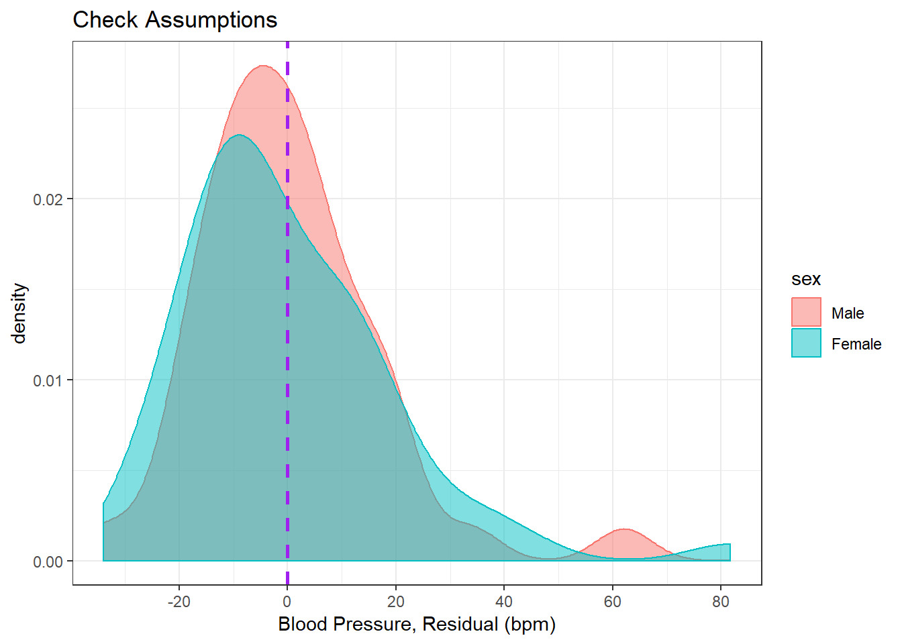


