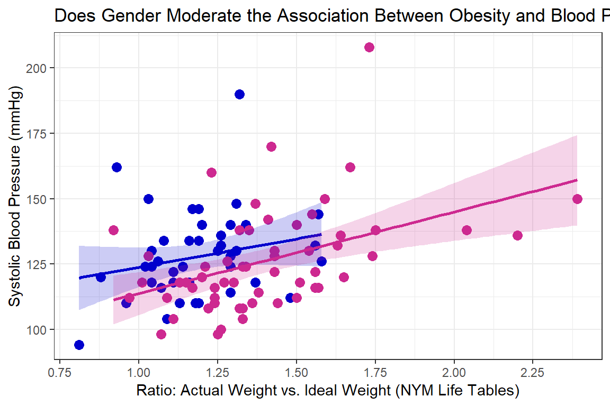

# Example: Obesity and Blood Pressure


```r
library(tidyverse)       # super helpful everything!
library(haven)           # inporting SPSS data files
library(furniture)       # nice tables of descriptives
library(texreg)          # nice regression summary tables
library(stargazer)       # nice tables of descrip and regression
library(corrplot)        # visualize correlations
library(car)             # companion for applied regression
library(psych)           # lots of handy tools
library(ISwR)            # Introduction to Statistics with R (datasets)
```


## Purpose

### Research Question

> Is obsesity associated with higher blood pressure and is that relationship the same among men and women?


### Data Description


This dataset is included in the `ISwR` package [@R-ISwR], which was a companion to the texbook "Introductory Statistics with R, 2nd ed." [@dalgaard2008], although it was first published by @brown1977.  

To view the documentation for the dataset, type `?bp.obese` in the console and enter or search the help tab for `bp.obese'.

> The `bp.obese` data frame has 102 rows and 3 columns. It contains data from a random sample of Mexican-American adults in a small California town.

This data frame contains the following columns:

* `sex` a numeric vector code, 0: male, 1: female
* `obese` a numeric vector, ratio of actual weight to ideal weight from New York Metropolitan Life Tables
* `bp` a numeric vector,systolic blood pressure (mm Hg)


```r
data(bp.obese, package = "ISwR")

bp.obese <- bp.obese %>% 
  dplyr::mutate(sex = factor(sex,
                             labels = c("Male", "Female"))) 

tibble::glimpse(bp.obese)
```

```
Observations: 102
Variables: 3
$ sex   <fct> Male, Male, Male, Male, Male, Male, Male, Male, Male, Ma...
$ obese <dbl> 1.31, 1.31, 1.19, 1.11, 1.34, 1.17, 1.56, 1.18, 1.04, 1....
$ bp    <int> 130, 148, 146, 122, 140, 146, 132, 110, 124, 150, 120, 1...
```


## Exploratory Data Analysis

Before embarking on any inferencial anlaysis or modeling, always get familiar with your variables one at a time *(univariate)*, as well as pairwise *(bivariate)*.


### Univariate Statistics

Summary Statistics for all three variables of interest.


```r
bp.obese %>% 
  stargazer::stargazer(type = "html")
```


<table style="text-align:center"><tr><td colspan="8" style="border-bottom: 1px solid black"></td></tr><tr><td style="text-align:left">Statistic</td><td>N</td><td>Mean</td><td>St. Dev.</td><td>Min</td><td>Pctl(25)</td><td>Pctl(75)</td><td>Max</td></tr>
<tr><td colspan="8" style="border-bottom: 1px solid black"></td></tr><tr><td style="text-align:left">obese</td><td>102</td><td>1.313</td><td>0.258</td><td>0.810</td><td>1.143</td><td>1.430</td><td>2.390</td></tr>
<tr><td style="text-align:left">bp</td><td>102</td><td>127.020</td><td>18.184</td><td>94</td><td>116</td><td>137.5</td><td>208</td></tr>
<tr><td colspan="8" style="border-bottom: 1px solid black"></td></tr></table>

### Bivariate Relationships


```r
bp.obese %>% 
  furniture::table1(obese, bp,
                    splitby = ~ sex,
                    test = TRUE,
                    output = "html")  
```

<table>
 <thead>
  <tr>
   <th>   </th>
   <th> Male </th>
   <th> Female </th>
   <th> P-Value </th>
  </tr>
 </thead>
<tbody>
  <tr>
   <td>  </td>
   <td> n = 44 </td>
   <td> n = 58 </td>
   <td>  </td>
  </tr>
  <tr>
   <td> obese </td>
   <td>  </td>
   <td>  </td>
   <td> &lt;.001 </td>
  </tr>
  <tr>
   <td>  </td>
   <td> 1.2 (0.2) </td>
   <td> 1.4 (0.3) </td>
   <td>  </td>
  </tr>
  <tr>
   <td> bp </td>
   <td>  </td>
   <td>  </td>
   <td> 0.646 </td>
  </tr>
  <tr>
   <td>  </td>
   <td> 128.0 (16.6) </td>
   <td> 126.3 (19.4) </td>
   <td>  </td>
  </tr>
</tbody>
</table>


```r
GGally::ggpairs(bp.obese,
                mapping = aes(fill      = sex,
                              col       = sex,
                              alpha     = 0.1),
                upper = list(continuous = "smooth",
                             combo      = "facethist",
                             discrete   = "ratio"),
                lower = list(continuous = "cor",
                             combo      = "box",
                             discrete   = "facetbar"),
                title = "Very Useful for Exploring Data") 
```


```r
bp.obese %>% 
  ggplot() +
  aes(x    = sex, 
      y    = bp,
      fill = sex) +
  geom_boxplot(alpha = 0.6) +
  scale_fill_manual(values = c("mediumblue", "maroon3")) +
  labs(x = "Gender",
       y = "Blood Pressure (mmHg)") +
  guides(fill = FALSE) +
  theme_bw()
```


Visual inspection for an interaction (is gender a moderator?)


```r
bp.obese %>% 
  ggplot(aes(x     = obese,
             y     = bp,
             color = sex)) +
  geom_point(size  = 3)  +
  geom_smooth(aes(fill = sex),
              alpha  = 0.2,
              method = "lm") +
  scale_color_manual(values = c("mediumblue", "maroon3"),
                     breaks = c("male",       "female"),
                     labels = c("Men",        "Women")) +
  scale_fill_manual(values  = c("mediumblue", "maroon3"),
                    breaks  = c("male",       "female"),
                    labels  = c("Men",        "Women")) +
  labs(title = "Does Gender Moderate the Association Between Obesity and Blood Pressure?",
       x     = "Ratio: Actual Weight vs. Ideal Weight (NYM Life Tables)",
       y     = "Systolic Blood Pressure (mmHg)") + 
  theme_bw() +
  scale_x_continuous(breaks  = seq(from = 0,  to = 3,   by = 0.25 )) +
  scale_y_continuous(breaks  = seq(from = 75, to = 300, by = 25)) +
  theme(legend.title         = element_blank(),
        legend.key           = element_rect(fill = "white"),
        legend.background    = element_rect(color = "black"),
        legend.justification = c(1, 0), 
        legend.position      = c(1, 0))
```




```r
bp.obese %>% 
  dplyr::mutate(sex = as.numeric(sex)) %>%  # cor needs only numeric
  cor() %>% 
  round(3)
```

```
         sex obese     bp
sex    1.000 0.405 -0.045
obese  0.405 1.000  0.326
bp    -0.045 0.326  1.000
```


```r
bp.obese %>% 
  dplyr::mutate(sex = as.numeric(sex)) %>%  # cor needs only numeric
  cor() %>% 
  corrplot::corrplot.mixed(lower  = "ellipse",
                           upper  = "number",
                           tl.col = "black")
```


## Regression Analysis


### Fit Nested Models 
                   
The **bottom-up** approach consists of starting with an initial `NULL` model with only an intercept term and them building additional models that are nested.  

Two models are considered **nested** if one is conains a subset of the terms (predictors or IV) compared to the other.   


```r
fit_bp_null   <- lm(bp ~ 1,            data = bp.obese) 
fit_bp_sex    <- lm(bp ~ sex,          data = bp.obese) 
fit_bp_obe    <- lm(bp ~ obese,        data = bp.obese)
fit_bp_obesex <- lm(bp ~ obese + sex,  data = bp.obese)
fit_bp_inter  <- lm(bp ~ obese*sex,    data = bp.obese)
```

### Comparing Nested Models


#### Model Comparison Table

In single level, multiple linear regression significance of predictors (independent variables, IV) is usually based on both the Wald tests of significance for each beta estimate (shown with stars here) and comparisons in the model fit via the $R^2$ values.


```r
texreg::htmlreg(list(fit_bp_null,
                     fit_bp_sex, 
                     fit_bp_obe, 
                     fit_bp_obesex, 
                     fit_bp_inter),
                custom.model.names = c("No Predictors", 
                                       "Only Sex Quiz", 
                                       "Only Obesity", 
                                       "Both IVs", 
                                       "Add Interaction"))
```


<!DOCTYPE HTML PUBLIC "-//W3C//DTD HTML 4.01 Transitional//EN" "http://www.w3.org/TR/html4/loose.dtd">
<table cellspacing="0" align="center" style="border: none;">
<caption align="bottom" style="margin-top:0.3em;">Statistical models</caption>
<tr>
<th style="text-align: left; border-top: 2px solid black; border-bottom: 1px solid black; padding-right: 12px;"><b></b></th>
<th style="text-align: left; border-top: 2px solid black; border-bottom: 1px solid black; padding-right: 12px;"><b>No Predictors</b></th>
<th style="text-align: left; border-top: 2px solid black; border-bottom: 1px solid black; padding-right: 12px;"><b>Only Sex Quiz</b></th>
<th style="text-align: left; border-top: 2px solid black; border-bottom: 1px solid black; padding-right: 12px;"><b>Only Obesity</b></th>
<th style="text-align: left; border-top: 2px solid black; border-bottom: 1px solid black; padding-right: 12px;"><b>Both IVs</b></th>
<th style="text-align: left; border-top: 2px solid black; border-bottom: 1px solid black; padding-right: 12px;"><b>Add Interaction</b></th>
</tr>
<tr>
<td style="padding-right: 12px; border: none;">(Intercept)</td>
<td style="padding-right: 12px; border: none;">127.02<sup style="vertical-align: 0px;">***</sup></td>
<td style="padding-right: 12px; border: none;">127.95<sup style="vertical-align: 0px;">***</sup></td>
<td style="padding-right: 12px; border: none;">96.82<sup style="vertical-align: 0px;">***</sup></td>
<td style="padding-right: 12px; border: none;">93.29<sup style="vertical-align: 0px;">***</sup></td>
<td style="padding-right: 12px; border: none;">102.11<sup style="vertical-align: 0px;">***</sup></td>
</tr>
<tr>
<td style="padding-right: 12px; border: none;"></td>
<td style="padding-right: 12px; border: none;">(1.80)</td>
<td style="padding-right: 12px; border: none;">(2.75)</td>
<td style="padding-right: 12px; border: none;">(8.92)</td>
<td style="padding-right: 12px; border: none;">(8.94)</td>
<td style="padding-right: 12px; border: none;">(18.23)</td>
</tr>
<tr>
<td style="padding-right: 12px; border: none;">sexFemale</td>
<td style="padding-right: 12px; border: none;"></td>
<td style="padding-right: 12px; border: none;">-1.64</td>
<td style="padding-right: 12px; border: none;"></td>
<td style="padding-right: 12px; border: none;">-7.73<sup style="vertical-align: 0px;">*</sup></td>
<td style="padding-right: 12px; border: none;">-19.60</td>
</tr>
<tr>
<td style="padding-right: 12px; border: none;"></td>
<td style="padding-right: 12px; border: none;"></td>
<td style="padding-right: 12px; border: none;">(3.65)</td>
<td style="padding-right: 12px; border: none;"></td>
<td style="padding-right: 12px; border: none;">(3.72)</td>
<td style="padding-right: 12px; border: none;">(21.66)</td>
</tr>
<tr>
<td style="padding-right: 12px; border: none;">obese</td>
<td style="padding-right: 12px; border: none;"></td>
<td style="padding-right: 12px; border: none;"></td>
<td style="padding-right: 12px; border: none;">23.00<sup style="vertical-align: 0px;">***</sup></td>
<td style="padding-right: 12px; border: none;">29.04<sup style="vertical-align: 0px;">***</sup></td>
<td style="padding-right: 12px; border: none;">21.65</td>
</tr>
<tr>
<td style="padding-right: 12px; border: none;"></td>
<td style="padding-right: 12px; border: none;"></td>
<td style="padding-right: 12px; border: none;"></td>
<td style="padding-right: 12px; border: none;">(6.67)</td>
<td style="padding-right: 12px; border: none;">(7.17)</td>
<td style="padding-right: 12px; border: none;">(15.12)</td>
</tr>
<tr>
<td style="padding-right: 12px; border: none;">obese:sexFemale</td>
<td style="padding-right: 12px; border: none;"></td>
<td style="padding-right: 12px; border: none;"></td>
<td style="padding-right: 12px; border: none;"></td>
<td style="padding-right: 12px; border: none;"></td>
<td style="padding-right: 12px; border: none;">9.56</td>
</tr>
<tr>
<td style="padding-right: 12px; border: none;"></td>
<td style="padding-right: 12px; border: none;"></td>
<td style="padding-right: 12px; border: none;"></td>
<td style="padding-right: 12px; border: none;"></td>
<td style="padding-right: 12px; border: none;"></td>
<td style="padding-right: 12px; border: none;">(17.19)</td>
</tr>
<tr>
<td style="border-top: 1px solid black;">R<sup style="vertical-align: 0px;">2</sup></td>
<td style="border-top: 1px solid black;">0.00</td>
<td style="border-top: 1px solid black;">0.00</td>
<td style="border-top: 1px solid black;">0.11</td>
<td style="border-top: 1px solid black;">0.14</td>
<td style="border-top: 1px solid black;">0.15</td>
</tr>
<tr>
<td style="padding-right: 12px; border: none;">Adj. R<sup style="vertical-align: 0px;">2</sup></td>
<td style="padding-right: 12px; border: none;">0.00</td>
<td style="padding-right: 12px; border: none;">-0.01</td>
<td style="padding-right: 12px; border: none;">0.10</td>
<td style="padding-right: 12px; border: none;">0.13</td>
<td style="padding-right: 12px; border: none;">0.12</td>
</tr>
<tr>
<td style="padding-right: 12px; border: none;">Num. obs.</td>
<td style="padding-right: 12px; border: none;">102</td>
<td style="padding-right: 12px; border: none;">102</td>
<td style="padding-right: 12px; border: none;">102</td>
<td style="padding-right: 12px; border: none;">102</td>
<td style="padding-right: 12px; border: none;">102</td>
</tr>
<tr>
<td style="border-bottom: 2px solid black;">RMSE</td>
<td style="border-bottom: 2px solid black;">18.18</td>
<td style="border-bottom: 2px solid black;">18.26</td>
<td style="border-bottom: 2px solid black;">17.28</td>
<td style="border-bottom: 2px solid black;">17.00</td>
<td style="border-bottom: 2px solid black;">17.05</td>
</tr>
<tr>
<td style="padding-right: 12px; border: none;" colspan="7"><span style="font-size:0.8em"><sup style="vertical-align: 0px;">***</sup>p &lt; 0.001, <sup style="vertical-align: 0px;">**</sup>p &lt; 0.01, <sup style="vertical-align: 0px;">*</sup>p &lt; 0.05</span></td>
</tr>
</table>


#### Likelihood Ratio Test of Nested Models

An alternative method for determing model fit and variable importance is the likelihood ratio test.  This involves comparing the $-2LL$ or inverse of twice the log of the likelihood value for the model.  The difference in these values follows a Chi Squared distribution with degrees of freedom equal to the difference in the number of parameters estimated *(number of betas)*.

* Test the main effect of math quiz:

```r
anova(fit_bp_null, fit_bp_sex)
```

```
# A tibble: 2 x 6
  Res.Df    RSS    Df `Sum of Sq`      F `Pr(>F)`
*  <dbl>  <dbl> <dbl>       <dbl>  <dbl>    <dbl>
1    101 33398.    NA        NA   NA       NA    
2    100 33330.     1        67.6  0.203    0.653
```

* Test the main effect of math phobia

```r
anova(fit_bp_null, fit_bp_obe)
```

```
# A tibble: 2 x 6
  Res.Df    RSS    Df `Sum of Sq`     F  `Pr(>F)`
*  <dbl>  <dbl> <dbl>       <dbl> <dbl>     <dbl>
1    101 33398.    NA         NA   NA   NA       
2    100 29846.     1       3552.  11.9  0.000822
```


* Test the main effect of math phobia,  after controlling for math test

```r
anova(fit_bp_obe, fit_bp_obesex) 
```

```
# A tibble: 2 x 6
  Res.Df    RSS    Df `Sum of Sq`     F `Pr(>F)`
*  <dbl>  <dbl> <dbl>       <dbl> <dbl>    <dbl>
1    100 29846.    NA         NA  NA     NA     
2     99 28595.     1       1250.  4.33   0.0401
```

* Test the interaction between math test and math phobia (i.e. moderation)

```r
anova(fit_bp_obesex, fit_bp_inter)
```

```
# A tibble: 2 x 6
  Res.Df    RSS    Df `Sum of Sq`      F `Pr(>F)`
*  <dbl>  <dbl> <dbl>       <dbl>  <dbl>    <dbl>
1     99 28595.    NA        NA   NA       NA    
2     98 28505.     1        89.9  0.309    0.579
```


### Checking Assumptions via Residual Diagnostics

Before reporting a model, ALWAYS make sure to check the residules to ensure that the model assumptions are not violated.


```r
plot(fit_bp_obesex, which = 1)  
```


```r
plot(fit_bp_obesex, which = 4, id.n = 10)  # Change the number labeled
```


using the `car` package

```r
car::residualPlots(fit_bp_obesex)    
```


```
           Test stat Pr(>|Test stat|)
obese        -0.2759           0.7832
sex                                  
Tukey test   -0.6141           0.5391
```

you can adjust any part of a ggplot

```r
bp.obese %>% 
  dplyr::mutate(e_bp = resid(fit_bp_obesex)) %>%  # add the resid to the dataset
  ggplot(aes(x     = sex,               # x-axis variable name
             y     = e_bp,              # y-axis variable name
             color = sex,               # color is the outline
             fill  = sex)) +            # fill is the inside
  geom_hline(yintercept = 0,               # set at a meaningful value
             size       = 1,               # adjust line thickness
             linetype   = "dashed",        # set type of line
             color      = "purple") +      # color of line
  geom_boxplot(alpha = 0.5) +                # level of transparency
  theme_bw() +                               # my favorite theme
  labs(title = "Check Assumptions",            # main title's text
       x = "Gender",                           # x-axis text label
       y = "Blood Pressure, Residual (bpm)") + # y-axis text label
  scale_y_continuous(breaks = seq(from = -40,    # declare a sequence of
                                  to   =  80,    # values to make the 
                                  by   =  20)) + # tick marks at
  guides(color = FALSE, fill = FALSE)               # no legends included
```


```r
bp.obese %>% 
  dplyr::mutate(e_bp = resid(fit_bp_obesex)) %>%  # add the resid to the dataset
  ggplot(aes(x     = e_bp,              # y-axis variable name
             color = sex,               # color is the outline
             fill  = sex)) +            # fill is the inside
  geom_density(alpha = 0.5) +
  geom_vline(xintercept = 0,               # set at a meaningful value
             size       = 1,               # adjust line thickness
             linetype   = "dashed",        # set type of line
             color      = "purple") +      # color of line
  theme_bw() +                               # my favorite theme
  labs(title = "Check Assumptions",            # main title's text
       x = "Blood Pressure, Residual (bpm)") + # y-axis text label
  scale_x_continuous(breaks = seq(from = -40,    # declare a sequence of
                                  to   =  80,    # values to make the 
                                  by   =  20))  # tick marks at
```


## Conclusion

Violations to the assumtions call the reliabity of the regression results into question.  The data should be further investigated, specifically the $102^{nd}$ case.   


