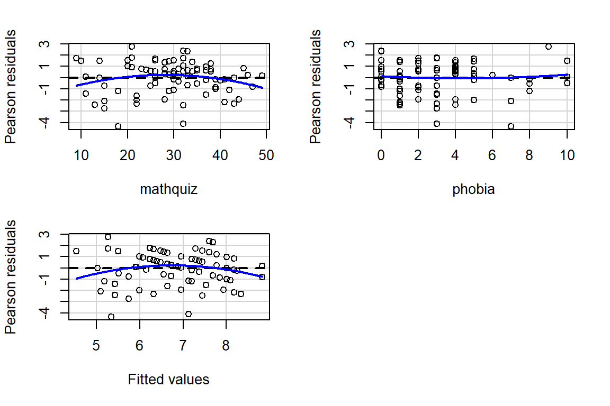
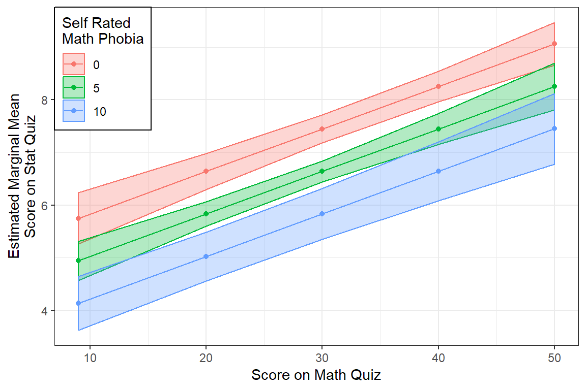

# Example: Ihno's Experiment


```r
library(tidyverse)       # super helpful everything!
library(haven)           # inporting SPSS data files
library(furniture)       # nice tables of descriptives
library(texreg)          # nice regression summary tables
library(stargazer)       # nice tables of descrip and regression
library(corrplot)        # visualize correlations
library(car)             # companion for applied regression
library(psych)           # lots of handy tools
```

## Purpose

### Research Question

> Does math phobia moderate the relationship between math and statistics performance?  That is, does the assocation between math and stat quiz performance differ at variaous levels of math phobia?


### Data Description


<div class="rmdlink">
<p>Inho's dataset is included in the textbook &quot;Explaining Psychological Statistics&quot; <span class="citation">[@epse4]</span> and details regarding the sample and measures is describe in this Encyclopedia's <a href="https://cehs-research.github.io/eBook_explore/example-ihnos-dataset.html">Vol. 2 - Ihno's Dataset</a>.</p>
</div>


```r
data_ihno <- haven::read_spss("http://www.psych.nyu.edu/cohen/Ihno_dataset.sav") %>% 
  dplyr::rename_all(tolower) %>% 
  dplyr::mutate(gender = factor(gender, 
                               levels = c(1, 2),
                               labels = c("Female", 
                                          "Male"))) %>% 
  dplyr::mutate(major = factor(major, 
                              levels = c(1, 2, 3, 4,5),
                              labels = c("Psychology",
                                         "Premed",
                                         "Biology",
                                         "Sociology",
                                         "Economics"))) %>% 
  dplyr::mutate(reason = factor(reason,
                                levels = c(1, 2, 3),
                                labels = c("Program requirement",
                                           "Personal interest",
                                           "Advisor recommendation"))) %>% 
  dplyr::mutate(exp_cond = factor(exp_cond,
                                  levels = c(1, 2, 3, 4),
                                  labels = c("Easy",
                                             "Moderate",
                                             "Difficult",
                                             "Impossible"))) %>% 
  dplyr::mutate(coffee = factor(coffee,
                                levels = c(0, 1),
                                labels = c("Not a regular coffee drinker",
                                           "Regularly drinks coffee"))) 
```


## Exploratory Data Analysis

Before embarking on any inferencial anlaysis or modeling, always get familiar with your variables one at a time *(univariate)*, as well as pairwise *(bivariate)*.


### Univariate Statistics

Summary Statistics for all three variables of interest.


```r
data_ihno %>% 
  dplyr::select(phobia, mathquiz, statquiz) %>% 
  data.frame() %>% 
  stargazer::stargazer(type = "html")
```


<table style="text-align:center"><tr><td colspan="8" style="border-bottom: 1px solid black"></td></tr><tr><td style="text-align:left">Statistic</td><td>N</td><td>Mean</td><td>St. Dev.</td><td>Min</td><td>Pctl(25)</td><td>Pctl(75)</td><td>Max</td></tr>
<tr><td colspan="8" style="border-bottom: 1px solid black"></td></tr><tr><td style="text-align:left">phobia</td><td>100</td><td>3.310</td><td>2.444</td><td>0</td><td>1</td><td>4</td><td>10</td></tr>
<tr><td style="text-align:left">mathquiz</td><td>85</td><td>29.071</td><td>9.480</td><td>9.000</td><td>22.000</td><td>35.000</td><td>49.000</td></tr>
<tr><td style="text-align:left">statquiz</td><td>100</td><td>6.860</td><td>1.700</td><td>1</td><td>6</td><td>8</td><td>10</td></tr>
<tr><td colspan="8" style="border-bottom: 1px solid black"></td></tr></table>

### Bivariate Relationships


Although categorizing continuous variables results in a loss of information *(possible signal or noise)*, it is often done to investigate relationships in an exploratory way.


```r
data_ihno %>% 
  dplyr::mutate(phobia_cut3 = cut(phobia,
                                 breaks = c(0, 2, 4, 10),
                                 include.lowest = TRUE)) %>% 
  furniture::table1(mathquiz, statquiz,
                    splitby = ~ phobia_cut3,
                    test = TRUE,
                    output = "html")
```

<table>
 <thead>
  <tr>
   <th>   </th>
   <th> [0,2] </th>
   <th> (2,4] </th>
   <th> (4,10] </th>
   <th> P-Value </th>
  </tr>
 </thead>
<tbody>
  <tr>
   <td>  </td>
   <td> n = 39 </td>
   <td> n = 37 </td>
   <td> n = 24 </td>
   <td>  </td>
  </tr>
  <tr>
   <td> mathquiz </td>
   <td>  </td>
   <td>  </td>
   <td>  </td>
   <td> 0.014 </td>
  </tr>
  <tr>
   <td>  </td>
   <td> 32.6 (8.5) </td>
   <td> 26.5 (9.8) </td>
   <td> 26.8 (8.9) </td>
   <td>  </td>
  </tr>
  <tr>
   <td> statquiz </td>
   <td>  </td>
   <td>  </td>
   <td>  </td>
   <td> 0.001 </td>
  </tr>
  <tr>
   <td>  </td>
   <td> 7.6 (1.3) </td>
   <td> 6.6 (1.6) </td>
   <td> 6.1 (2.0) </td>
   <td>  </td>
  </tr>
</tbody>
</table>


```r
data_ihno %>% 
  dplyr::select(phobia, mathquiz, statquiz) %>% 
  data.frame() %>% 
  psych::pairs.panels(lm = TRUE, 
                      ci = TRUE,
                      stars = TRUE)
```


When two variables are both continuous, correlations (Pearson's $R$) are an important measure of association.  

Notice the discrepincy between the correlation between `statquiz` and `phobia`.  Above, the `psych::pairs.panels()` function uses **pairwise complete** cases by default, so $r=-.39$ is computed on all $n=100$ subjects.  Below, we specified `use = "complete.obs"` in the `cor()` fucntion, so all correlations will be based on the same $n=85$ students, making it **listwise complete**.  The choice of which method to you will vary by situation.


```r
data_ihno %>% 
  dplyr::select(phobia, mathquiz, statquiz) %>% 
  cor(use = "complete.obs") %>% 
  corrplot::corrplot.mixed(lower  = "ellipse",
                           upper  = "number",
                           tl.col = "black")
```


## Regression Analysis

### Subset the Sample


All regression models can only be fit to complete observations regarding the variables included in the model (dependent and independent).  Removing any case that is incomplete with respect to even one variables is called **"list-wise deletion"**.  

In this analysis, models including the `mathquiz` variable will be fit on only 85 students (sincle 15 students did not take the math quiz), where as models not including this variable will be fit to all 100 studnets.  

This complicates model comparisons, which require nested models be fit to the same data (exactly).  For this reason, the dataset has been reduced to the subset of students that are complete regarding the three variables utilized throughout the set of five nested models.


```r
data_ihno_fitting <- data_ihno %>% 
                      dplyr::filter(complete.cases(mathquiz, statquiz, phobia))

dim(data_ihno_fitting)
```

```
[1] 85 18
```
 

### Fit Nested Models 
                   
The **bottom-up** approach consists of starting with an initial `NULL` model with only an intercept term and them building additional models that are nested.  

Two models are considered **nested** if one is conains a subset of the terms (predictors or IV) compared to the other.                                     
                                    

```r
fit_ihno_lm_0 <- lm(statquiz ~ 1,                    # null model: intercept only
                    data = data_ihno_fitting)

fit_ihno_lm_1 <- lm(statquiz ~ mathquiz,             # only main effect of mathquiz
                    data = data_ihno_fitting)

fit_ihno_lm_2 <- lm(statquiz ~ phobia,               # only mian effect of phobia
                    data = data_ihno_fitting)

fit_ihno_lm_3 <- lm(statquiz ~ mathquiz + phobia,    # both main effects 
                    data = data_ihno_fitting)

fit_ihno_lm_4 <- lm(statquiz ~ mathquiz*phobia,      # additional interaction
                    data = data_ihno_fitting)
```


### Comparing Nested Models


#### Model Comparison Table

In single level, multiple linear regression significance of predictors (independent variables, IV) is usually based on both the Wald tests of significance for each beta estimate (shown with stars here) and comparisons in the model fit via the $R^2$ values.


```r
texreg::htmlreg(list(fit_ihno_lm_0, 
                     fit_ihno_lm_1, 
                     fit_ihno_lm_2, 
                     fit_ihno_lm_3, 
                     fit_ihno_lm_4),
                custom.model.names = c("No Predictors", 
                                       "Only Math Quiz", 
                                       "Only Phobia", 
                                       "Both IVs", 
                                       "Add Interaction"))
```


<!DOCTYPE HTML PUBLIC "-//W3C//DTD HTML 4.01 Transitional//EN" "http://www.w3.org/TR/html4/loose.dtd">
<table cellspacing="0" align="center" style="border: none;">
<caption align="bottom" style="margin-top:0.3em;">Statistical models</caption>
<tr>
<th style="text-align: left; border-top: 2px solid black; border-bottom: 1px solid black; padding-right: 12px;"><b></b></th>
<th style="text-align: left; border-top: 2px solid black; border-bottom: 1px solid black; padding-right: 12px;"><b>No Predictors</b></th>
<th style="text-align: left; border-top: 2px solid black; border-bottom: 1px solid black; padding-right: 12px;"><b>Only Math Quiz</b></th>
<th style="text-align: left; border-top: 2px solid black; border-bottom: 1px solid black; padding-right: 12px;"><b>Only Phobia</b></th>
<th style="text-align: left; border-top: 2px solid black; border-bottom: 1px solid black; padding-right: 12px;"><b>Both IVs</b></th>
<th style="text-align: left; border-top: 2px solid black; border-bottom: 1px solid black; padding-right: 12px;"><b>Add Interaction</b></th>
</tr>
<tr>
<td style="padding-right: 12px; border: none;">(Intercept)</td>
<td style="padding-right: 12px; border: none;">6.85<sup style="vertical-align: 0px;">***</sup></td>
<td style="padding-right: 12px; border: none;">4.14<sup style="vertical-align: 0px;">***</sup></td>
<td style="padding-right: 12px; border: none;">7.65<sup style="vertical-align: 0px;">***</sup></td>
<td style="padding-right: 12px; border: none;">5.02<sup style="vertical-align: 0px;">***</sup></td>
<td style="padding-right: 12px; border: none;">5.60<sup style="vertical-align: 0px;">***</sup></td>
</tr>
<tr>
<td style="padding-right: 12px; border: none;"></td>
<td style="padding-right: 12px; border: none;">(0.19)</td>
<td style="padding-right: 12px; border: none;">(0.53)</td>
<td style="padding-right: 12px; border: none;">(0.29)</td>
<td style="padding-right: 12px; border: none;">(0.63)</td>
<td style="padding-right: 12px; border: none;">(0.91)</td>
</tr>
<tr>
<td style="padding-right: 12px; border: none;">mathquiz</td>
<td style="padding-right: 12px; border: none;"></td>
<td style="padding-right: 12px; border: none;">0.09<sup style="vertical-align: 0px;">***</sup></td>
<td style="padding-right: 12px; border: none;"></td>
<td style="padding-right: 12px; border: none;">0.08<sup style="vertical-align: 0px;">***</sup></td>
<td style="padding-right: 12px; border: none;">0.06<sup style="vertical-align: 0px;">*</sup></td>
</tr>
<tr>
<td style="padding-right: 12px; border: none;"></td>
<td style="padding-right: 12px; border: none;"></td>
<td style="padding-right: 12px; border: none;">(0.02)</td>
<td style="padding-right: 12px; border: none;"></td>
<td style="padding-right: 12px; border: none;">(0.02)</td>
<td style="padding-right: 12px; border: none;">(0.03)</td>
</tr>
<tr>
<td style="padding-right: 12px; border: none;">phobia</td>
<td style="padding-right: 12px; border: none;"></td>
<td style="padding-right: 12px; border: none;"></td>
<td style="padding-right: 12px; border: none;">-0.25<sup style="vertical-align: 0px;">***</sup></td>
<td style="padding-right: 12px; border: none;">-0.16<sup style="vertical-align: 0px;">*</sup></td>
<td style="padding-right: 12px; border: none;">-0.34</td>
</tr>
<tr>
<td style="padding-right: 12px; border: none;"></td>
<td style="padding-right: 12px; border: none;"></td>
<td style="padding-right: 12px; border: none;"></td>
<td style="padding-right: 12px; border: none;">(0.07)</td>
<td style="padding-right: 12px; border: none;">(0.07)</td>
<td style="padding-right: 12px; border: none;">(0.21)</td>
</tr>
<tr>
<td style="padding-right: 12px; border: none;">mathquiz:phobia</td>
<td style="padding-right: 12px; border: none;"></td>
<td style="padding-right: 12px; border: none;"></td>
<td style="padding-right: 12px; border: none;"></td>
<td style="padding-right: 12px; border: none;"></td>
<td style="padding-right: 12px; border: none;">0.01</td>
</tr>
<tr>
<td style="padding-right: 12px; border: none;"></td>
<td style="padding-right: 12px; border: none;"></td>
<td style="padding-right: 12px; border: none;"></td>
<td style="padding-right: 12px; border: none;"></td>
<td style="padding-right: 12px; border: none;"></td>
<td style="padding-right: 12px; border: none;">(0.01)</td>
</tr>
<tr>
<td style="border-top: 1px solid black;">R<sup style="vertical-align: 0px;">2</sup></td>
<td style="border-top: 1px solid black;">0.00</td>
<td style="border-top: 1px solid black;">0.26</td>
<td style="border-top: 1px solid black;">0.13</td>
<td style="border-top: 1px solid black;">0.31</td>
<td style="border-top: 1px solid black;">0.31</td>
</tr>
<tr>
<td style="padding-right: 12px; border: none;">Adj. R<sup style="vertical-align: 0px;">2</sup></td>
<td style="padding-right: 12px; border: none;">0.00</td>
<td style="padding-right: 12px; border: none;">0.25</td>
<td style="padding-right: 12px; border: none;">0.12</td>
<td style="padding-right: 12px; border: none;">0.29</td>
<td style="padding-right: 12px; border: none;">0.29</td>
</tr>
<tr>
<td style="padding-right: 12px; border: none;">Num. obs.</td>
<td style="padding-right: 12px; border: none;">85</td>
<td style="padding-right: 12px; border: none;">85</td>
<td style="padding-right: 12px; border: none;">85</td>
<td style="padding-right: 12px; border: none;">85</td>
<td style="padding-right: 12px; border: none;">85</td>
</tr>
<tr>
<td style="border-bottom: 2px solid black;">RMSE</td>
<td style="border-bottom: 2px solid black;">1.74</td>
<td style="border-bottom: 2px solid black;">1.50</td>
<td style="border-bottom: 2px solid black;">1.63</td>
<td style="border-bottom: 2px solid black;">1.46</td>
<td style="border-bottom: 2px solid black;">1.46</td>
</tr>
<tr>
<td style="padding-right: 12px; border: none;" colspan="7"><span style="font-size:0.8em"><sup style="vertical-align: 0px;">***</sup>p &lt; 0.001, <sup style="vertical-align: 0px;">**</sup>p &lt; 0.01, <sup style="vertical-align: 0px;">*</sup>p &lt; 0.05</span></td>
</tr>
</table>


#### Likelihood Ratio Test of Nested Models

An alternative method for determing model fit and variable importance is the likelihood ratio test.  This involves comparing the $-2LL$ or inverse of twice the log of the likelihood value for the model.  The difference in these values follows a Chi Squared distribution with degrees of freedom equal to the difference in the number of parameters estimated *(number of betas)*.

* Test the main effect of math quiz:

```r
anova(fit_ihno_lm_0, fit_ihno_lm_1)
```

```
# A tibble: 2 x 6
  Res.Df   RSS    Df `Sum of Sq`     F     `Pr(>F)`
*  <dbl> <dbl> <dbl>       <dbl> <dbl>        <dbl>
1     84  253.    NA        NA    NA   NA          
2     83  188.     1        65.3  28.8  0.000000700
```

* Test the main effect of math phobia

```r
anova(fit_ihno_lm_0, fit_ihno_lm_2)
```

```
# A tibble: 2 x 6
  Res.Df   RSS    Df `Sum of Sq`     F  `Pr(>F)`
*  <dbl> <dbl> <dbl>       <dbl> <dbl>     <dbl>
1     84  253.    NA        NA    NA   NA       
2     83  221.     1        32.3  12.1  0.000791
```


* Test the main effect of math phobia,  after controlling for math test

```r
anova(fit_ihno_lm_1, fit_ihno_lm_3) 
```

```
# A tibble: 2 x 6
  Res.Df   RSS    Df `Sum of Sq`     F `Pr(>F)`
*  <dbl> <dbl> <dbl>       <dbl> <dbl>    <dbl>
1     83  188.    NA        NA   NA     NA     
2     82  175.     1        12.6  5.88   0.0175
```

* Test the interaction between math test and math phobia (i.e. moderation)

```r
anova(fit_ihno_lm_3, fit_ihno_lm_4)
```

```
# A tibble: 2 x 6
  Res.Df   RSS    Df `Sum of Sq`      F `Pr(>F)`
*  <dbl> <dbl> <dbl>       <dbl>  <dbl>    <dbl>
1     82  175.    NA       NA    NA       NA    
2     81  173.     1        1.69  0.789    0.377
```


### Checking Assumptions via Residual Diagnostics

Before reporting a model, ALWAYS make sure to check the residules to ensure that the model assumptions are not violated.


```r
plot(fit_ihno_lm_3, which = 1)
```


```r
plot(fit_ihno_lm_3, which = 2)
```


```r
car::residualPlots(fit_ihno_lm_3)
```



```
           Test stat Pr(>|Test stat|)  
mathquiz     -1.7778          0.07918 .
phobia        0.5004          0.61813  
Tukey test   -1.5749          0.11527  
---
Signif. codes:  0 '***' 0.001 '**' 0.01 '*' 0.05 '.' 0.1 ' ' 1
```


```r
summary(fit_ihno_lm_3)
```

```

Call:
lm(formula = statquiz ~ mathquiz + phobia, data = data_ihno_fitting)

Residuals:
    Min      1Q  Median      3Q     Max 
-4.3436 -0.8527  0.2805  0.9857  2.7370 

Coefficients:
            Estimate Std. Error t value Pr(>|t|)    
(Intercept)  5.01860    0.62791   7.993 7.23e-12 ***
mathquiz     0.08097    0.01754   4.617 1.42e-05 ***
phobia      -0.16176    0.06670  -2.425   0.0175 *  
---
Signif. codes:  0 '***' 0.001 '**' 0.01 '*' 0.05 '.' 0.1 ' ' 1

Residual standard error: 1.462 on 82 degrees of freedom
Multiple R-squared:  0.3076,	Adjusted R-squared:  0.2907 
F-statistic: 18.21 on 2 and 82 DF,  p-value: 2.849e-07
```


```r
summary(fit_ihno_lm_4)
```

```

Call:
lm(formula = statquiz ~ mathquiz * phobia, data = data_ihno_fitting)

Residuals:
    Min      1Q  Median      3Q     Max 
-4.1634 -0.8433  0.2832  0.9685  2.9434 

Coefficients:
                 Estimate Std. Error t value Pr(>|t|)    
(Intercept)      5.600183   0.907824   6.169 2.57e-08 ***
mathquiz         0.061216   0.028334   2.161   0.0337 *  
phobia          -0.339426   0.210907  -1.609   0.1114    
mathquiz:phobia  0.006485   0.007303   0.888   0.3771    
---
Signif. codes:  0 '***' 0.001 '**' 0.01 '*' 0.05 '.' 0.1 ' ' 1

Residual standard error: 1.464 on 81 degrees of freedom
Multiple R-squared:  0.3143,	Adjusted R-squared:  0.2889 
F-statistic: 12.37 on 3 and 81 DF,  p-value: 9.637e-07
```


## Conclusion


### Tabulate the Final Model Summary

Many journals prefer that regression tables include 95% confidence intervals, rater than standard errors for the beta estimates.

<div class="rmdlightbulb">
<p>The <code>texreg</code> package contains three version of the regression table function.</p>
<ul>
<li><code>screenreg()</code> Use when working on a project and viewing tables on your computer screen</li>
<li><code>htmlreg()</code> Use when knitting your .Rmd file to a .html document</li>
<li><code>texreg()</code> Use when knitting your .Rmd file to a .pdf via LaTeX</li>
</ul>
</div>


```r
texreg::htmlreg(fit_ihno_lm_3,
               custom.model.names = "Main Effects Model",
               ci.force = TRUE,                              # request 95% conf interv
               caption = "Final Model for Stat's Quiz",
               single.row = TRUE)
```


<!DOCTYPE HTML PUBLIC "-//W3C//DTD HTML 4.01 Transitional//EN" "http://www.w3.org/TR/html4/loose.dtd">
<table cellspacing="0" align="center" style="border: none;">
<caption align="bottom" style="margin-top:0.3em;">Final Model for Stat's Quiz</caption>
<tr>
<th style="text-align: left; border-top: 2px solid black; border-bottom: 1px solid black; padding-right: 12px;"><b></b></th>
<th style="text-align: left; border-top: 2px solid black; border-bottom: 1px solid black; padding-right: 12px;"><b>Main Effects Model</b></th>
</tr>
<tr>
<td style="padding-right: 12px; border: none;">(Intercept)</td>
<td style="padding-right: 12px; border: none;">5.02 [3.79; 6.25]<sup style="vertical-align: 0px;">*</sup></td>
</tr>
<tr>
<td style="padding-right: 12px; border: none;">mathquiz</td>
<td style="padding-right: 12px; border: none;">0.08 [0.05; 0.12]<sup style="vertical-align: 0px;">*</sup></td>
</tr>
<tr>
<td style="padding-right: 12px; border: none;">phobia</td>
<td style="padding-right: 12px; border: none;">-0.16 [-0.29; -0.03]<sup style="vertical-align: 0px;">*</sup></td>
</tr>
<tr>
<td style="border-top: 1px solid black;">R<sup style="vertical-align: 0px;">2</sup></td>
<td style="border-top: 1px solid black;">0.31</td>
</tr>
<tr>
<td style="padding-right: 12px; border: none;">Adj. R<sup style="vertical-align: 0px;">2</sup></td>
<td style="padding-right: 12px; border: none;">0.29</td>
</tr>
<tr>
<td style="padding-right: 12px; border: none;">Num. obs.</td>
<td style="padding-right: 12px; border: none;">85</td>
</tr>
<tr>
<td style="border-bottom: 2px solid black;">RMSE</td>
<td style="border-bottom: 2px solid black;">1.46</td>
</tr>
<tr>
<td style="padding-right: 12px; border: none;" colspan="3"><span style="font-size:0.8em"><sup>*</sup> 0 outside the confidence interval</span></td>
</tr>
</table>


### Plot the Model

When a model only contains main effects, a plot is not important for interpretation, but can help understand the relationship between multiple predictors.

<div class="rmdlightbulb">
<p>When plotting a regression model the outcome (dependent variable) is always on the y-axis (<code>fit</code>) and only one predictor (independent variable) may be used on the x-axis. You may incorporate additional predictor using colors, shapes, linetypes, or facets. For these predictors, you will want to specify only 2-4 values for illustration and then declare them as factors prior to plotting.</p>
</div>


```r
effects::Effect(focal.predictors = c("mathquiz", "phobia"),
                mod = fit_ihno_lm_3,
                xlevels = list(phobia = c(0, 5, 10))) %>%   # values for illustration
  data.frame %>% 
  dplyr::mutate(phobia = factor(phobia)) %>%               # factor for illustration
  ggplot() +
  aes(x = mathquiz,
      y = fit,
      fill = phobia,
      color = phobia) +
  geom_ribbon(aes(ymin = fit - se, 
                  ymax = fit + se),
              alpha = .3) +
  geom_point() +
  geom_line() +
  theme_bw() +
  labs(x = "Score on Math Quiz",
       y = "Estimated Marginal Mean\nScore on Stat Quiz",
       fill  = "Self Rated\nMath Phobia",
       color = "Self Rated\nMath Phobia") +
  theme(legend.background = element_rect(color = "black"),
        legend.position = c(0, 1),
        legend.justification = c(0, 1))
```




## Write-up

> There is evidence both `mathquiz` and `phobia` are associated with `statquiz` and that the relationship is addative (i.e. no interaction).


There is a strong association between math and stats quiz scores, $r = .51$.  Math phobia is associated with lower math, $r = -.28$, and stats quiz scores, $r = -.36$.  When considered togehter, the combined effects of math phobia and math score account for 31% of the variance in statistical achievement.  

Not surprizingly, while higher self-reported math phobia was associated with lower statists scores, $b = -0.162$, $p=.018$, $95CI = [-0.29, -0.03]$, higher math quiz scores were associated with higher stats score, $b = -0.081$, $p<.001$, $95CI = [0.05, 0.12]$.  

There was no evidence that math phobia moderated the relationship between math and quiz performance, $p=.377$. 


