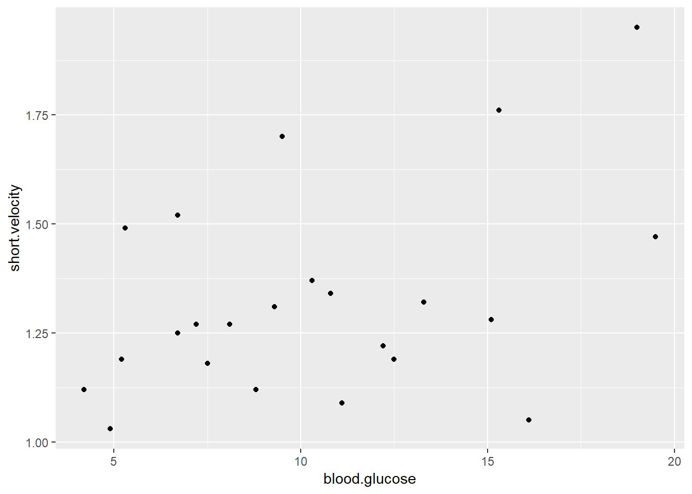
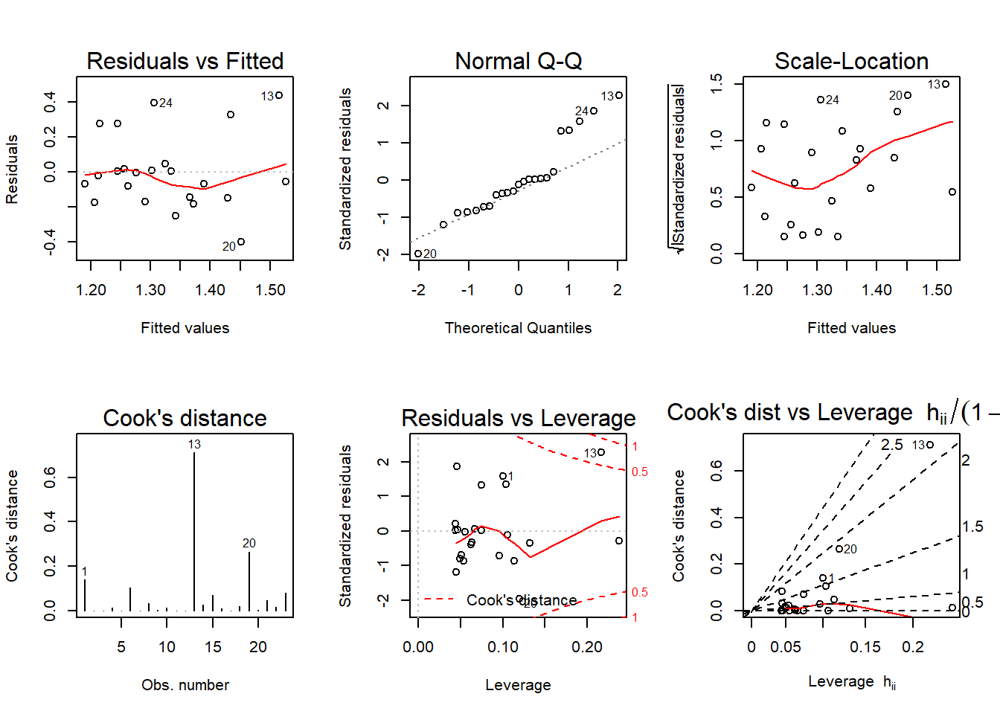
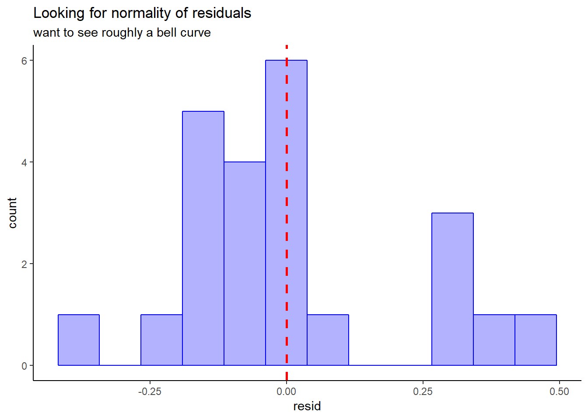

# Example: Ventricular shortening velocity

## Packages


```r
library(tidyverse)
library(magrittr)
library(furniture)
library(texreg)
library(stargazer)
library(psych)
library(car)
library(effects)
library(ISwR)  # Introduction to Statistics with R (datasets)
```


load dataset that is included in the `ISwR` package

```r
data(thuesen)
```

The `thuesen` data frame has 24 rows and 2 columns. It contains ventricular shortening velocity and blood glucose for type 1 diabetic patients.

* `blood.glucose` a numeric vector, fasting blood glucose (mmol/l).
* `short.velocity` a numeric vector, mean circumferential shortening velocity (%/s).


### Get to know the data with `?thuesen`


```r
dim(thuesen)      # number of rows (subjects) & columns (variables)
```

```
## [1] 24  2
```

```r
names(thuesen)    # names of the variables
```

```
## [1] "blood.glucose"  "short.velocity"
```

```r
glimpse(thuesen)  # view the class and 1st few values of each variable
```

```
## Observations: 24
## Variables: 2
## $ blood.glucose  <dbl> 15.3, 10.8, 8.1, 19.5, 7.2, 5.3, 9.3, 11.1, 7.5...
## $ short.velocity <dbl> 1.76, 1.34, 1.27, 1.47, 1.27, 1.49, 1.31, 1.09,...
```

```r
summary(thuesen)  # notice a missing value (NA) on velocity
```

```
##  blood.glucose    short.velocity 
##  Min.   : 4.200   Min.   :1.030  
##  1st Qu.: 7.075   1st Qu.:1.185  
##  Median : 9.400   Median :1.270  
##  Mean   :10.300   Mean   :1.326  
##  3rd Qu.:12.700   3rd Qu.:1.420  
##  Max.   :19.500   Max.   :1.950  
##                   NA's   :1
```


```r
stargazer(thuesen, 
          type   = "html", 
          digits = 4, 
          flip   = TRUE,                    
          summary.stat   = c("n", "mean", "sd", "min", "median", "max"),
          title  = "Descriptives")
```


<table style="text-align:center"><caption><strong>Descriptives</strong></caption>
<tr><td colspan="3" style="border-bottom: 1px solid black"></td></tr><tr><td style="text-align:left">Statistic</td><td>blood.glucose</td><td>short.velocity</td></tr>
<tr><td colspan="3" style="border-bottom: 1px solid black"></td></tr><tr><td style="text-align:left">N</td><td>24</td><td>23</td></tr>
<tr><td style="text-align:left">Mean</td><td>10.3000</td><td>1.3257</td></tr>
<tr><td style="text-align:left">St. Dev.</td><td>4.3375</td><td>0.2329</td></tr>
<tr><td style="text-align:left">Min</td><td>4.2000</td><td>1.0300</td></tr>
<tr><td style="text-align:left">Median</td><td>9.4000</td><td>1.2700</td></tr>
<tr><td style="text-align:left">Max</td><td>19.5000</td><td>1.9500</td></tr>
<tr><td colspan="3" style="border-bottom: 1px solid black"></td></tr></table>

## VISUALIZATION: Raw Data 

Base Graphics: let it determine the type of plot

```r
ggplot(thuesen, 
       aes(x = blood.glucose, 
           y = short.velocity)) + 
  geom_point()
```

```
## Warning: Removed 1 rows containing missing values (geom_point).
```




`ggplot2`: specify plot type

```r
thuesen %>% 
  ggplot(aes(x = blood.glucose,       # x-axis variable name
             y = short.velocity)) +   # y-axis variable name
  geom_point() +                      # scatterplot
  theme_bw()                          # black-and-white theme 
```

```
## Warning: Removed 1 rows containing missing values (geom_point).
```


### CORRELATION: un-adjusted 

cor doesn't like NA values

```r
thuesen %>% cor           
```

```
##                blood.glucose short.velocity
## blood.glucose              1             NA
## short.velocity            NA              1
```

specify to do listwise deletion

```r
thuesen %>% cor(use = "complete.obs") 
```

```
##                blood.glucose short.velocity
## blood.glucose      1.0000000      0.4167546
## short.velocity     0.4167546      1.0000000
```

you can abbreviate

```r
thuesen %>% cor(use = "complete")     # 
```

```
##                blood.glucose short.velocity
## blood.glucose      1.0000000      0.4167546
## short.velocity     0.4167546      1.0000000
```

same as above, but without the pipe

```r
cor(thuesen, use = "complete")     
```

```
##                blood.glucose short.velocity
## blood.glucose      1.0000000      0.4167546
## short.velocity     0.4167546      1.0000000
```

you can choose the number of decimal places

```r
thuesen %>% 
  cor(use="complete") %>%   
  round(2)                   
```

```
##                blood.glucose short.velocity
## blood.glucose           1.00           0.42
## short.velocity          0.42           1.00
```


this version give a single value instead of a matrix

```r
thuesen %$% 
  cor(blood.glucose,                
      short.velocity,               
      use="complete")
```

```
## [1] 0.4167546
```

This TESTS if the cor == 0

```r
thuesen %$% 
  cor.test(blood.glucose,           
           short.velocity, 
           use = 'complete')
```

```
## 
## 	Pearson's product-moment correlation
## 
## data:  blood.glucose and short.velocity
## t = 2.101, df = 21, p-value = 0.0479
## alternative hypothesis: true correlation is not equal to 0
## 95 percent confidence interval:
##  0.005496682 0.707429479
## sample estimates:
##       cor 
## 0.4167546
```

The default is Pearson's R, which assesses linear relationships.  Spearman's correlation assesses monotonic relationships.


```r
thuesen %$% 
  cor.test(blood.glucose, 
           short.velocity, 
           use    = 'complete',
           method = 'spearman')     # spearman's (rho) 
```

```
## Warning in cor.test.default(blood.glucose, short.velocity, use =
## "complete", : Cannot compute exact p-value with ties
```

```
## 
## 	Spearman's rank correlation rho
## 
## data:  blood.glucose and short.velocity
## S = 1380.4, p-value = 0.1392
## alternative hypothesis: true rho is not equal to 0
## sample estimates:
##      rho 
## 0.318002
```

## FIT REGRESSION: simple linear 


```r
fit_vel_glu <- lm(short.velocity ~ blood.glucose, data = thuesen)

fit_vel_glu
```

```
## 
## Call:
## lm(formula = short.velocity ~ blood.glucose, data = thuesen)
## 
## Coefficients:
##   (Intercept)  blood.glucose  
##       1.09781        0.02196
```


```r
summary(fit_vel_glu)
```

```
## 
## Call:
## lm(formula = short.velocity ~ blood.glucose, data = thuesen)
## 
## Residuals:
##      Min       1Q   Median       3Q      Max 
## -0.40141 -0.14760 -0.02202  0.03001  0.43490 
## 
## Coefficients:
##               Estimate Std. Error t value Pr(>|t|)    
## (Intercept)    1.09781    0.11748   9.345 6.26e-09 ***
## blood.glucose  0.02196    0.01045   2.101   0.0479 *  
## ---
## Signif. codes:  0 '***' 0.001 '**' 0.01 '*' 0.05 '.' 0.1 ' ' 1
## 
## Residual standard error: 0.2167 on 21 degrees of freedom
##   (1 observation deleted due to missingness)
## Multiple R-squared:  0.1737,	Adjusted R-squared:  0.1343 
## F-statistic: 4.414 on 1 and 21 DF,  p-value: 0.0479
```


```r
coef(fit_vel_glu)
```

```
##   (Intercept) blood.glucose 
##    1.09781488    0.02196252
```


```r
confint(fit_vel_glu)
```

```
##                      2.5 %     97.5 %
## (Intercept)   0.8534993816 1.34213037
## blood.glucose 0.0002231077 0.04370194
```


```r
anova(fit_vel_glu)
```

```
## # A tibble: 2 x 5
##      Df `Sum Sq` `Mean Sq` `F value` `Pr(>F)`
## * <int>    <dbl>     <dbl>     <dbl>    <dbl>
## 1     1    0.207    0.207       4.41   0.0479
## 2    21    0.986    0.0470     NA     NA
```


model fit indicies

```r
logLik(fit_vel_glu)     
```

```
## 'log Lik.' 3.583612 (df=3)
```

```r
AIC(fit_vel_glu)
```

```
## [1] -1.167223
```

```r
BIC(fit_vel_glu)
```

```
## [1] 2.239259
```


```r
stargazer(fit_vel_glu, type = "html")
```


<table style="text-align:center"><tr><td colspan="2" style="border-bottom: 1px solid black"></td></tr><tr><td style="text-align:left"></td><td><em>Dependent variable:</em></td></tr>
<tr><td></td><td colspan="1" style="border-bottom: 1px solid black"></td></tr>
<tr><td style="text-align:left"></td><td>short.velocity</td></tr>
<tr><td colspan="2" style="border-bottom: 1px solid black"></td></tr><tr><td style="text-align:left">blood.glucose</td><td>0.022<sup>**</sup></td></tr>
<tr><td style="text-align:left"></td><td>(0.010)</td></tr>
<tr><td style="text-align:left"></td><td></td></tr>
<tr><td style="text-align:left">Constant</td><td>1.098<sup>***</sup></td></tr>
<tr><td style="text-align:left"></td><td>(0.117)</td></tr>
<tr><td style="text-align:left"></td><td></td></tr>
<tr><td colspan="2" style="border-bottom: 1px solid black"></td></tr><tr><td style="text-align:left">Observations</td><td>23</td></tr>
<tr><td style="text-align:left">R<sup>2</sup></td><td>0.174</td></tr>
<tr><td style="text-align:left">Adjusted R<sup>2</sup></td><td>0.134</td></tr>
<tr><td style="text-align:left">Residual Std. Error</td><td>0.217 (df = 21)</td></tr>
<tr><td style="text-align:left">F Statistic</td><td>4.414<sup>**</sup> (df = 1; 21)</td></tr>
<tr><td colspan="2" style="border-bottom: 1px solid black"></td></tr><tr><td style="text-align:left"><em>Note:</em></td><td style="text-align:right"><sup>*</sup>p<0.1; <sup>**</sup>p<0.05; <sup>***</sup>p<0.01</td></tr>
</table>


```r
texreg::htmlreg(fit_vel_glu)
```


<!DOCTYPE HTML PUBLIC "-//W3C//DTD HTML 4.01 Transitional//EN" "http://www.w3.org/TR/html4/loose.dtd">
<table cellspacing="0" align="center" style="border: none;">
<caption align="bottom" style="margin-top:0.3em;">Statistical models</caption>
<tr>
<th style="text-align: left; border-top: 2px solid black; border-bottom: 1px solid black; padding-right: 12px;"><b></b></th>
<th style="text-align: left; border-top: 2px solid black; border-bottom: 1px solid black; padding-right: 12px;"><b>Model 1</b></th>
</tr>
<tr>
<td style="padding-right: 12px; border: none;">(Intercept)</td>
<td style="padding-right: 12px; border: none;">1.10<sup style="vertical-align: 0px;">***</sup></td>
</tr>
<tr>
<td style="padding-right: 12px; border: none;"></td>
<td style="padding-right: 12px; border: none;">(0.12)</td>
</tr>
<tr>
<td style="padding-right: 12px; border: none;">blood.glucose</td>
<td style="padding-right: 12px; border: none;">0.02<sup style="vertical-align: 0px;">*</sup></td>
</tr>
<tr>
<td style="padding-right: 12px; border: none;"></td>
<td style="padding-right: 12px; border: none;">(0.01)</td>
</tr>
<tr>
<td style="border-top: 1px solid black;">R<sup style="vertical-align: 0px;">2</sup></td>
<td style="border-top: 1px solid black;">0.17</td>
</tr>
<tr>
<td style="padding-right: 12px; border: none;">Adj. R<sup style="vertical-align: 0px;">2</sup></td>
<td style="padding-right: 12px; border: none;">0.13</td>
</tr>
<tr>
<td style="padding-right: 12px; border: none;">Num. obs.</td>
<td style="padding-right: 12px; border: none;">23</td>
</tr>
<tr>
<td style="border-bottom: 2px solid black;">RMSE</td>
<td style="border-bottom: 2px solid black;">0.22</td>
</tr>
<tr>
<td style="padding-right: 12px; border: none;" colspan="3"><span style="font-size:0.8em"><sup style="vertical-align: 0px;">***</sup>p &lt; 0.001, <sup style="vertical-align: 0px;">**</sup>p &lt; 0.01, <sup style="vertical-align: 0px;">*</sup>p &lt; 0.05</span></td>
</tr>
</table>


## VISUALIZATION: Model Fit 

Base Graphics: let it determine the type of plot `?plot.lm`


show all plots at once

```r
par(mfrow = c(2, 3))
plot(fit_vel_glu, which = 1:6)
```



```r
par(mfrow = c(1, 1))
```

potentially influencial or outlier points

```r
thuesen %>% 
  dplyr::mutate(id = row_number()) %>% 
  dplyr::filter(id == c(13, 20, 24))
```

```
## # A tibble: 3 x 3
##   blood.glucose short.velocity    id
##           <dbl>          <dbl> <int>
## 1          19             1.95    13
## 2          16.1           1.05    20
## 3           9.5           1.7     24
```


`ggplot2`: specify plot type

```r
thuesen %>% 
  dplyr::filter(complete.cases(.)) %>%            # get ride fo the incomplete cases
  ggplot(data = ,                        # name the dataset 1st
         mapping = aes(x = blood.glucose,       # x-axis variable name
                       y = short.velocity)) +   # y-axis variable name
  geom_point() +                              # do a scatterplot
  stat_smooth(method = "lm") +                # smooth: linear model
  theme_bw()  +                               # black-and-while theme
  geom_point(data = thuesen %>% 
               filter(row_number() == c(13, 20, 24)), #  
             pch = 19,
             size = 4,
             color = "red")
```


## CHECK VALIDITY of the  ASSUMPTIONS w/ residual diagnostics

store values from the model (into the dataset)


```r
thuesen %>% 
  dplyr::filter(complete.cases(.)) %>%            # get ride fo the incomplete cases
  dplyr::mutate(pred = fitted(fit_vel_glu)) %>%   # fitted/prediction values
  dplyr::mutate(resid = residuals(fit_vel_glu))   # residual values
```

```
## # A tibble: 23 x 4
##    blood.glucose short.velocity  pred    resid
##            <dbl>          <dbl> <dbl>    <dbl>
##  1          15.3           1.76  1.43  0.326  
##  2          10.8           1.34  1.34  0.00499
##  3           8.1           1.27  1.28 -0.00571
##  4          19.5           1.47  1.53 -0.0561 
##  5           7.2           1.27  1.26  0.0141 
##  6           5.3           1.49  1.21  0.276  
##  7           9.3           1.31  1.30  0.00793
##  8          11.1           1.09  1.34 -0.252  
##  9           7.5           1.18  1.26 -0.0825 
## 10          12.2           1.22  1.37 -0.146  
## # ... with 13 more rows
```


```r
thuesen %>% 
  dplyr::mutate(id = row_number()) %>% 
  dplyr::filter(complete.cases(.)) %>%                # get ride fo the incomplete cases
  dplyr::mutate(pred = fitted(fit_vel_glu)) %>%       # fitted/prediction values
  dplyr::mutate(resid = residuals(fit_vel_glu)) %>%   # residual values
  ggplot(aes(x = id,
             y = resid)) +
  geom_point() +
  geom_hline(yintercept = 0,
             color = "red",
             size = 1,
             linetype = "dashed") +
  theme_classic() +
  labs(title = "Looking for homogeneity of residuals",
       subtitle = "want to see equal spread all across")
```


```r
thuesen %>% 
  dplyr::filter(complete.cases(.)) %>%                # get ride fo the incomplete cases
  dplyr::mutate(pred = fitted(fit_vel_glu)) %>%       # fitted/prediction values
  dplyr::mutate(resid = residuals(fit_vel_glu)) %>%   # residual values
  ggplot(aes(x = resid)) +
  geom_histogram(bins = 12,
                 color = "blue",
                 fill = "blue",
                 alpha = 0.3) +
  geom_vline(xintercept = 0,
             size = 1,
             color = "red",
             linetype = "dashed") +
  theme_classic() +
  labs(title = "Looking for normality of residuals",
       subtitle = "want to see roughly a bell curve")
```



the residual plots 

```r
residualPlots(fit_vel_glu)
```


```
##               Test stat Pr(>|Test stat|)
## blood.glucose    0.9289           0.3640
## Tukey test       0.9289           0.3529
```


`ggplot2`: plotting confidence intervals for the mean outcome

```r
ggplot(thuesen,
       aes(x = blood.glucose,
           y = short.velocity)) +
  stat_smooth(method = "lm", 
              color  = "blue") +
  geom_point(shape = 10,
             size  = 2) +                    
  theme_bw()
```

```
## Warning: Removed 1 rows containing non-finite values (stat_smooth).
```

```
## Warning: Removed 1 rows containing missing values (geom_point).
```


## Plot the model


```r
effects::Effect(focal.predictors = c("blood.glucose"),
                mod = fit_vel_glu)
```

```
## 
##  blood.glucose effect
## blood.glucose
##      4.2        8       12       16       20 
## 1.190057 1.273515 1.361365 1.449215 1.537065
```


```r
effects::Effect(focal.predictors = c("blood.glucose"),
                mod = fit_vel_glu) %>% 
  data.frame() 
```

```
## # A tibble: 5 x 5
##   blood.glucose   fit     se lower upper
## *         <dbl> <dbl>  <dbl> <dbl> <dbl>
## 1           4.2  1.19 0.0788  1.03  1.35
## 2           8    1.27 0.0516  1.17  1.38
## 3          12    1.36 0.0483  1.26  1.46
## 4          16    1.45 0.0742  1.29  1.60
## 5          20    1.54 0.110   1.31  1.77
```


```r
effects::Effect(focal.predictors = c("blood.glucose"),
                mod = fit_vel_glu,
                xlevels = list(blood.glucose = c(5, 10, 15, 20))) %>% 
  data.frame()
```

```
## # A tibble: 4 x 5
##   blood.glucose   fit     se lower upper
## *         <dbl> <dbl>  <dbl> <dbl> <dbl>
## 1             5  1.21 0.0721  1.06  1.36
## 2            10  1.32 0.0454  1.22  1.41
## 3            15  1.43 0.0662  1.29  1.56
## 4            20  1.54 0.110   1.31  1.77
```


```r
effects::Effect(focal.predictors = c("blood.glucose"),
                mod = fit_vel_glu,
                xlevels = list(blood.glucose = seq(from = 4, to = 20, by = 1))) %>% 
  data.frame() %>% 
  ggplot(aes(x = blood.glucose,
             y = fit)) +
  geom_ribbon(aes(ymin = lower,
                  ymax = upper),
              alpha = .5) +
  geom_line()
```


